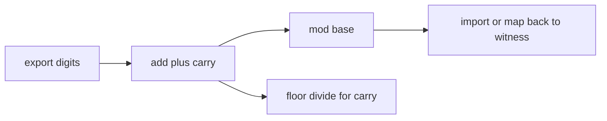
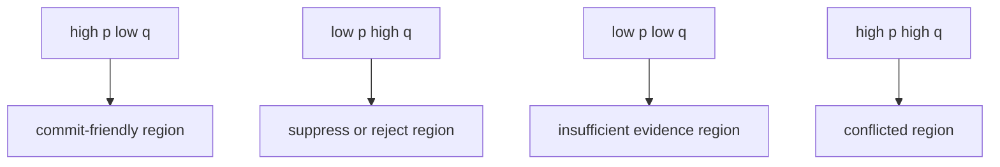
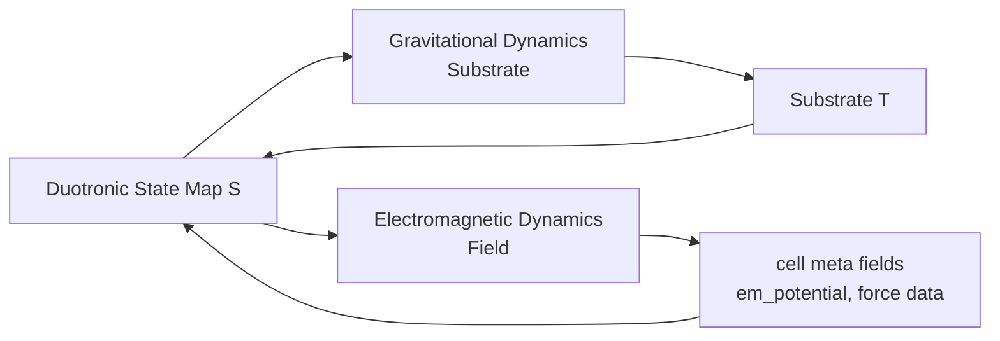
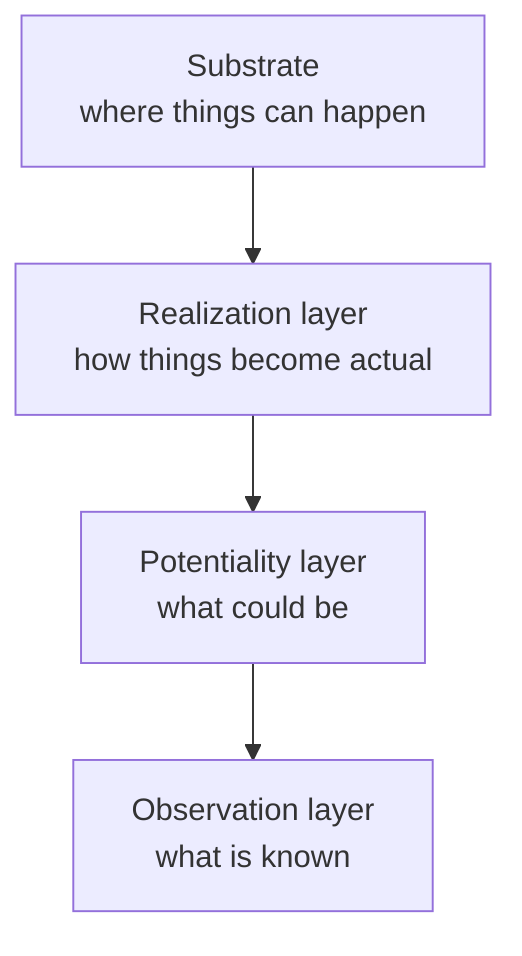

> Core statement
>
> Duotronics is a presence-first representational framework and a candidate representational physics.
> In its native public scalar layer, realized values begin at 1 because minimal existence is modeled as presence rather than as nothingness.
> Structural absence is represented by omission rather than by a native public zero token.
> Ordinary zero appears only after explicit export into conventional arithmetic, indexing, storage, or modular systems.

## Abstract

Duotronics is a layered representational framework for systems that need to distinguish realized values, absence, uncertainty, geometric realization, and stream transport without collapsing them into a single overloaded zero token. In this revision, the framework is also developed as a candidate representational physics: a language for describing existence, potentiality, observation, and state evolution in a single formal stack. The framework is not a rejection of standard mathematics. In Duotronics, realized public scalar values begin at 1, structural absence is represented by omission, and interoperability with standard arithmetic is handled through an explicit bridge $E(d)=d-1$ and its inverse $I(z)=z+1$.

This revision tightens the framework in five ways: (1) stricter separation of structural positions, native values, export values, witnesses, and semantic states; (2) a complete end-to-end walkthrough from witness realization through meta interpretation into sparse transport; (3) expanded formal development covering signed coordinates, division, rational export, scalar and witness profiles, and error semantics; (4) grounding the dual-signal layer in existing decision-theoretic families (Bayesian odds, Dempster-Shafer evidential support, two-channel confidence architectures) without claiming reducibility to any one; (5) expanded conformance, security, performance, and implementation guidance so the framework can be criticized on engineering rather than rhetorical grounds.

The result is a more disciplined source paper. Duotronics is presented here both as an architectural stance and as a candidate formal language for physical description. In this framework, realized things begin at 1 in native public space because minimal existence is modeled as presence; empty stays empty; unknown stays unknown; conditional states carry potentiality; witnesses make realization explicit; sparse streams preserve omission; and conventional zero is introduced only where translation into standard systems requires it.

The framework also supplies a structured calculus for physical description. This revision introduces a canonical physical state tuple $(S, T, F, \Pi, O)$, formal operator semantics for `MEASURE`, `METRIC_UPDATE`, and `FORK`, explicit physical invariants and conservation-style laws, and fully worked toy dynamics models for gravity, electromagnetism, measurement, and branching. Within this calculus, the paper constructs profile-bounded candidate models for shared representational dynamics, frames observation as a physical information process with formal coarse-graining rules, and poses recursive questions about the nature of physical law itself. The paper does not yet provide a full Lagrangian theory, an empirical derivation of known physical constants, or a demonstration of equivalence to general relativity, quantum mechanics, or the Standard Model. These physical models are presented as a formal research program, not as a completed or demonstrated physical theory.

**Physics roadmap.** The physical reading proceeds in stages. Sections 8 and 13 define the substrate and realization layer with explicit physical state and profile schemas. Section 17 formalizes potentiality with quantum-profile interference. Section 20 adds a general evolution template. Sections 26–27 develop the core physics: substrate dynamics, field dynamics, observation maps, and toy models. Section 26.8 introduces the minimal physical kernel. Section 26.9 collects the fully worked toy models. Section 26.10 states empirical and falsifiability criteria. Section 26.11 states the limits of correspondence to existing physics. Section 27 is the formal hinge: it defines how potentiality becomes recorded state through observation, connecting dynamics to knowledge. Appendices P–Q formalize operator semantics and test vectors. Appendix S provides reference pseudocode for a toy simulator.

## Contents

Executive summary
1. Purpose and scope
2. The two readings of Duotronics
2.1. How to read this document: the three tiers of Duotronics
2.2. Reader pathways
3. Non-claims
4. Terminology and object types
5. The core bridge
6. End-to-end worked system walkthrough
7. Structural space, semantic states, and omission
8. The substrate: modeling the fabric of spacetime
9. Signed native extension
10. Transported algebra on native public space
11. Division and rational values
12. Native modular arithmetic
13. The realization layer
14. Witness families and representability
15. Canonicalization and identity
16. Mixed-radix and positional witness chains
17. The potentiality layer
18. Grounding the potentiality layer in decision theory and quantum profiles
19. Combined cell object
20. Sparse streaming as finite partial-map evolution
21. DBP, Duostream, and transport profiles
22. Security and integrity
23. Error semantics and failure modes
24. Performance and complexity
25. Catalogs, registries, and drift control
Capstone of the Physical Reading
26. Modeling physical dynamics: a representational approach
26.7. Canonical end-to-end physics walkthrough
26.8. Minimal physical kernel
26.9. Toy models and expected behaviors
26.10. Empirical and falsifiability criteria
26.11. Limits of correspondence to existing physics
27. The physics of observation
28. Speculative extension: the Meta-Substrate analogy
29. Conformance
30. Implementation mapping
31. Type-system mappings
32. A hierarchical model of dimensions
33. Duotronic process calculus sketch
34. Duality, invariants, and conservation laws
35. Open questions
36. Final synthesis
Appendices A-M. The Engineering Specification
Appendix A. Compact formulas
Appendix B. Example conformance checklist
Appendix C. Bibliography
Appendix D. Figures and diagrams
Appendix E. Extended dashboard example
Appendix F. Profile templates
Appendix G. Expansion notes for the next revision
Appendix H. Protocol appendix: DBP and Duostream instantiation
Appendix I. Protocol field checklists
Appendix J. Protocol growth targets
Appendix K. Sparse streaming appendix
Appendix L. Chemistry two-layer appendix
Appendix M. Computational reproducibility appendix
Appendices N-U. The Physical Reading and Speculative Extensions
Appendix N. Conformance test vectors
Appendix O. Physical profiles and notation
Appendix P. Operator semantics
Appendix Q. Physical operator test vectors
Appendix R. Terminology glossary
Appendix S. Reference simulator pseudocode
Appendix T. Minimal physical profile schema
Appendix U. Failure cases and rejection catalogue

## Executive summary

> Reading scope: shared foundation for both the Engineering Reading and the Physical Reading.

Duotronics is an architectural framework designed to solve a recurring problem in software engineering: the semantic overloading of the "zero" token. Real systems routinely use a single zero-like value to mean absence, default, unvisited, null, measured-nothing, and explicit command value simultaneously. Duotronics responds by separating these meanings into a disciplined, four-layer stack: (1) **the Substrate**, which specifies where events may occur; (2) **the Realization Layer**, which specifies how objects and values become actual; (3) **the Potentiality Layer**, which records what could be before observation fixes an outcome; and (4) **the Observation Layer**, which specifies how one system extracts and exports information from another. The familiar scalar bridge, witnesses, dual-signal objects, and sparse streams remain the operational machinery that instantiate this stack.

The Duotronic plane $\Pi_{\mathbb{D}}$ is the first concrete substrate: a relabeled integer lattice where the displayed center is $(1,1)$, labels $0$ and $-1$ are excluded, and each cell may carry semantic state (`empty`, `unknown`, `conditional`, `realized`, `error`), an optional witness, and potentiality data.

The same framework also provides a disciplined language for physical description. It does not claim to be a completed physical theory, but rather a calculus in which physical hypotheses can be constructed with clarity. This revision strengthens the physical reading substantially: it introduces a canonical physical state tuple, partial operator semantics with explicit domain, codomain, preconditions, and postconditions, executable toy dynamics models with numerical tables, and formal invariants and conservation-style laws. Within this calculus, it becomes possible to build candidate models for dynamic spacetime geometry, to frame the measurement problem as a physical process of subsystem observation, and even to pose recursive questions about the nature of physical law itself. The paper does not yet derive the Einstein field equations, Maxwell's equations, or the Schrödinger equation from the framework; nor does it derive known physical constants or demonstrate equivalence to the Standard Model. Those tasks remain the frontier of a formal research program.

The sections that follow develop each layer formally, provide end-to-end worked examples, address conformance and security, and identify open questions for future empirical validation. The paper presents the core engineering specification and then demonstrates the expressive power of this language by building these physical models as a formal research program.

## 1. Purpose and scope

> Reading scope: shared foundation, with the engineering motivation stated first and the physical interpretation declared explicitly.

This paper has a narrower scope than some earlier Duotronic drafts, but it now takes a stronger interpretive step. It does not claim to replace established algebra, analysis, or physics, yet it does propose Duotronics as a candidate representational physics: a formal way to describe how existence, potentiality, observation, and transport are structured.

The motivating axiom is presence-first. In this paper, native public 1 is not treated as an arbitrary indexing convenience. It is the least realized state. The rationale is physical as well as formal: absolute nothingness is not an observed operative state in the domains the paper targets. Even vacuum-scale descriptions retain temporal order, fluctuation, or latent activity. Duotronic omission therefore represents non-realization within a model, while native public 1 represents minimal realized existence.

The framework is organized through four connected layers:

1. the Substrate, which defines where things can happen,
2. the Realization Layer, which defines what things are and how they are realized,
3. the Potentiality Layer, which defines what could be before measurement or commitment,
4. the Observation Layer, which defines what is known and how information crosses system boundaries.

The framework is motivated by a practical engineering problem: systems need a disciplined way to keep the different meanings of zero-like tokens distinct. Duotronics responds by separating those meanings instead of overloading one symbol.

This revised paper focuses on what must be true for the framework to be coherent, what remains profile-dependent, and what is still open.

## 1.1 Physical reading of the four layers

The Substrate is the arena of relation: spacetime lattice, graph, manifold, Hilbert-indexed basis, or other structured position set.

The Realization Layer is the layer of objects and actualization: a witness is the story of how a value or state comes to exist, and a realization grammar is the profile-dependent rule set that permits such existence.

The Potentiality Layer is the layer of uncertainty, interference, and non-finality. In classical profiles it is represented by real-valued dual signals. In quantum profiles it is represented by amplitudes over candidate realizations.

The Observation Layer is the layer of boundary, measurement, and information loss. It formalizes how one subsystem extracts, exports, or collapses information from another.

## 2. The two readings of Duotronics

> Reading scope: explicit partition between the Engineering Reading and the Physical Reading.

This revision makes a separation that earlier drafts implied but did not enforce strongly enough. The same formal machinery can be read in two different ways, and the paper is clearer when those readings are named up front.

1. **The Engineering Reading.** Duotronics is a formal specification for building deterministic systems that keep omission, uncertainty, realization, and transport distinct. In this reading, the scalar bridge, sparse streaming, realization grammars, conformance rules, and typed boundaries are the primary subject matter.
2. **The Physical Reading.** Duotronics is a candidate representational physics. In this reading, the same structures are used to model spacetime-like substrates, realization as physical actualization, potentiality as superposition or unrealized alternatives, and observation as lossy subsystem-to-subsystem modeling.

The layer names are fixed across both readings, but their emphasis changes. In the Engineering Reading, the Potentiality Layer corresponds to the earlier dual-signal commitment view used for action policy, calibration, and deferred commitment. In the Physical Reading, the same layer is interpreted more broadly as the domain of non-final possibilities. Likewise, the Observation Layer is the physical-reading name for what engineering deployments earlier described as the explicit boundary and translation surface.

The main text keeps the two readings connected but now marks the dominant one where that improves clarity. Appendices A-M collect the engineering specification and bounded empirical support. Appendices N-U collect the physical reading and the more speculative extensions.

## 2.1 How to read this document: the three tiers of Duotronics

This document deliberately spans a wide range from formal mathematics to speculative physics. To navigate this scope, the reader is advised to approach the paper as a series of three conceptual tiers, each building on the last but with a different level of rigor and completeness.

**Tier 1: The Core Formalism (Formally Defined and Internally Consistent).** This tier comprises the foundational axioms of the framework. It includes the scalar bridge to conventional arithmetic ($E(d)=d-1$), the transported native algebra ($\oplus, \otimes$), the formal definitions of the five semantic states, and the logic of canonicalization. This layer is presented as a formally specified and internally consistent system with stated propositions.

**Tier 2: The Engineering Architecture and Profiles (Implementable Specification).** This tier describes the architectural application of the core formalism. It includes the four-layer stack (Substrate, Realization, Potentiality, Observation), the sparse streaming transport protocol, the concept of Realization Grammars, and the design of specific profiles like the dual-signal layer for decision-making. This layer should be read as a detailed software and systems architecture specification, ready for implementation and empirical testing.

**Tier 3: The Physical Hypotheses (A Formal Research Program).** This tier explores the application of the Duotronic calculus to representational physics. It now includes formal operator semantics for `MEASURE`, `METRIC_UPDATE`, and `FORK` with explicit domain, codomain, preconditions, postconditions, and invariants; profile-bounded constraints that define well-formed physical payloads and conformance; executable toy dynamics models with numerical tables for gravity, electromagnetism, measurement, and branching; physical invariants and conservation-style laws; and the speculative models of profile-bounded dynamics, observation, and the Meta-Substrate analogy. The physics tier is strongest where it is formal and profile-bounded, not where it ventures into metaphysical claims. It should not be read as a completed or demonstrated physical theory, but rather as a **formal research program** that uses the language developed in Tiers 1 and 2 to pose a series of bold hypotheses about the nature of reality, with the intent of provoking future theoretical and experimental work.

By separating the document into these three tiers, we invite the reader to evaluate the engineering specification on its own merits, while engaging with the physical hypotheses as the ambitious but still-developing research frontier of the Duotronics framework.

## 2.2 Reader pathways

The paper is long and rich. Not every reader needs every section. The following paths are suggested for different audiences.

| Audience | Recommended route | Sections to skip or skim |
| --- | --- | --- |
| **Core / formal reader** | §1–§7, §10, §13 (profiles), §15 (canonicalization), §34 (invariants), Appendix A | §8 substrate physics, §26–27 physical reading, §28 Meta-Substrate |
| **Engineering reader** | §1–§7, §8 (§8.1–§8.14 only), §13, §17–§18, §20–§25, §29–§31, Appendices A–M | §26–§28 physical capstone, §32–§33 dimensions/calculus |
| **Physics-program reader** | §1–§2, §8 (full), §13.5, §17, §20, §26–27, §32–34, Appendices N–U | §9–§12 (algebra details), §21–§25 (protocol and engineering) |
| **Speculative reader** | §1–§2, §26–§28, §32, §35–§36 | Most engineering and formal detail |
| **First-time reader** | Executive summary, §1–§3, §6 (walkthrough), §8.1–§8.3, §26.8 (kernel), §36 (synthesis) | Everything else on first pass |

## 3. Non-claims

**Core claim.** For systems where a single zero-like token is routinely overloaded to mean absence, default, unvisited, null, and measured-nothing simultaneously, Duotronics claims that separating those semantic roles into distinct architectural components — omission for absence, semantic states for uncertainty, realized values starting at 1, and an explicit bridge for conventional interoperability — leads to greater clarity, auditability, and operational stability. In the stronger reading of this revision, the same separation is proposed as a candidate representational language for physical existence: presence, potentiality, and observation should not be collapsed into one token any more than absence and measured zero should be.

With that positive claim stated, the following are explicitly *not* claimed. Duotronics does not claim that:

1. standard mathematics is wrong to use zero,
2. all natural number systems must begin at 1,
3. all software should use one-based indexing,
4. the present paper has already derived the complete laws of fundamental physics,
5. polygon witnesses are necessary for every application,
6. a dual-signal pair is equivalent to consciousness or human introspection,
7. the specific models for consciousness or the Meta-Substrate presented here are the final or only possible ones, but rather that Duotronics provides a formal language in which such questions can be coherently posed and investigated.

The claim is representational before it is metaphysical. The paper proposes a candidate formalism for describing physical and computational systems in which public realized values begin at 1, absence remains structural, and translation to standard arithmetic is explicit.

## 3.7 Addressing common objections

The following objections have been raised against earlier, broader drafts. They are answered here explicitly so that reviewers can see the framework has been deliberately scoped.

1. **"Zero is a valid abstract concept; removing it is not a simplification."** Agreed. This framework does not claim zero should not exist. It claims that some systems benefit from a public layer where realized values begin at 1 and structural absence is represented by omission rather than by a zero token. Ordinary zero remains available in the export codomain.

2. **"The hexagonal weight sequence $2,4,6,8,10,12$ is arbitrary."** The even-range weight scheme is one of several family choices (§14). It is not claimed to be a universal constant. Weight choices are engineering decisions frozen by profile (§13.5), not assertions about nature.

3. **"Making 1 a prime breaks the Fundamental Theorem of Arithmetic."** This framework makes no claim about prime number theory. The number 1 in Duotronics is the minimal realized native public value and the additive identity of the transported algebra (§10.4). It is not asserted to be prime.

4. **"A number system without zero cannot do calculus, group theory, or ring theory."** Duotronics does not replace standard mathematics. All standard structures remain available in the export codomain $\mathbb{N}_0$ or $\mathbb{Z}$. The bridge $E(d)=d-1$ is the explicit interface. The native layer is a restricted representational discipline, not an alternative foundations program.

5. **"If representational efficiency is claimed, the codebook cost must be counted."** Agreed. Any compression or efficiency claim must be evaluated under Minimum Description Length (MDL) or equivalent information-theoretic framing, not under ad hoc token-counting proxies (see §24.8.1).

These answers are not a retreat from the framework. They are a perimeter. Duotronics is presented here as a candidate representational physics and a disciplined architecture, not as a completed metaphysical doctrine about zero, primes, or the totality of physics.

## 4. Terminology and object types

Earlier drafts used closely related terms too loosely. This revision freezes the following vocabulary.

## 4.1 Structural positions

A structural position is an address in a grid, stream, lattice, table, registry, or state space. A structural position may be empty. It is not itself a scalar value.

## 4.2 Native public scalar value

A native public scalar value is a realized Duotronic scalar in

$$
\mathbb{D}^+ = \{1,2,3,\ldots\}.
$$

This is the basic one-based realized value space. There is no native public scalar $0$ in $\mathbb{D}^+$.

## 4.3 Export value

An export value is a standard nonnegative integer in

$$
\mathbb{N}_0 = \{0,1,2,3,\ldots\}
$$

obtained by the bridge $E(d)=d-1$.

## 4.4 Raw witness valuation

For a witness object $W$, the raw witness valuation $\rho(W)$ is the unexported value computed from the center and occupied features of the witness. Under the basic witness profiles of this paper, the native public value is $\nu(W)=\rho(W)$ whenever the witness is realizable.

## 4.5 Witness object

A witness object is a structured realizer, often geometric, that explains how a native public value is instantiated. A witness is not merely a decorative view of a scalar. It is an identity-bearing object with family, ordering, policy, and valuation.

## 4.6 Semantic state

A semantic state is one of

$$
\Xi = \{\mathsf{empty}, \mathsf{unknown}, \mathsf{conditional}, \mathsf{realized}, \mathsf{error}\}.
$$

The symbol $\Xi$ is reserved for the semantic-state set throughout this paper; the symbol $\Sigma$ is reserved for the canonical physical state tuple $(S, T, F, \Pi, O)$ introduced in §26. The earlier four-state model is preserved, but this revision adds an explicit error state for malformed or rejected payloads.

## 4.7 Meta object

A meta object carries support, inhibition, calibration, provenance, and policy information about an object-level value or witness. It is distinct from the value itself.

> **Disambiguation.** The cell-local `meta` storage bag defined here is not the same concept as the former "meta layer" (now deprecated in favor of Potentiality Layer; see §17). In the physical reading, `meta` objects store per-cell field data such as `em_potential` (§26.2). The `meta` key in JSON payloads refers to this storage bag, not to the Potentiality Layer.

## 4.8 Profile

A profile is a declared bundle of conventions that affects interoperability. Profiles may choose scalar-only versus witness-bearing realization, canonicalization group, allowed families, transport shape, and security requirements.

## 5. The core bridge

> Primary reading: Engineering.

The framework becomes stable once the scalar bridge is stated plainly.

## 5.1 Native and export spaces

Define

$$
\mathbb{D}^+ = \{1,2,3,\ldots\},
\qquad
\mathbb{N}_0 = \{0,1,2,3,\ldots\}.
$$

The export map is

$$
E : \mathbb{D}^+ \to \mathbb{N}_0,
\qquad
E(d) = d - 1.
$$

The import map is

$$
I : \mathbb{N}_0 \to \mathbb{D}^+,
\qquad
I(z) = z + 1.
$$

These are mutually inverse bijections.

## 5.2 Meaning of the bridge

The bridge does not say that native public 1 is secretly zero. It says that when a native public value is exported into ordinary arithmetic, indexing, or storage, zero-based systems see the image under $E$.

## 5.3 Why the bridge is normative

The framework becomes ambiguous if the subtract-one step is merely implied. In this revision, the bridge is normative. Any conforming scalar profile must declare export explicitly.

A general design principle follows: **representational purity and computational efficiency are separate concerns.** The native domain preserves semantic distinctions; arithmetic is performed in the export domain using standard operations; results are mapped back via the bridge. Since both directions are $O(1)$ piecewise-linear maps, this separation adds negligible cost (§9.2).

## 5.4 Boundaries and translation policy

The bridge becomes operational only when a system specifies where Duotronic objects cross into non-Duotronic environments. Define a boundary as a first-class translation object

$$
B : X_{\mathrm{in}} \to X_{\mathrm{out}},
$$

equipped with a declared translation policy, lossiness policy, and rejection policy.

Typical examples include:

1. a numeric-display boundary that exports only ordinary values,
2. a monitoring boundary that exports value plus semantic status and calibrated confidence,
3. a database boundary that may refuse to write `conditional` or `error` states,
4. an API boundary that strips witness detail but preserves provenance tags.

The important point is that a boundary is not merely formatting. It is the place where semantic richness may be preserved, compressed, or intentionally discarded. A conforming deployment should therefore declare, for each boundary:

1. which Duotronic fields are preserved,
2. which fields are collapsed or projected,
3. whether omission becomes `NULL`, deletion, or absence of field,
4. whether `conditional` and `error` are exported, rejected, or coerced,
5. whether witness identity survives the translation,
6. which versioned profile governs the conversion.

This makes lossiness explicit by design. A boundary may intentionally map

$$
(\mathsf{conditional}, \nu=20, (p,q)=(0.9,0.2))
$$

to an ordinary numeric value `19`, to a structured object carrying status and confidence, or to a rejected write. What matters is that the policy is declared rather than silently improvised.

## 6. End-to-end worked system walkthrough

Earlier drafts had many local examples but no single full-path scenario. This section supplies one.

## 6.1 Scenario

Suppose a sparse dashboard tracks a six-vertex witness cell at structural position $(1,1)$. The system uses:

1. the even-range hex witness family,
2. rotation-only canonicalization,
3. the scalar export bridge,
4. a potentiality pair,
5. a sparse delta stream.

The dashboard cell is realized by a hex witness with center contribution $1$, weights $(2,4,6,8,10,12)$, and occupancy $(1,0,1,0,0,1)$.

## 6.2 Witness realization

The raw valuation is

$$
\rho(W) = 1 + 2 + 6 + 12 = 21.
$$

So the native public value is

$$
\nu(W) = 21.
$$

The exported standard value is

$$
\zeta(W) = E(21) = 20.
$$

## 6.3 Canonicalization

The system rotates the witness signature through all six cyclic positions and picks the lexicographically minimal signature as the canonical form. The stored identity key is derived from:

1. family identifier,
2. profile identifier,
3. center flag,
4. rotated weight-occupancy signature,
5. canonicalization mode.

This avoids treating display orientation as identity.

## 6.4 Potentiality interpretation

The realized candidate is accompanied by a potentiality pair

$$
D = (p,q) = (0.91, 0.22).
$$

With inhibitory coefficient $\lambda = 1.5$,

$$
N_{1.5}(D) = 0.91 - 1.5(0.22) = 0.58.
$$

The stability magnitude is

$$
S(D) = \sqrt{0.91^2 + 0.22^2} \approx 0.94.
$$

The semantic state is `conditional`: the object-level realization exists, but the system is not yet willing to treat it as fully realized for irreversible downstream action.

## 6.5 Sparse transport

The transport frame should not densely serialize surrounding empty cells. A sparse delta can therefore upsert only the affected position:

```json
{
  "frame_type": "DELTA",
  "profile": "duotronics.revised.v1",
  "ops": [
    {
      "op": "UPSERT",
      "cell": "(1,1)",
      "payload": {
        "state": "conditional",
        "witness": {
          "family": "hex-even-range-v1",
          "center": 1,
          "weights": [2, 4, 6, 8, 10, 12],
          "occupancy": [1, 0, 1, 0, 0, 1],
          "native_public": 21,
          "exported_standard": 20,
          "canon": "rot-lexmin:..."
        },
        "meta": {
          "p": 0.91,
          "q": 0.22,
          "lambda": 1.5,
          "projection": 0.58,
          "stability": 0.94,
          "source": "model-A"
        }
      }
    }
  ]
}
```

## 6.6 Commit or rejection

If later validation succeeds, a PATCH can move the semantic state from `conditional` to `realized` without changing the witness value. If validation fails, the system should either:

1. delete the cell if the position should return to omission, or
2. preserve the cell with state `error` if auditability matters.

> **Transition-rule scoping.** In engineering profiles, a `conditional` → `realized` transition may be triggered by any profile-declared mechanism: PATCH, confirming observation, threshold crossing, or explicit human approval. In physical profiles (§26–§27), the same transition is restricted to explicit `MEASURE`-class events (see §34.3.5). The invariant "no silent coercion" applies universally — every transition must be declared — but the set of *permitted declaring operators* is profile-scoped.

This single example shows the framework end-to-end: realization, export, identity, potentiality judgment, and observation-layer transport.

## 6.7 Expanded 3x3 dashboard walkthrough

The preceding single-cell example is useful, but the real pressure on the framework appears when multiple semantic states coexist. Consider a $3 \times 3$ dashboard indexed in displayed coordinates around the center cell $(1,1)$.

At time $t_0$, suppose the visible dashboard contains the following structural situation:

```text
(-2,2)   (1,2)   (2,2)
 empty   unknown realized

(-2,1)   (1,1)   (2,1)
 empty conditional empty

(-2,-2) (1,-2)  (2,-2)
 error   empty   realized
```

This example is deliberately mixed:

1. `empty` means omission from the sparse state,
2. `unknown` means a cell is in scope but lacks a committed value,
3. `conditional` means a candidate value exists but is not yet trusted,
4. `realized` means a committed payload exists,
5. `error` means the receiver or validator rejected a previous payload but retained the event for audit.

In dense zero-filled systems, these states are often forced into one or two sentinel values. In Duotronics they remain distinct.

## 6.8 Dashboard state as a sparse partial map

Let the cell identifier set be

$$
C = \{(-2,2), (1,2), (2,2), (-2,1), (1,1), (2,1), (-2,-2), (1,-2), (2,-2)\}.
$$

At time $t_0$, the sparse state does not store all nine positions. It stores only the positions that are semantically occupied by a payload:

$$
S_{t_0} : C \rightharpoonup Y.
$$

For example:

1. $(1,2)$ is present with `unknown`,
2. $(2,2)$ is present with `realized`,
3. $(1,1)$ is present with `conditional`,
4. $(-2,-2)$ is present with `error`,
5. $(2,-2)$ is present with `realized`,
6. every other displayed position is omitted.

That distinction matters operationally. A UI renderer may show placeholders for omitted cells, but the transport state does not need to serialize them.

## 6.9 Example state objects

An `unknown` cell might be represented as:

```json
{
  "state": "unknown",
  "meta": {
    "source": "sensor-cluster-B",
    "reason": "pending fusion window"
  }
}
```

The `conditional` center cell may be:

```json
{
  "state": "conditional",
  "witness": {
    "family": "hex-even-range-v1",
    "center": 1,
    "weights": [2, 4, 6, 8, 10, 12],
    "occupancy": [1, 0, 1, 0, 0, 1],
    "native_public": 21,
    "exported_standard": 20,
    "canon": "rot-lexmin:abc123"
  },
  "meta": {
    "p": 0.91,
    "q": 0.22,
    "lambda": 1.5,
    "projection": 0.58,
    "stability": 0.94,
    "source": "model-A"
  }
}
```

An `error` cell may be:

```json
{
  "state": "error",
  "error": {
    "kind": "invalid-delta",
    "reason": "PATCH referenced non-existent witness under current profile",
    "seq": 1448
  }
}
```

## 6.10 Delta update across the dashboard

Suppose a later frame performs the following transitions:

1. $(1,1)$ moves from `conditional` to `realized`,
2. $(1,2)$ moves from `unknown` to `conditional`,
3. $(2,-2)$ is deleted,
4. $(2,1)$ receives a new scalar-profile realized value.

Then a sparse delta can express exactly those changes and nothing else:

```json
{
  "frame_type": "DELTA",
  "seq": 1452,
  "ops": [
    {
      "op": "PATCH",
      "cell": "(1,1)",
      "payload": {
        "state": "realized"
      }
    },
    {
      "op": "UPSERT",
      "cell": "(1,2)",
      "payload": {
        "state": "conditional",
        "meta": {
          "p": 0.62,
          "q": 0.19,
          "lambda": 1.5,
          "source": "fusion-A"
        }
      }
    },
    {
      "op": "DELETE",
      "cell": "(2,-2)"
    },
    {
      "op": "UPSERT",
      "cell": "(2,1)",
      "payload": {
        "state": "realized",
        "scalar": {
          "native_public": 8,
          "exported_standard": 7
        }
      }
    }
  ]
}
```

This is a useful example because it shows scalar and witness-bearing profiles coexisting inside one broader state discipline.

## 6.11 Consumer-side observation view

Not every consumer wants the full Duotronic object. A REST endpoint or SQL projection may want only exported values and state tags. For that purpose, the server can define an observation-layer view:

```json
{
  "cell": "(1,1)",
  "state": "realized",
  "value": 20,
  "confidence": 0.58
}
```

This exported view is intentionally thinner than the native object. It drops realization identity detail and compresses the potentiality pair into a projection. That is acceptable only because the Observation Layer policy is explicit and the native record remains available upstream.

## 6.12 Why the expanded walkthrough matters

The full dashboard example clarifies four things that are otherwise easy to miss.

1. Empty cells need not be serialized.
2. Unknown, conditional, realized, and error are all transport-relevant.
3. Scalar-only and witness-bearing realizations can coexist under a shared semantic contract.
4. Export views are lossy by design and should therefore be treated as Observation Layer artifacts rather than as the native truth of the system.

## 6.13 Quantum collapse walkthrough

The same semantic machinery can express a simple quantum-style measurement event.

Consider the center cell $(1,1)$ in a quantum profile. It is currently `conditional` and carries the superposition map

$$
Q = \{W_{\mathrm{spin\_up}} : \tfrac{1}{\sqrt{2}} + 0i,
W_{\mathrm{spin\_down}} : 0 + \tfrac{1}{\sqrt{2}} i\}.
$$

The two observation probabilities are equal because

$$
\left|\tfrac{1}{\sqrt{2}} + 0i\right|^2 = 0.5,
\qquad
\left|0 + \tfrac{1}{\sqrt{2}} i\right|^2 = 0.5.
$$

Suppose an observer process now measures cell $(1,1)$. The measurement does not preserve the superposition payload. It emits one of two possible deltas.

**Outcome A (50%):**

```json
{
  "frame_type": "DELTA",
  "ops": [
    {
      "op": "UPSERT",
      "cell": "(1,1)",
      "payload": {
        "state": "realized",
        "witness": "W_spin_up"
      }
    }
  ]
}
```

**Outcome B (50%):**

```json
{
  "frame_type": "DELTA",
  "ops": [
    {
      "op": "UPSERT",
      "cell": "(1,1)",
      "payload": {
        "state": "realized",
        "witness": "W_spin_down"
      }
    }
  ]
}
```

This gives the paper an operational reading of wavefunction collapse: the semantic transition from `conditional` to `realized` is the formal language in which measurement chooses one realized witness from a potentiality map.

## 7. Structural space, semantic states, and omission

## 7.1 Structural omission

Let $C$ be the set of structural positions. A sparse realized scalar state is a partial map

$$
s : C \rightharpoonup \mathbb{D}^+.
$$

If $c \notin \operatorname{dom}(s)$, the position is omitted. It is not assigned a public zero.

## 7.2 Semantic state lattice

For value-bearing payloads $V$, define the semantic state domain

$$
\mathcal{S}(V) =
\{(\mathsf{empty},\bot), (\mathsf{unknown},\bot), (\mathsf{conditional},v), (\mathsf{realized},v), (\mathsf{error},e)
: v \in V, e \in \mathcal{E}\},
$$

where $\mathcal{E}$ is an error domain.

## 7.3 Informational progression

A useful informational order is

$$
(\mathsf{empty},\bot)
\preceq
(\mathsf{unknown},\bot)
\preceq
(\mathsf{conditional},v)
\preceq
(\mathsf{realized},v),
$$

with `error` treated as an orthogonal failure branch rather than as more or less information.

## 7.3.1 Quantum-profile conditional states and measurement

Under the default classical profile, a `conditional` cell may carry a single candidate payload together with supporting meta information. Under a quantum profile, a `conditional` cell carries a finite **superposition map**

$$
Q = \{W_1 : \psi_1, W_2 : \psi_2, \ldots, W_n : \psi_n\},
$$

where each $W_k$ is a candidate realization and each $\psi_k \in \mathbb{C}$ is its complex amplitude.

Measurement is then modeled as a state transition acting on a `conditional` cell. The measurement process selects one witness $W_k$ with probability

$$
\Pr(W_k) = |\psi_k|^2,
$$

and emits a delta that upserts the cell into `realized` state carrying only the selected witness. In this way, the Duotronic semantic transition from `conditional` to `realized` becomes the operational model of wavefunction collapse under the quantum profile.

## 7.4 Why `error` is explicit

Without an error state, malformed imported values, invalid deltas, failed canonicalization, and security rejection get collapsed into omission or unknownness. That destroys auditability. This revision therefore makes `error` first-class.

## 8. The substrate: modeling the fabric of spacetime

> Primary reading: Physical.

The scalar layer and the displayed coordinate layer are related but distinct. The grid is not merely a cosmetic relabeling trick. It is the structural address surface on which omission, semantic state, witnesses, and sparse transport operate.

## 8.1 Scalar values versus signed coordinates

Native public scalar values live in $\mathbb{D}^+$ and are not signed. By contrast, displayed public coordinates may require left-right or up-down orientation around a center. That is a labeling problem, not a scalar arithmetic problem.

## 8.2 Coordinate label map

Let $u \in \mathbb{Z}$ be an ordinary signed coordinate. Define the displayed Duotronic coordinate label

$$
D(u) =
\begin{cases}
u+1, & u \ge 0, \\
u-1, & u < 0.
\end{cases}
$$

This yields the public axis

```text
... -5  -4  -3  -2   1   2   3   4   5 ...
```

The labels $0$ and $-1$ are excluded from the displayed coordinate system.

For quick reference, here are a few concrete mappings:

| Ordinary $u$ | Duotronic $D(u)$ |
| --- | --- |
| $0$ | $1$ |
| $1$ | $2$ |
| $2$ | $3$ |
| $-1$ | $-2$ |
| $-2$ | $-3$ |
| $-3$ | $-4$ |

And the displayed axis itself, emphasizing the gap:

```text
Ordinary:    ... -3  -2  -1   0   1   2   3 ...
                  |   |   |   |   |   |   |
Duotronic:   ... -4  -3  -2   1   2   3   4 ...
                           ^^^^
                        gap: no 0 or -1
```

## 8.3 Inverse coordinate map

To recover the underlying ordinary signed coordinate from a displayed Duotronic label, use

$$
D^{-1}(x) =
\begin{cases}
x-1, & x \ge 1, \\
x+1, & x \le -2.
\end{cases}
$$

This inverse is defined exactly on the displayed label set

$$
\Lambda_{\mathbb{D}} = \{\ldots,-5,-4,-3,-2,1,2,3,4,5,\ldots\}.
$$

The excluded labels $0$ and $-1$ are therefore outside the valid public coordinate alphabet.

## 8.4 Ordered axis and excluded labels

The Duotronic axis is an ordered labeled line:

$$
\cdots < -5 < -4 < -3 < -2 < 1 < 2 < 3 < 4 < 5 < \cdots.
$$

The ordering is inherited from ordinary coordinates through $D$, so spatial order is preserved.

**Proposition 8.1 (Order-preserving bijection).** The coordinate label map $D : \mathbb{Z} \to \Lambda_{\mathbb{D}}$ is an order-preserving bijection. That is, for all $u, v \in \mathbb{Z}$, $u < v$ if and only if $D(u) < D(v)$, and $D$ is surjective onto $\Lambda_{\mathbb{D}}$.

*Proof sketch.* Both branches of $D$ are strictly increasing (each is a unit translation), and they partition $\mathbb{Z}$ into the non-negative and negative halves whose images cover $\Lambda_{\mathbb{D}}$ without overlap. The inverse $D^{-1}$ of §8.3 witnesses bijectivity, and the order claim follows because each branch preserves the standard ordering of $\mathbb{Z}$. $\square$

What changes is the visible label sequence near the center. The immediate neighborhood of the center is

```text
-2  1  2
```

not

```text
-1  0  1.
```

## 8.5 Why the gap exists

The gap is intentional. It preserves a visible center label of 1 while maintaining sign direction on both sides. The two excluded labels have different roles:

1. `0` is excluded because the display layer does not want a public zero at the center.
2. `-1` is excluded because the piecewise shift moves negative coordinates away from the center symmetrically with the positive shift.

This is the coordinate analogue of the scalar bridge: the first public presence is 1, not 0.

## 8.6 The Duotronic plane

The two-dimensional Duotronic plane is the displayed coordinate surface

$$
\Pi_{\mathbb{D}} = \Lambda_{\mathbb{D}} \times \Lambda_{\mathbb{D}}.
$$

Equivalently, it is the image of the ordinary integer lattice under componentwise application of $D$:

$$
\Pi_{\mathbb{D}} = (D \times D)(\mathbb{Z}^2).
$$

Thus each structural address in the Duotronic plane is a pair $(a,b)$ with $a,b \in \Lambda_{\mathbb{D}}$. The ordinary origin $(0,0)$ maps to the displayed center address $(1,1)$, ordinary $(1,-1)$ maps to $(2,-2)$, and so on.

```mermaid
flowchart TD
  A[(ordinary (0,0))] --> B[(displayed (1,1))]
  C[(ordinary (1,0))] --> D[(displayed (2,1))]
  E[(ordinary (-1,0))] --> F[(displayed (-2,1))]
  G[(ordinary (1,-1))] --> H[(displayed (2,-2))]
```

## 8.7 Center point and the "single 1"

There are two levels here and they must not be conflated.

1. **Address level.** The center of the plane is the displayed address $(1,1)$.
2. **Rendered-glyph level.** A human-facing renderer may choose to draw only one visible center marker labeled `1` rather than printing both coordinate components redundantly.

So the mathematically correct center address remains $(1,1)$, but the graphical convention may collapse that to a single displayed center glyph `1`. This is a rendering policy, not a change to the address domain.

## 8.8 Quadrants and axis roles

The Duotronic plane retains a four-region decomposition analogous to the Cartesian quadrants. Using displayed coordinates $(a,b)$:

1. Quadrant I: $a \ge 1$, $b \ge 1$,
2. Quadrant II: $a \le -2$, $b \ge 1$,
3. Quadrant III: $a \le -2$, $b \le -2$,
4. Quadrant IV: $a \ge 1$, $b \le -2$.

The displayed axes are the lines $a=1$ and $b=1$, which play the structural role that $x=0$ and $y=0$ play in the ordinary Cartesian lattice.

## 8.9 Adjacency and neighborhoods

Because the Duotronic plane is the image of $\mathbb{Z}^2$ under a bijective relabeling, adjacency is defined through the inverse map rather than through naive label subtraction. Two cells $(a,b)$ and $(c,d)$ are 4-neighbors iff

$$
|D^{-1}(a)-D^{-1}(c)| + |D^{-1}(b)-D^{-1}(d)| = 1.
$$

In particular, the 4-neighbors of the center $(1,1)$ are

$$
(2,1),\; (-2,1),\; (1,2),\; (1,-2).
$$

Similarly, 8-neighborhoods, pathfinding rules, and local stencils should all be defined on the underlying ordinary lattice and only then displayed through $D$.

**Worked example: shortest path across the center.** Suppose an agent at displayed cell $(-3,1)$ needs to reach $(2,3)$. Convert to ordinary coordinates: $D^{-1}(-3)=-2$, $D^{-1}(1)=0$, $D^{-1}(2)=1$, $D^{-1}(3)=2$. The ordinary path is $(-2,0) \to (-1,0) \to (0,0) \to (0,1) \to (1,1) \to (1,2)$, which in Manhattan distance is 5 steps. Re-label via $D$:

```text
(-3,1) → (-2,1) → (1,1) → (1,2) → (2,2) → (2,3)
```

Note that the step from $(-2,1)$ to $(1,1)$ looks like a jump of 3 in label space but is structurally one step. Any pathfinding algorithm operating on displayed labels must therefore route through the inverse map to obtain correct distances and adjacency.

## 8.10 Structural distance and metrics

The coordinate map is not an isometry of the ordinary integer line as a labeled object. The numerical label differences near the center do not correspond naively to geometric distance. For example, the jump from displayed `-2` to displayed `1` crosses one structural step, not three.

The correct one-dimensional Duotronic distance is therefore

$$
d_{\mathbb{D}}(a,b) = |D^{-1}(a) - D^{-1}(b)|.
$$

In two dimensions, the Manhattan metric is

$$
d_{1,\mathbb{D}}\big((a,b),(c,d)\big) = |D^{-1}(a)-D^{-1}(c)| + |D^{-1}(b)-D^{-1}(d)|,
$$

and the Euclidean metric is

$$
d_{2,\mathbb{D}}\big((a,b),(c,d)\big) = \sqrt{(D^{-1}(a)-D^{-1}(c))^2 + (D^{-1}(b)-D^{-1}(d))^2}.
$$

So the Duotronic plane is best understood as a relabeled lattice with preserved structure but non-naive public metric labels.

## 8.11 Symmetries, translation, and rendering

Rotations and reflections about the center still make sense because they act on the underlying ordinary lattice and then re-export through $D$. Translation is more delicate at the public-label level because moving across the center crosses the visible gap. The correct rule is therefore:

1. perform geometric motion in ordinary coordinates,
2. relabel the result through $D$ for public display.

This is also the right implementation stance for renderers. Internal geometry, physics, and layout engines may remain zero-based or ordinary signed; the Duotronic plane can be applied as a labeling layer at the presentation boundary.

## 8.12 The plane as an information surface

The Duotronic plane is not merely a coordinate vocabulary. It is the structural surface on which the semantic state machinery of §§6-7 lives. Formally, a dashboard, lattice, or board state is a finite partial map

$$
S : \Pi_{\mathbb{D}} \rightharpoonup Y,
$$

where $Y$ is a scalar-bearing or witness-bearing cell domain. This makes the Duotronic plane an information plane:

1. omission is represented by absence from $\operatorname{dom}(S)$,
2. present cells carry semantic state rather than zero-filled default values,
3. realized cells may carry witnesses,
4. cells may also carry potentiality data and transport provenance.

This is why §6's dashboard example and §7's sparse-state definitions are not separate topics from the coordinate system. They are the coordinate system in use.

## 8.13 Comparison with the Cartesian plane

The Duotronic plane differs from the ordinary Cartesian plane in presentation and semantics, not in the existence of an underlying lattice.

| Property | Cartesian plane | Duotronic plane |
| --- | --- | --- |
| Center address | $(0,0)$ | $(1,1)$ |
| Excluded public labels | none | $0$ and $-1$ on each axis |
| Visible center marker | `0` or `(0,0)` | `1` or `(1,1)` |
| Label difference equals distance | yes | not across the center gap |
| Default treatment of empty cells | often zero-filled or implicit | structurally omitted |
| Typical cell payload | coordinate plus value | coordinate plus semantic state, optional witness, optional meta |
| Translation symmetry | full | broken at the center gap; translations must lift to ordinary coordinates, shift, and re-export through $D$ |
| Renderer boundary | native throughout | internal geometry may stay zero-based; $D$ applied at the display boundary |

The conceptual shift is that the Duotronic plane is presence-first not only in value space but also in address display.

## 8.14 Alternative coordinate policies

The displayed gap is a policy choice, not a theorem. Three alternatives are available:

1. keep the gap and accept non-metric display labels near the center,
2. use a signed pair representation such as `(side, magnitude)` to avoid numeric adjacency confusion,
3. keep scalar Duotronics one-based but use ordinary signed coordinates for geometry-heavy tooling.

For human-facing Duotronic displays, policy 1 is the recommended stance of this paper. For metric-heavy simulation code, policy 3 is often cleaner. The key requirement is that profiles must declare which policy is in effect so that address interpretation is reproducible.

## 8.14.1 The coordinate plane as a canonical labeling convention

It is important to clarify the role of the Duotronic coordinate system. While it provides a well-defined topology and neighborhood structure, its primary purpose is to serve as a **canonical labeling and display convention** that is philosophically consistent with the framework's presence-first axiom, ensuring no coordinate is labeled "0".

For intensive geometric or physics calculations (e.g. pathfinding, metric tensors), it is not recommended to perform arithmetic directly on the Duotronic labels. The prescribed method is to lift the coordinates into a standard integer space via $D^{-1}$, perform the necessary computations using conventional mathematics, and then map the results back to Duotronic coordinates via $D$ for storage or display. Since both $D$ and $D^{-1}$ are piecewise linear $O(1)$ maps, this conversion is computationally cheap and should be treated as the normal pre-computation step rather than as a burden. This approach acknowledges that the coordinate system is a semantic layer designed for representational clarity, while leveraging the power of standard arithmetic for computation. This separation of concerns — representational purity from computational efficiency — is a core design principle.

## 8.15 The substrate as a dynamic object

The Duotronic plane is the canonical two-dimensional example in this paper, but the deeper idea is more general. What Duotronics needs is not specifically a grid. It needs a substrate: a declared space of positions together with adjacency, containment, or transition relations on those positions.

Formally, one may treat a structural topology as an object

$$
T = (P, R, L, d_{\mathbb{D}}),
$$

where:

1. $P$ is a set of structural positions,
2. $R$ is a declared relation family on $P$ such as adjacency, edge-connectivity, parent-child relation, or path reachability,
3. $L$ is the labeling or addressing policy exposed to public representation,
4. $d_{\mathbb{D}}$ is the active metric or distance policy on the substrate.

In substrate-aware deployments, the full Duotronic state is the pair

$$
(S, T),
$$

where $S$ is the sparse state map and $T$ is the substrate itself. The metric component of $T$ is not required to remain fixed.

The Duotronic plane is then the special case where $P = \mathbb{Z}^2$, $R$ is the ordinary lattice-neighborhood structure, and $L = D \times D$ is the public display map. But other structural topologies are equally admissible:

1. a graph, where positions are nodes and $R$ is edge incidence,
2. a tree, where positions are nodes with parent-child and ancestor relations,
3. a molecule graph, as in Appendix L, where positions are atom sites or bond-layer embeddings,
4. a state machine, where positions are abstract states and $R$ is transition reachability.

This generalization clarifies that Duotronics is not fundamentally about Cartesian coordinates. It is about separating semantic state, realization, omission, and transport on any structured position space where occupancy matters. The plane is the most concrete illustration, not the only admissible substrate.

Besides ordinary state deltas, substrate-aware deployments may also emit a **metric update operation** whose purpose is not to change cell contents but to modify the substrate metric itself. This makes the substrate a mutable object rather than a silent background.

## 8.15.1 Formal physical substrate state

Under a physical profile, the substrate carries richer data than the engineering reading requires. Define a **physical substrate state** as the record

$$
T_{\mathrm{phys}} = (P,\; R,\; L,\; d_{\mathbb{D}},\; g,\; \kappa),
$$

where, in addition to the components defined above:

5. $g : P \to \mathbb{R}_{\ge 0}$ is the metric weight function that assigns a local cost or curvature-like scalar to each structural position,
6. $\kappa : P \to \mathbb{R}$ is an optional curvature summary field derived from $g$ and the relation structure $R$, analogous to discrete scalar curvature.

The mutable components of $T_{\mathrm{phys}}$ are $d_{\mathbb{D}}$, $g$, and $\kappa$. The position set $P$, relation family $R$, and labeling policy $L$ are fixed for a given deployment but may vary across profiles.

The substrate is:

- **purely discrete** in its reference instantiation (the Duotronic lattice),
- **a display layer** when $D$ coordinates are used; a computational layer when lifted to standard coordinates via $D^{-1}$,
- **not automatically spacetime itself** — it is a structured position space on which spacetime-like dynamics can be modeled, but deriving a smooth manifold or full metric tensor theory from it remains future work.

## 8.16 Modeling curvature via witness-substrate dynamics

Under a physical profile, realized witnesses may contribute to substrate geometry through a declared `stress_energy` field. A substrate dynamics process runs after accepted state updates and performs the following logic:

1. query the sparse state map $S$ for realized witnesses carrying `stress_energy`,
2. aggregate those contributions under the active physical profile,
3. compute a new metric $d'_{\mathbb{D}}$ from the aggregate field,
4. if $d'_{\mathbb{D}} \ne d_{\mathbb{D}}$, emit a metric update operation that replaces the old metric in $T$.

The specific computation is profile-dependent. The following toy update rule provides a concrete reference. Define the **local metric inflation** at position $p$ as

$$
g'(p) = g(p) + \alpha \sum_{q \in \mathsf{src}(S)} \frac{\mathsf{stress\_energy}(q)}{1 + d_{\mathbb{D}}(p,q)^2},
$$

where $\alpha > 0$ is a profile-declared coupling constant, $\mathsf{src}(S)$ is the set of realized positions carrying nonzero `stress_energy`, and $d_{\mathbb{D}}(p,q)$ is the current metric distance. This is a discrete analogue of a Poisson-like potential: each source inflates local cost at all nearby positions, with strength decaying quadratically with distance. The update is local in the sense that positions far from any source experience negligible inflation.

This toy rule is an **intended toy gravitational model** — a discrete approximation to how nearby mass-energy curves local geometry. It is not a derived discretization of the Einstein field equations, but a representationally admissible toy dynamics that captures the qualitative effect of mass on geometry within the Duotronic substrate.

The locality radius is profile-declared; a typical choice is to truncate the sum at $d_{\mathbb{D}}(p,q) > r_{\max}$ for computational efficiency. The update is nonlinear in the metric because $d_{\mathbb{D}}$ itself depends on $g$.

## 8.17 Worked example: gravitational lensing

Consider a $21 \times 21$ displayed grid centered at $(1,1)$. Let

$$
A = (-10,1),
\qquad
B = (10,1).
$$

In the initial substrate $T_0$, the metric is uniform and Euclidean on the underlying ordinary lattice, so the shortest path from $A$ to $B$ is a straight horizontal geodesic passing through the center.

```text
Initial substrate T0:
A -------------------- (1,1) -------------------- B
uniform local distance = 1
```

Now suppose an upsert places a realized physical-profile witness at the center:

```json
{
  "op": "UPSERT",
  "cell": "(1,1)",
  "payload": {
    "state": "realized",
    "witness": {
      "family": "hex-even-range-v1",
      "native_public": 21,
      "exported_standard": 20,
      "stress_energy": 1000
    }
  }
}
```

The substrate dynamics process reads `stress_energy = 1000`, computes a new metric $d'_{\mathbb{D}}$, and increases local distances near the center using the toy rule from §8.16 with $\alpha = 0.001$.

### 8.17.1 Numerical metric inflation table

The following table shows the updated local edge cost $g'(p)$ at selected positions along the horizontal axis from $A$ to $B$, computed under the toy rule $g'(p) = 1 + \alpha \cdot \mathsf{stress\_energy}(c) / (1 + d^2(p,c))$ with $\alpha = 0.001$, source $c = (1,1)$, and $\mathsf{stress\_energy} = 1000$.

| Position | $d(p,c)$ | Initial $g(p)$ | Source contribution | Updated $g'(p)$ |
| --- | --- | --- | --- | --- |
| $(-10,1)$ | 10 | 1.0 | $1000/(1+100) \approx 9.90$ | $1.0 + 0.001 \times 9.90 \approx 1.010$ |
| $(-5,1)$ | 5 | 1.0 | $1000/(1+25) \approx 38.46$ | $1.0 + 0.001 \times 38.46 \approx 1.038$ |
| $(-2,1)$ | 1 | 1.0 | $1000/(1+1) = 500.00$ | $1.0 + 0.001 \times 500.00 = 1.500$ |
| $(1,1)$ | 0 | 1.0 | $1000/(1+0) = 1000.00$ | $1.0 + 0.001 \times 1000.00 = 2.000$ |
| $(2,1)$ | 1 | 1.0 | $1000/(1+1) = 500.00$ | $1.0 + 0.001 \times 500.00 = 1.500$ |
| $(5,1)$ | 5 | 1.0 | $1000/(1+25) \approx 38.46$ | $1.0 + 0.001 \times 38.46 \approx 1.038$ |
| $(10,1)$ | 10 | 1.0 | $1000/(1+100) \approx 9.90$ | $1.0 + 0.001 \times 9.90 \approx 1.010$ |

### 8.17.2 Geodesic path comparison

Under $T_0$ (uniform), the shortest path from $A$ to $B$ is straight horizontal: total cost $= 20 \times 1.0 = 20.0$.

Under $T_1$ (inflated), the straight-through path has elevated cost near center. A direct numerical comparison on the $21 \times 21$ grid:

- **Straight path** $A \to B$ through center: sum of edge costs $\approx 23.8$ (inflated edges near center dominate).
- **Bypass path** $A \to (-5,4) \to (5,4) \to B$ (detour 3 rows above center): sum $\approx 22.1$ (longer coordinate distance but lower edge costs).

The bypass wins because the metric inflation near center makes the direct route more expensive than a longer but flatter detour. This is the discrete analogue of gravitational lensing: light follows geodesics, and mass curves the metric.

```text
Curved substrate T1:
A --------------\
                  \
                   \__ around central mass __/ 
                                             \
                                              B
```

In this model, gravity is not an extra force token pushed into the payload. It is a direct consequence of realized witnesses changing the metric structure of the substrate.

## 9. Signed native extension

The base scalar theory is one-based and positive. Some applications still need signed native values. This revision separates that extension from the core.

## 9.1 Signed native set

Define the signed native extension

$$
\mathbb{D}^{\pm} = \mathbb{Z} \setminus \{0\}.
$$

Here the absence of zero remains explicit, but signed realized values are permitted.

## 9.2 Signed export bridge

One possible signed export map is

$$
E_{\pm}(d) =
\begin{cases}
d-1, & d > 0, \\
d+1, & d < 0,
\end{cases}
$$

which lands in $\mathbb{Z}$ and skips native zero.

The inverse is

$$
I_{\pm}(z) =
\begin{cases}
z+1, & z \ge 0, \\
z-1, & z < 0.
\end{cases}
$$

## 9.3 When to use the extension

The signed extension is useful when a native public layer must distinguish positive and negative realized quantities without introducing a native zero token. It should not be used casually, because it complicates what is otherwise a clean positive scalar theory.

**Motivating example.** Consider a financial ledger that tracks realized debits and credits natively. A credit of 5 units and a debit of 3 units are both *present, realized quantities* — neither is zero, absent, or unknown. If the ledger uses ordinary signed integers, zero appears as both "no transaction" and "a transaction whose net is zero," reintroducing exactly the semantic overload Duotronics is designed to eliminate. In the signed extension, credit $5$ and debit $-4$ (which exports to $-3$) are both realized native values, while the absence of a transaction is structural omission. The bridge still converts cleanly to standard accounting arithmetic for reconciliation. More generally, any domain where positive and negative realized values coexist and where the absence-versus-zero-value distinction matters operationally — sensor deltas, signed error corrections, bidirectional flow metrics — is a candidate for the signed extension.

## 9.4 Relation to coordinates

The signed native extension is not the same as the displayed coordinate rule from the previous section. One is a scalar value space; the other is a coordinate labeling convention.

## 9.5 Signed transported algebra

The signed extension should not remain only a bridge sketch. Once one admits

$$
\mathbb{D}^{\pm} = \mathbb{Z} \setminus \{0\},
$$

one can transport ordinary signed arithmetic through $E_{\pm}$ and $I_{\pm}$ exactly as in the positive case.

Define signed native addition by

$$
a \oplus_{\pm} b = I_{\pm}(E_{\pm}(a) + E_{\pm}(b)).
$$

Define signed native multiplication by

$$
a \otimes_{\pm} b = I_{\pm}(E_{\pm}(a)E_{\pm}(b)).
$$

Define signed native subtraction by

$$
a \ominus_{\pm} b = I_{\pm}(E_{\pm}(a) - E_{\pm}(b)).
$$

These operations are total on $\mathbb{D}^{\pm}$ because the export codomain is now all of $\mathbb{Z}$.

## 9.6 Explicit piecewise formulas

Because the bridge is piecewise, the signed native formulas are also piecewise. Write

$$
\delta(a) =
\begin{cases}
1, & a > 0, \\
-1, & a < 0.
\end{cases}
$$

Then

$$
E_{\pm}(a) = a - \delta(a).
$$

So signed native addition can be written as

$$
a \oplus_{\pm} b = I_{\pm}(a + b - \delta(a) - \delta(b)).
$$

The exact simplified form depends on the sign of the exported sum. Similar remarks apply to multiplication and subtraction. This is one reason the signed theory is less elegant than the purely positive scalar core.

## 9.7 Identity elements

Under the signed bridge, the additive identity is the native element whose export is ordinary zero, namely native public $1$.

Indeed,

$$
E_{\pm}(1) = 0,
$$

so

$$
a \oplus_{\pm} 1 = a.
$$

The multiplicative identities are the two native elements whose exports are $1$ and $-1$ respectively.

1. Native public $2$ exports to $1$ and acts as the positive multiplicative identity.
2. Native public $-2$ exports to $-1$ and acts as multiplicative negation relative to the signed transport.

Thus

$$
a \otimes_{\pm} 2 = a,
$$

and

$$
a \otimes_{\pm} (-2) = I_{\pm}(-E_{\pm}(a)).
$$

## 9.8 Example calculations

Take $a=4$ and $b=-3$. Then

$$
E_{\pm}(4)=3,
\qquad
E_{\pm}(-3)=-2.
$$

So

$$
4 \oplus_{\pm} (-3) = I_{\pm}(3+(-2)) = I_{\pm}(1) = 2.
$$

This is correct because native public $2$ exports to ordinary $1$.

For multiplication,

$$
4 \otimes_{\pm} (-3) = I_{\pm}(3 \cdot -2) = I_{\pm}(-6) = -7.
$$

Since $E_{\pm}(-7)=-6$, the transport is preserved.

## 9.9 Signed modular structure

Once the signed bridge is available, modular structure is naturally inherited from $\mathbb{Z}/n\mathbb{Z}$. For modulus $n \ge 1$, define signed native congruence by

$$
a \equiv^{\mathbb{D}^{\pm}}_n b
\quad\Longleftrightarrow\quad
E_{\pm}(a) \equiv E_{\pm}(b) \pmod n.
$$

This is an equivalence relation because it is the pullback of ordinary congruence along the bridge.

## 9.10 Signed residue representatives

Unlike the positive case, there is no single universally natural signed representative set. Three common choices are possible:

1. positive-native representatives $\{1,2,\ldots,n\}$ via the positive branch only,
2. symmetric ordinary residues in export space followed by import,
3. profile-specific balanced representatives minimizing absolute exported magnitude.

For signed deployments, the third option is often the most interpretable. Let $r_n^{\mathrm{bal}}(z)$ be the balanced ordinary residue in the interval $[-\lfloor n/2 \rfloor, \lceil n/2 \rceil - 1]$. Then a balanced signed native residue map is

$$
\rho_n^{\pm}(a) = I_{\pm}(r_n^{\mathrm{bal}}(E_{\pm}(a))).
$$

## 9.11 Signed modular operations

With a chosen signed residue policy, define

$$
a \oplus_n^{\pm} b = \rho_n^{\pm}(a \oplus_{\pm} b),
$$

$$
a \otimes_n^{\pm} b = \rho_n^{\pm}(a \otimes_{\pm} b).
$$

The important point is not the exact representative convention. It is that the representative convention must be frozen by profile, because unlike the positive case there is no single canonical display choice that is obviously best for every signed use case.

## 9.12 Recommendation on scope

The signed theory is mathematically valid, but it is operationally heavier than the positive scalar core. For that reason, this paper treats it as an extension profile rather than as the normative default. Systems should move into the signed extension only when their domain genuinely requires signed realized values rather than just signed coordinates or signed export calculations.

## 10. Transported algebra on native public space

The scalar algebra is transported through the bridge.

## 10.1 Native addition

Define

$$
a \oplus b = I(E(a) + E(b)) = a + b - 1.
$$

## 10.2 Native multiplication

Define

$$
a \otimes b = I(E(a)E(b)) = (a-1)(b-1)+1.
$$

## 10.3 Partial subtraction

Define the partial operation

$$
a \ominus b = I(E(a)-E(b)) = a-b+1
$$

whenever $E(a) \ge E(b)$, equivalently $a \ge b$.

## 10.4 Identities

The additive identity for $\oplus$ is native public 1 because

$$
a \oplus 1 = a.
$$

For $\otimes$, the multiplicative identity is native public 2 because $E(2)=1$ and hence

$$
a \otimes 2 = a.
$$

## 10.5 Why this is useful

This is not decorative algebra. It lets a one-based public layer preserve closure while remaining strictly interoperable with ordinary arithmetic.

## 11. Division and rational values

Earlier drafts largely stopped at addition and multiplication. That leaves a gap for applications that need division, averaging, rates, or normalized scores.

## 11.1 Native division is not always closed

Given native values $a,b \in \mathbb{D}^+$ with $b \ne 1$ in export terms, ordinary export division is

$$
\frac{E(a)}{E(b)} = \frac{a-1}{b-1}.
$$

If the quotient is not a nonnegative integer, importing it back into $\mathbb{D}^+$ is impossible without changing the codomain.

## 11.2 Export-first rule

The clean rule is therefore:

1. export first,
2. perform division or rational arithmetic in the conventional codomain,
3. re-import only if the result lies in the importable subset.

## 11.3 Rational extension

If an application needs native public rational values, define the rational Duotronic extension

$$
\mathbb{D}_{\mathbb{Q}} = \{q+1 : q \in \mathbb{Q}_{\ge 0}\}.
$$

Then $E$ extends naturally to

$$
E : \mathbb{D}_{\mathbb{Q}} \to \mathbb{Q}_{\ge 0},
\qquad
E(d)=d-1.
$$

This extension should be profile-gated, not assumed globally.

## 11.4 Practical guidance

For databases, protocols, and UI layers, it is usually simpler to keep native public realization discrete and perform non-integer arithmetic in export space. Only specialized analytical profiles should native-ize rational values.

**Example: scientific simulation profile.** A simulation that models energy transfer between cells may need to represent "half a realized unit" natively — for instance, when a realized cell with witness value $3$ (exporting to $2$) splits evenly between two neighbors, each should receive a realized native quantity of $2.0$ (exporting to $1.0$), not a zero-filled placeholder. A profile declaring $\mathbb{D}_{\mathbb{Q}}$ support would allow this split to remain within the native representation, preserving the Duotronic invariant that every present value is a positive realized quantity. Without the rational extension, the split must be performed in export space and the fractional result left there, which may be acceptable for many use cases but breaks the presence-first idiom for analytical pipelines that need to chain multiple native operations on fractional quantities.

## 12. Native modular arithmetic

For modulus $n \ge 1$, define the native residue representative set

$$
R_n^{\mathbb{D}} = \{1,2,\ldots,n\}.
$$

The native residue map is

$$
r_n^{\mathbb{D}}(a) = ((a-1) \bmod n) + 1.
$$

Then native modular operations are

$$
a \oplus_n b = ((a+b-2) \bmod n) + 1,
$$

$$
a \otimes_n b = (((a-1)(b-1)) \bmod n) + 1.
$$

This is ordinary modular arithmetic transported through the bridge. The representative of ordinary residue class $0$ is native public 1.

## 13. The realization layer

The Realization Layer gives the framework geometric and structural content.

## 13.1 Witness tuple

Write a witness as

$$
W = (m, c, \mathbf{w}, \mathbf{x}, f, \sigma, \pi),
$$

where:

1. $m$ is the vertex count,
2. $c$ is the center contribution,
3. $\mathbf{w}=(w_1,\ldots,w_m)$ is the weight vector,
4. $\mathbf{x}=(x_1,\ldots,x_m)$ is the occupancy vector,
5. $f$ is the family identifier,
6. $\sigma$ is the ordering policy,
7. $\pi$ is the active profile bundle.

## 13.2 Raw, native, and export valuations

Define

$$
\rho(W) = c + \sum_{i=1}^{m} w_i x_i.
$$

If the witness is realizable and $\rho(W) \ge 1$, set

$$
\nu(W) = \rho(W),
\qquad
\zeta(W) = E(\nu(W)) = \rho(W)-1.
$$

## 13.3 Minimal realized witness

If $c=1$, all weights are nonnegative, and all occupancies are nonnegative, then the center-only witness is the least realized witness. It realizes native public 1 and exports to standard 0.

This is the formal reason the framework insists that minimal presence is not emptiness.

## 13.4 Scalar profile

Not every application needs geometry. The scalar profile is therefore first-class. Under a scalar profile, a realized object is simply

$$
d \in \mathbb{D}^+,
$$

with the same bridge, semantic lattice, and sparse transport rules, but without polygon decomposition.

## 13.5 Witness-bearing profile

Under a witness-bearing profile, realized objects carry a structured witness plus optional metadata. The profile must declare:

1. allowed families,
2. occupancy mode,
3. canonicalization group,
4. export policy,
5. error policy.

### 13.5.1 Physical profile

Under a physical profile, a realized witness is not only a value-bearing object but also a contributor to substrate dynamics. A physical profile must declare the following schema.

**Required fields.** Every realized physical witness must carry:

| Field | Allowed shapes | Role |
| --- | --- | --- |
| `stress_energy` | scalar, vector, or tensor-like record | feeds substrate dynamics (gravity-like metric update) |
| `charges` | map of named charge channels (e.g. `{ "electric": +1 }`) | feeds field dynamics (EM-like field propagation) |
| `mass_like` | nonneg scalar | inertial or gravitational coupling strength |

**Optional fields.** Physical profiles may additionally require:

| Field | Allowed shapes | Role |
| --- | --- | --- |
| `momentum_like` | vector (dimensionality = substrate spatial dims) | response to field or metric gradients |
| `spin_like` | scalar or half-integer token | internal angular-momentum-like quantum number |
| `metric` | local metric tensor record | point-local geometry override (advanced profiles only) |
| `em_potential` | vector | locally stored electromagnetic-like potential from field dynamics |

**Provenance fields.** For auditability, physical payloads should carry:

1. `profile_id` — the active physical profile under which the payload was produced,
2. `seq` — the sequence number at which the witness was realized,
3. `source_operator` — the operator that produced this state (`UPSERT`, `MEASURE`, `FORK`, etc.).

**Well-formedness.** A physical payload is well-formed if and only if:

1. all required fields are present and non-null,
2. `stress_energy` is finite and nonnegative (under default profiles),
3. `charges` values are finite,
4. `mass_like` $\ge 0$,
5. optional fields, if present, conform to their declared shape.

**Incompleteness and rejection.** A profile is **incomplete** and therefore non-conforming if it omits the specification of any required field's shape or validation rule. Under-specified witnesses — those missing required fields — must be rejected by the substrate-dynamics and field-dynamics processes rather than silently ignored.

**Conformance matrix:**

| Field | Required | Optional | Forbidden |
| --- | --- | --- | --- |
| `stress_energy` | yes | — | — |
| `charges` | yes | — | — |
| `mass_like` | yes | — | — |
| `momentum_like` | — | yes | — |
| `spin_like` | — | yes | — |
| `metric` | — | yes (advanced only) | default profiles |
| `em_potential` | — | yes (field output) | — |
| `raw witness without any physical field` | — | — | yes |

**Three kinds of completeness.** Physical profiles should distinguish:

1. **Representational completeness** — all required fields present and valid; the payload is well-formed within the Duotronic calculus.
2. **Dynamical completeness** — the profile specifies enough update rules that every required field can be evolved forward in time by the declared dynamics processes.
3. **Empirical adequacy** — the profile's dynamics reproduce or approximate known physical observations. This is the hardest criterion and is not claimed by the toy profiles in this paper.

### 13.5.2 Realization grammars across profiles

The paper now benefits from a broader term than witness grammar alone. Define a **realization grammar** as the profile-specific rule system that determines how a value may be realized.

Under a scalar profile, the realization grammar is trivial: each realized value $d \in \mathbb{D}^+$ has exactly one direct realization as itself. Under a witness-bearing profile, the realization grammar is richer: productions assemble centers, weighted vertices, chains, or other declared primitives into admissible witnesses. In this language, a witness grammar is a nontrivial realization grammar.

This unifies scalar and witness-bearing profiles on a single continuum. They differ not in whether they have a realization grammar, but in how expressive that grammar is and whether degeneracy can exceed 1.

## 13.6 Formal scalar profile definition

Because scalar-only deployments are likely to be the lowest-friction adoption path, the scalar profile deserves a more explicit definition than earlier drafts gave it.

Define the scalar profile object type as

$$
X_{\mathrm{scalar}} = \Xi \times (\mathbb{D}^+ \cup \bot) \times \mathcal{P},
$$

subject to the following well-formedness rules.

1. If the semantic state is `realized`, the scalar field must be present and must lie in $\mathbb{D}^+$.
2. If the semantic state is `empty`, the scalar field must be absent at wire level unless the profile explicitly encodes deletions as events.
3. If the semantic state is `unknown` or `conditional`, the scalar field may be absent or provisional depending on profile policy.
4. If the semantic state is `error`, the scalar field is not authoritative unless the error subtype explicitly says the value was retained for forensics.

This gives the scalar profile a fully specified semantic contract rather than leaving it as a narrative shortcut.

## 13.7 Scalar profile stream example

An explicit scalar-profile realized cell can be serialized as:

```json
{
  "state": "realized",
  "scalar": {
    "native_public": 11,
    "exported_standard": 10
  },
  "meta": {
    "source": "counter-A",
    "profile": "duotronics.scalar.v1"
  }
}
```

This object is deliberately smaller than a witness-bearing payload. It carries no family registry, no vertex schema, and no canonical orbit, but it still obeys the bridge and the semantic lattice.

## 13.8 Witness-bearing profile object schema

The corresponding witness-bearing payload can be viewed as

$$
X_{\mathrm{witness}} = \Xi \times (\mathcal{W} \cup \bot) \times \mathcal{C} \times \mathcal{P},
$$

where:

1. $\mathcal{W}$ is the witness domain,
2. $\mathcal{C}$ is the dual-signal domain,
3. $\mathcal{P}$ is the provenance and policy domain.

This larger product type makes explicit why witness-bearing profiles are more expressive but also heavier. They are for cases where realization history, geometric traceability, or family-sensitive identity matters.

## 13.9 When to choose scalar versus witness-bearing profiles

The choice should be made by required semantics rather than by aesthetic preference.

Choose scalar profile when:

1. the system only needs one-based realized values and semantic non-coercion,
2. witness identity is not queried downstream,
3. transport size matters more than geometric auditability,
4. canonicalization would add overhead without interpretive value.

Choose witness-bearing profile when:

1. different realizers of the same value must be compared,
2. cataloging and canonicalization are first-class,
3. geometry carries explanatory or search value,
4. degeneracy itself is analytically meaningful.

## 13.10 Geometry sketch of a witness cell

Even a text-only source paper benefits from a minimal shape sketch. For a center-plus-hex witness, one may think of the public object as:

```text
          v1(2)
      v6(12)   v2(4)

        c(1)  center

      v5(10)   v3(6)
          v4(8)
```

An occupancy mask such as $(1,0,1,0,0,1)$ means the active contributions are $v_1$, $v_3$, $v_6$, plus the center contribution if the profile enables it.

## 13.11 Feature vector projection from a witness cell

For machine-learning or classification tasks, a single witness cell can be projected into a fixed-length numeric feature vector. The following eight features are defined:

| # | Feature | Definition | Range |
|---|---------|------------|-------|
| 1 | `value_norm` | Normalized native value $\nu / \nu_{\max}$ | $[0, 1]$ |
| 2 | `n_sides_norm` | Polygon side count divided by profile maximum | $[0, 1]$ |
| 3 | `center_on` | Binary indicator: 1 if vertex 0 (center) is occupied | $\{0, 1\}$ |
| 4 | `activation_density` | Population count of occupancy mask divided by $m+1$ | $[0, 1]$ |
| 5 | `kind_flag` | Family type encoded as integer (0 = even-range, 1 = pronic, …) | $\mathbb{N}_0$ |
| 6 | `band_position` | Fractional position within the value's degeneracy band | $[0, 1]$ |
| 7 | `parity` | Native value mod 2 | $\{0, 1\}$ |
| 8 | `degeneracy` | Raw count of distinct witnesses sharing the same export value | $\mathbb{N}$ |

This encoding is deliberately compatible with standard tabular ML pipelines. Features 1-4 capture geometric magnitude; features 5-7 capture categorical and structural properties; feature 8 captures representational multiplicity. A profile may extend this list, but the base eight should be stable across family registries to allow cross-family comparisons.

## 14. Witness families and representability

## 14.1 Even-range family

For an $m$-gon, the even-range family uses

$$
\mathbf{w} = (2,4,6,\ldots,2m),
\qquad
c = 1.
$$

This yields simple monotone growth and a clean parity interpretation.

## 14.2 Pronic-chain family

Another useful family is the pronic-chain family, where witness cells or ordered chains draw from pronic quantities $k(k+1)$. This family is useful where consecutive differences being even helps maintain parity structure across catalog growth.

### 14.2.1 Pronic-gap evenness and the parity bridge

The consecutive differences of pronic numbers are

$$
P_{n+1} - P_n = (n+1)(n+2) - n(n+1) = 2(n+1),
$$

which is always even. This means any sum of pronic gaps is itself even, so a pure pronic-chain construction can only reach **even** target values. This is the **parity wall** of the pronic-chain family.

The catalog construction solves this by adjusting the center contribution. For even targets, the center value is 1 and `subtract_one = true`, so $Z = \text{gap sum} + 1 - 1 = \text{gap sum}$. For odd targets, the center value is set to 2 with `subtract_one = true`, giving $Z = \text{gap sum} + 2 - 1 = \text{gap sum} + 1$, which is odd.

This center-value parity bridge is structurally analogous to how bijective numeration systems handle carry adjustments when the digit set excludes zero (see §14.7 for the full parallel). It should be declared as part of the family definition rather than left implicit, because a reviewer who sees only even pronic gaps will immediately ask how odd $Z$ values are covered.

### 14.2.2 Computational verification on bounded ranges

Computational catalog data confirms that pronic chains cover all $Z \ge 2$ at least once through $Z = 5000$, with degeneracy growing non-monotonically (e.g. $Z=42$ has 23 pronic-chain witnesses, $Z=70$ has 36). This is a bounded computational verification result, not a proof of coverage for all integers. The even-range family provides supplementary coverage but is sparser, contributing witnesses only for certain $Z$ values.

### 14.2.3 Realization grammars and family generation

The even-range and pronic-chain constructions should not be viewed only as isolated discovered families. They can be unified under a more general realization-grammar perspective.

A realization grammar specifies:

1. a set of primitives, such as center contributions, weighted vertices, chain links, or previously realized witnesses,
2. a set of production rules for composing those primitives,
3. a valuation rule mapping a completed derivation to a native public value,
4. a canonicalization rule identifying when two derivations count as the same witness.

Under this perspective, the scalar profile has the simplest possible realization grammar: each value is realized directly and degeneracy is always 1. The even-range family is the witness-bearing grammar whose productions choose a subset of weighted vertices around a fixed center,

$$
W \Rightarrow c(1) + \sum_{k=1}^{m} 2k\,x_k,
$$

while the pronic-chain family is a witness-bearing grammar whose productions concatenate pronic increments together with the family's center-value parity bridge.

This reframing matters for three reasons. First, it puts scalar and witness-bearing profiles under a single theoretical umbrella. Second, it turns family design into a systematic activity: one can define grammars based on partitions, tilings, graph motifs, mixed-radix chains, or domain-specific compositional rules. Third, it sharpens the treatment of degeneracy, because multiple realizations of the same value can now be analyzed as distinct valid derivations of the same terminal valuation.

### 14.2.4 String-theoretic or Calabi-Yau profile

The realization layer also admits profiles in which the internal geometry of a witness is richer than an ordinary polygon in displayed space. Under a string-theoretic or Calabi-Yau profile, the witness tuple is extended so that weights or modes need not be simple scalars. They may instead live in a complex vector space representing compactified internal degrees of freedom.

In such profiles, the geometry of a witness has two parts:

1. an external displayed geometry, such as polygonal or chain structure on the substrate,
2. an internal compactified geometry that carries spin-like, charge-like, or vibrational mode information.

This is not presented as an established physical derivation. It is a **representational claim**: Duotronic witnesses can be extended to encode higher-dimensional internal structure without abandoning the framework's native distinction between realization, potentiality, and observation. No claim is made that these internal structures correspond to actual string-theoretic compactifications. The profile is representationally admissible — the framework can host such structure — but the physics of compactification is not derived here.

## 14.3 Family-level questions

For each family one should ask:

1. which native values are representable,
2. how many witnesses realize each value,
3. what the degeneracy histogram looks like,
4. whether the family is dense enough for positional use,
5. whether the family is suited for scalar export only or for full geometric use.

## 14.4 Catalog survey discipline

Witness families become useful only when they are cataloged systematically. A serious family survey should freeze at least:

1. family identifier and version,
2. center rule,
3. allowed occupancy mode,
4. canonicalization policy,
5. representative selection policy,
6. export policy,
7. tested range of values,
8. computed degeneracy histogram.

Without that discipline, one cannot compare two claims such as "this family covers the range well" or "this family preserves parity structure" because the underlying catalog procedure is drifting.

## 14.5 Offset survey and universality question

An open question is whether an offset policy such as subtract-one is universal across the intended family space or whether some families require overrides. This paper keeps the scalar bridge normative, but a family survey should still report:

1. whether center-only witnesses always export to standard zero,
2. whether parity or adjacency intuitions survive the family definition,
3. whether family-specific adjustments are being silently smuggled into decoding.

If a family needs special correction to keep the bridge coherent, that correction should be declared as profile policy rather than presented as an invisible fact about the family itself.

## 14.6 Degeneracy as signal rather than nuisance

Degeneracy means multiple witnesses realize the same native or export value. That is not automatically a flaw. In many settings it is information.

For example, a family may map several structurally distinct witnesses to the same exported value while preserving different:

1. symmetry classes,
2. support sizes,
3. local adjacency patterns,
4. downstream dynamical affordances.

In such cases, a catalog should not discard degeneracy merely to keep a flat scalar table. It should preserve the preimage and separately mark the chosen representative.

### 14.6.1 Parse multiplicity as degeneracy

Under the realization-grammar view, degeneracy can be interpreted as parse multiplicity: the number of distinct valid derivations that terminate in the same native or export valuation. This gives a cleaner formal reading of the claim that degeneracy is signal rather than nuisance.

Two witnesses may agree in scalar value while differing in:

1. production history,
2. symmetry class,
3. support size,
4. local topology,
5. downstream action affordances.

Those differences can matter analytically even when the final scalar value agrees. A catalog that records only the chosen representative loses information about the full derivation space. A catalog that records the witness preimage preserves a richer object: not just a value, but the family of admissible parses that realize it.

## 14.7 Bijective numeration as formal analogue

The Duotronic principle that "zero is represented by absence, not by a digit" maps directly onto **bijective base-$k$ numeration**, where the digit set is $\{1, 2, \ldots, k\}$ and zero is represented as the empty string. Bijective numeration is well-established prior art with a clear lineage:

1. The general framework appears in discussions of zero-free positional systems and is documented in OEIS cross-references to "number systems without a zero symbol" [3, 4].
2. Forslund (1995) explicitly proposed positional arithmetic without a zero digit as a "logical alternative" [4].
3. The carry condition changes from standard base-$k$: carry triggers at $k$ rather than $k-1$ because there is no zero digit to absorb exact multiples.

Duotronics is not identical to bijective numeration — the Realization Layer adds geometric structure that bijective strings lack — but the correspondence is precise at the scalar level: the native public value $d \in \mathbb{D}^+$ plays the role of a bijective digit, and the bridge $E(d) = d-1$ performs exactly the shift that converts bijective representation to standard positional value.

This recognition matters for two reasons. First, it gives reviewers a recognized mathematical precedent for the "no zero digit" design, preventing the objection that the idea is unprecedented. Second, it predicts where engineering complications will arise — specifically, carry rules and modular arithmetic — because those are exactly the places where bijective numeration already differs from standard positional systems.

## 15. Canonicalization and identity

Canonicalization is where witness systems often drift. This revision makes the rule sharper.

## 15.1 Signature

Define the witness signature

$$
s(W) = ((w_1,x_1), \ldots, (w_m,x_m)).
$$

## 15.2 Rotation action

Let $C_m$ act on the signature by cyclic rotation. The rotation orbit is

$$
\mathcal{O}_{\mathrm{rot}}(W) = \{R_k \cdot s(W) : 0 \le k < m\}.
$$

## 15.3 Canonical representative

Choose the lexicographically minimal orbit element:

$$
\kappa(W) = \min_{\mathrm{lex}} \mathcal{O}_{\mathrm{rot}}(W).
$$

## 15.4 Critical consistency rule

If weights are position-dependent, they must co-rotate with occupancies under the group action. It is incorrect to rotate only the occupancy bits while keeping a fixed weight vector in place, because that would change valuation semantics while pretending identity is preserved.

### 15.4.1 Why this matters: the valuation-breaking failure mode

Consider a hexagonal witness with index-anchored weights $\mathbf{w} = (2, 4, 6, 8, 10, 12)$ and occupancy $\mathbf{x} = (1, 0, 0, 0, 0, 0)$. The raw valuation is $\rho = 1 + 2 = 3$. If only the occupancy is rotated one position to $\mathbf{x}' = (0, 0, 0, 0, 0, 1)$ while weights remain anchored, the raw valuation becomes $\rho' = 1 + 12 = 13$. The system would treat these as equivalent witnesses under rotation, but they decode to different values.

Three approaches fix this:

1. **Co-rotation (recommended):** The group action applies to the pair $(\mathbf{w}, \mathbf{x})$ jointly, so weights rotate with occupancies. Then $\mathrm{Dec}(g \cdot P) = \mathrm{Dec}(P)$ is guaranteed by construction.
2. **Canonical-representative decoding:** Define $\mathrm{Dec}([P]) := \mathrm{Dec}(\kappa(P))$ so that valuation is always computed from the chosen representative, never from an arbitrary orbit element.
3. **Constant weights:** Use dihedrally symmetric weight vectors (e.g. uniform weights) so the valuation is invariant under any permutation. This eliminates the issue but restricts expressiveness.

This paper adopts approach (1) as the default. Profiles that choose approach (2) or (3) must declare the choice explicitly.

## 15.5 Reflection option

If the profile enables reflection equivalence, replace $C_m$ with the dihedral group $D_m$. That choice must be explicit because some applications treat mirror forms as the same object and others do not.

## 15.5.1 Canonicalization hierarchy: defaults and profile overrides

The framework's baseline default for canonicalization of a witness is to find the lexicographically smallest representation under rotational symmetry ($C_m$). This ensures a simple, universal starting point.

However, a specific Profile's Realization Grammar may declare a more complex symmetry group to be used for its witnesses. For instance, a profile for hexagonal structures might declare the full dihedral group $D_6$ (including reflections) as its canonicalization group, as shown in `canon_group: "D6"` in some registry examples. This is not a contradiction of the default, but rather a **profile-specific extension.** The profile's grammar always has final authority on what constitutes a canonical witness, allowing for richer and more domain-appropriate definitions of identity than the simple rotational default provides.

## 15.6 Degeneracy and representative policy

Multiple witnesses may realize the same native or export value. A conforming catalog therefore needs both:

1. the full preimage set for each value,
2. a deterministic representative selection policy.

Recommended policy:

1. minimize dot count,
2. then minimize center usage if domain-appropriate,
3. then use canonical hash as deterministic tiebreaker.

## 16. Mixed-radix and positional witness chains

Witnesses can be used singly or as ordered chains.

## 16.1 Export-digit principle

For positional arithmetic, each cell should map to a dense exported digit set even if the native witness family is sparse. Let

$$
\chi_j : \mathcal{W}_j^{\mathrm{adm}} \to \{0,1,\ldots,B_j-1\}
$$

be the exported digit map for cell $j$.

## 16.2 Positional valuation

With positional weights

$$
P_0=1,
\qquad
P_j = \prod_{i=0}^{j-1} B_i,
$$

the chain value is

$$
\Psi(\mathbf{W}) = \sum_{j=0}^{k-1} e_j P_j,
$$

where $e_j = \chi_j(W_j)$.

## 16.3 Carry rule

Carry is computed in export space:

1. compute $s_j = e_j + e'_j + c_j$,
2. output $\tilde e_j = s_j \bmod B_j$,
3. propagate $c_{j+1} = \lfloor s_j / B_j \rfloor$,
4. re-import or recatalog the result.

This is cleaner than trying to define carry directly on sparse witness valuations.



### 16.3.1 Termination and confluence

The carry procedure terminates because each cell's exported digit sum is bounded, so the propagated carry decreases or reaches a cell that absorbs it. Specifically, if all input digits satisfy $0 \le e_j < B_j$ and all carries satisfy $0 \le c_j \le 1$ (which holds for single-pair addition), then each step produces a valid digit and a carry of at most 1. The number of carry-bearing steps is bounded by the chain length $k$.

The normal form is unique because carry direction is fixed (left-to-right or equivalently low-to-high in positional weight). This makes the procedure a **confluent rewriting system**: the result does not depend on evaluation order among cells, only on the directional sweep. This is the standard carry-propagation analysis; Pippenger [6] shows the expected length of the longest carry chain for random $n$-digit additions is $O(\log n)$.

When multiple operands are combined simultaneously (e.g. three-way addition), the carry at each cell may exceed 1, but the argument extends: carry magnitude is still bounded by the number of operands, and the sweep terminates in at most $k$ additional passes.

## 16.4 Axioms for polygon positional arithmetic

The mixed-radix positional witness system can be summarized by three formal axioms that connect it to established mathematics.

**Axiom 1 (Bijective encoding).** For each cell $j$ with base $B_j = M_j + 1$, the witness family's dot patterns (including the empty pattern) correspond bijectively to the digit set $\{0, 1, \ldots, M_j\}$. The empty pattern encodes digit 0. This aligns the polygon encoding with bijective numeration [3, 4].

**Axiom 2 (Dihedral invariance).** For any symmetry $g$ in the declared canonicalization group (typically $C_m$ or $D_m$) and any witness $P$, the decoding function satisfies $\mathrm{Dec}(g \cdot P) = \mathrm{Dec}(P)$. This ensures that rotated or reflected copies of a witness are not counted as distinct digits. The formal framework is standard bracelet/necklace canonization [10].

**Axiom 3 (Additive normalization).** When two cell values are summed, the result is reduced modulo $B_j$ and the integer quotient is carried to the designated neighbor cell. This is mixed-radix positional addition [9], generalized from uniform-base to per-cell-base arithmetic.

Together these three axioms guarantee that the polygon witness chain forms a valid positional numeral system with unique representations (given fixed family, profile, and canonicalization policy), well-defined addition via local carry, and compatibility with standard arithmetic through the export bridge.

## 16.5 Structural omission versus in-band zero digits

A potential point of confusion arises between the framework's global principle of structural omission and the local use of a zero-digit representation within a positional witness. This distinction is critical and is resolved by understanding the difference between the Substrate and the Realization Layer.

1. **Structural Omission (Substrate Level).** If a coordinate $c$ does not exist in the state map $S$, it signifies true structural absence. There is no object, no value, and no information realized at that position. This is the primary meaning of "absence" in Duotronics.

2. **In-Band Zero (Realization Level).** Once a cell *is* realized at a coordinate $c$, its payload is determined by the active Profile. If the profile is a positional witness grammar (e.g. `duotronics.positional-chain.v1`), that grammar must define patterns for all admissible digits. For interoperability with standard arithmetic, this includes a pattern for the digit "0". For example, a profile might state that a witness with center contribution $c=1$ and no active vertices, written schematically as $(c=1, \mathbf{w}=\emptyset, \mathbf{x}=\emptyset)$, represents the zero digit. This is a local, symbolic assignment *within* a realized object; it is not a structural absence *of* an object.

In short: the absence of a cell means "nothing is here." A cell containing a zero-digit witness means "something is here, and its value is zero."

## 17. The potentiality layer

> Primary reading: shared, with engineering calibration and physical potentiality treated as two views of the same object.

The realization layer says what value is proposed or realized. The potentiality layer says what could be before observation or commitment fixes the outcome.

Throughout this paper, the older terms **meta layer** and **commitment layer** should be read as deprecated aliases for the same structure. The preferred term is **Potentiality Layer** because it covers both the engineering reading of calibrated commitment state and the physical reading of non-final possibility prior to observation.

## 17.1 Primitive

Define the dual-signal primitive as

$$
D = (p,q),
$$

with promotive component $p$ and inhibitory component $q$.

For publication, many profiles use bounded values in $[0,1]^2$. For accumulation, the cleaner mathematical domain is the nonnegative cone

$$
\mathcal{C} = \mathbb{R}_{\ge 0}^2.
$$

## 17.2 Projection family

For $\lambda \ge 0$, define

$$
N_\lambda(p,q) = p - \lambda q.
$$

## 17.3 Stability magnitude

Define

$$
S(p,q) = \sqrt{p^2 + q^2}.
$$

## 17.3.1 Quantum profile: complex amplitudes

Under the default classical profile, the pair $(p,q)$ may be read as promotive and inhibitory evidence channels. Under a quantum profile, the same pair is promoted to a single complex amplitude

$$
\psi = p + iq.
$$

Its observation probability is the magnitude squared

$$
|\psi|^2 = p^2 + q^2,
$$

which directly connects to the existing stability magnitude by

$$
|\psi| = S(p,q).
$$

The quantum phase is

$$
\theta = \operatorname{atan2}(q,p),
$$

which governs interference under superposition [17, 19].

### 17.3.2 Normalization rule

Under the quantum profile, a superposition map $Q = \{W_1 : \psi_1, \ldots, W_n : \psi_n\}$ is well-formed when the total probability mass sums to unity:

$$
\sum_{k=1}^{n} |\psi_k|^2 = 1.
$$

If the amplitudes do not satisfy this condition, the profile must either:

1. **renormalize** by dividing each $\psi_k$ by $\sqrt{\sum |\psi_j|^2}$, or
2. **reject** the superposition as malformed, depending on profile policy.

Profiles must declare which behavior applies. Silent acceptance of unnormalized amplitudes is non-conforming.

### 17.3.3 Multi-state superposition format

A cell under a quantum profile may carry more than two candidate witnesses. The full superposition map is

$$
Q_c = \{W_1 : \psi_1, W_2 : \psi_2, \ldots, W_n : \psi_n\}, \qquad n \ge 1,
$$

where each $\psi_k = p_k + iq_k \in \mathbb{C}$ and $\sum |\psi_k|^2 = 1$. The case $n = 1$ means a deterministic outcome with probability 1. The case $n = 2$ is the canonical qubit-like state used in most examples.

### 17.3.4 Interference example

Consider two paths to the same realized state $W_A$ at cell $c$:

- Path 1 contributes amplitude $\psi_1 = 0.6 + 0.0i$.
- Path 2 contributes amplitude $\psi_2 = -0.4 + 0.0i$.

Under the superposition rule, the total amplitude is $\psi_A = \psi_1 + \psi_2 = 0.2 + 0.0i$, giving $|\psi_A|^2 = 0.04$. Despite both paths individually favoring $W_A$ (path 1 strongly), partial **destructive interference** reduces the combined probability to only 4%. This is not collapse; it is the consequence of phase cancellation under amplitude addition.

By contrast, if the two paths contributed in-phase amplitudes $\psi_1 = 0.5$ and $\psi_2 = 0.5$, the combined amplitude would be $1.0$ with $|\psi_A|^2 = 1.0$ — **constructive interference**.

### 17.3.5 Repeated measurement behavior

Under the quantum profile, a cell that has already been measured (transitioned from `conditional` to `realized`) has a definite state. A repeated `MEASURE` on an already-realized cell returns the same realized witness deterministically with probability 1, consistent with quantum mechanical projection postulates.

If the profile supports re-preparation (resetting a cell back to `conditional` with a new superposition map), this must be an explicit `UPSERT` with a new `conditional` payload, not a silent consequence of measurement.

### 17.3.6 Physics reading of potentiality

Under the physical reading, the Potentiality Layer is treated as:

- **amplitude-theoretic** in quantum profiles: $(p,q)$ pairs represent complex amplitudes, and accumulation is amplitude addition with interference,
- **evidential** in classical profiles: $(p,q)$ represents support and counter-support evidence without phase structure,
- **profile-dependent** in general: the interpretation is declared by the active profile, not assumed globally.

This choice must be explicit. A physical profile must state whether its potentiality model is evidential, operational (action-gating only), or amplitude-theoretic.

## 17.4 Accumulation

Define componentwise accumulation on the cone:

$$
(p_1,q_1) \boxplus (p_2,q_2) = (p_1+p_2, q_1+q_2).
$$

Under the quantum profile, this is precisely the superposition rule: if a realization can be reached in two ways with amplitudes $\psi_1$ and $\psi_2$, then the total amplitude is

$$
\psi_{\mathrm{total}} = \psi_1 + \psi_2,
$$

so constructive and destructive interference arise naturally from ordinary complex addition.

Under **classical profiles**, accumulation is componentwise real addition: $(p_1,q_1) \boxplus (p_2,q_2) = (p_1+p_2, q_1+q_2)$. Under **quantum profiles**, accumulation is complex amplitude addition: $\psi_1 + \psi_2 = (p_1+p_2) + i(q_1+q_2)$, which is mathematically the same operation but carries phase structure and therefore supports interference. Accumulation behavior is **forbidden** unless declared by the active profile; profiles that do not specify an accumulation rule must reject any attempt to combine potentiality data from multiple sources.

## 17.5 Optional multiplicative composition

Some profiles may use the dual-number-like law

$$
(p_1,q_1) \odot (p_2,q_2) = (p_1p_2, p_1q_2 + q_1p_2)
$$

when chaining promotive drive with inhibitory carry-forward. This paper does not make that law normative, but records it as a profile option for implementations that need multiplicative signal composition.

The algebraic structure here is that of **dual numbers** $(a + \varepsilon b)$ where $\varepsilon^2 = 0$. Under the identification $D = (p, q) \leftrightarrow p + \varepsilon q$, the multiplication rule above matches the dual-number product exactly. The promotive component multiplies like a real magnitude, while the inhibitory component collects cross-terms — each source's inhibition is weighted by the other source's promotive strength. This means the product of two signals inherits inhibition from all contributing sources, weighted by how much each source promoted the outcome.

Profiles that use this composition should be aware that repeated multiplication can cause the inhibitory component $q$ to grow much faster than $p$, potentially dominating projections. A normalization step after composition is recommended.

## 17.6 Commitment functions and strategy profiles

The linear projection

$$
N_\lambda(p,q) = p - \lambda q
$$

is the default commitment function of this paper, but it should not be mistaken for the only admissible one. More generally, a profile may define a commitment function

$$
K : \mathcal{C} \to \mathbb{R}
$$

or, more cautiously, a decision map from $\mathcal{C}$ into an action set such as

$$
\{\mathsf{commit},\; \mathsf{defer},\; \mathsf{reject},\; \mathsf{escalate}\}.
$$

This permits profile-specific commitment strategies, for example:

1. a cautious strategy that heavily suppresses conflicted pairs with both high $p$ and high $q$,
2. an eager strategy that commits quickly when $p$ exceeds a low threshold and $q$ remains small,
3. a conflict-sensitive strategy that treats high-support/high-inhibition cases differently from low-support/low-inhibition cases even when the scalar projection agrees,
4. a learned non-linear strategy, provided its calibration and provenance are published.

The architectural point is that $(p,q)$ is the evidential primitive, while the commitment function is the policy that turns that primitive into action. Keeping those roles separate makes profiles more extensible without abandoning the disciplined two-channel representation.

## 17.7 Policy lattices for commitment strategies

Commitment strategies themselves can be partially ordered by strictness. Write

$$
K_1 \preceq K_2
$$

when $K_2$ is at least as strict as $K_1$, meaning that every input on which $K_2$ commits is also an input on which $K_1$ would commit. Under this reading, stricter policies commit on a smaller subset of the evidence cone.

This allows a profile family to organize strategies into a **policy lattice**:

1. the meet $K_1 \wedge K_2$ is the stricter effective policy,
2. the join $K_1 \vee K_2$ is the more permissive effective policy,
3. policy refinement can be reasoned about as monotone movement toward stricter or looser commitment.

This matters at boundaries and subsystem joins. If an internal component uses an eager policy and an external-facing boundary uses a cautious policy, the safe composed behavior is governed by the stricter effective rule. The policy-lattice view therefore gives a formal language for talking about risk posture, escalation discipline, and composition of local commitment strategies.

## 18. Grounding the potentiality layer in decision theory and quantum profiles

Earlier drafts motivated the layer by metacognition language alone. That was not enough. This revision anchors the two-channel pattern more carefully and makes explicit that the same formal object admits both classical evidential and quantum-amplitude readings.

## 18.1 Bayesian and odds-style intuition

Many systems naturally separate evidence for and evidence against a proposition before collapsing them into a final posterior or odds score. Duotronics does not claim equivalence to Bayesian inference, but $(p,q)$ fits that design habit: keep support and counter-pressure separate until a decision projection is needed.

In the quantum profile, the same pair becomes a complex amplitude (§17.3.1). The collapse from `conditional` to `realized` is then interpreted as a measurement event that selects one realized witness from a superposition according to amplitude-squared weighting [17, 19].

## 18.2 Dempster-Shafer style intuition

In evidential reasoning frameworks, support for a proposition and support against it need not be a single number with symmetric interpretation. Duotronics echoes that architectural insight by refusing to flatten promotive and inhibitory signals too early.

## 18.3 Intuitionistic and bipolar fuzzy parallels

Two-channel value descriptions also appear in intuitionistic fuzzy and bipolar scoring systems, where membership, non-membership, support, and opposition are tracked separately. Duotronics is compatible with that family of ideas without collapsing into a specific fuzzy formalism. The formal connection is to Atanassov's intuitionistic fuzzy sets [5], which generalize classical Zadeh fuzzy sets by tracking both a membership degree and a non-membership degree independently.

## 18.3.1 Excitation/inhibition balance in neural decision models

The dual-signal architecture also has an empirical grounding in computational neuroscience. Decision dynamics in neural circuit models depend critically on the balance between excitatory and inhibitory signals. An elevated excitation-to-inhibition ratio produces impulsive, fast decisions that are error-prone; an elevated inhibition ratio produces cautious, slow decisions or outright indecision. The optimal decision regime sits at a balanced E/I ratio.

This maps directly onto the dual-signal projection $N_\lambda(p,q) = p - \lambda q$: the coefficient $\lambda$ controls the balance point. Too-low $\lambda$ under-weights inhibition (impulsive commit); too-high $\lambda$ over-weights it (excessive suppression). The calibration procedure in §18.5 is therefore not arbitrary tuning — it is the operational analogue of finding the regime where the system commits accurately without excessive delay.

## 18.4 Monitoring and control interpretation

The metacognition analogy remains useful when kept narrow. The object layer carries the candidate or realized value. The Potentiality Layer carries monitoring and control information about whether the system should trust, delay, suppress, or act on that value.

## 18.5 Calibration of $\lambda$

The inhibitory coefficient $\lambda$ must not be hidden. A practical calibration procedure is:

1. gather task-specific decision traces,
2. compute projected rankings over a grid of candidate $\lambda$ values,
3. compare false-commit versus false-suppression costs,
4. freeze an operating range per profile,
5. record the chosen value and dataset version in provenance.

This keeps the ranking rule empirically auditable.

## 18.6 Why a single score is often insufficient

Suppose two candidates produce the same scalar score $0.58$. Without a two-channel representation, a downstream system may not know whether this means:

1. strong support partially canceled by strong inhibition,
2. weak support and almost no inhibition,
3. medium support and medium inhibition,
4. high support that has been aggressively normalized.

Those situations are not operationally equivalent. They imply different follow-up actions, escalation policies, and audit interpretations. The dual-signal representation exists precisely to preserve that distinction until the final action boundary.

## 18.7 Evidence geometry and abstention region

The pair $(p,q)$ can be visualized geometrically in the first quadrant. This yields a useful way to think about abstention or deferral.



The importance of this picture is that not all low net projections mean the same thing. A low projection caused by low evidence in both channels is an ignorance problem. A low projection caused by high evidence in both channels is a conflict problem. Those require different control responses.

## 18.8 Calibration metrics beyond ranking

Calibration should not be treated as choosing a pleasant $\lambda$ by intuition. A profile can evaluate candidate values of $\lambda$ against metrics such as:

1. false-commit rate,
2. false-suppress rate,
3. abstention rate,
4. time-to-commit under repeated updates,
5. policy regret under task-specific costs.

This is especially important when the dual-signal layer is used in control settings rather than only in ranking dashboards.

## 18.9 Provenance requirements for dual-signal publication

A published dual-signal object should document at least:

1. the emitter or model identity,
2. the calibration regime,
3. the timestamp or sequence epoch,
4. whether the pair is raw or normalized,
5. the active $\lambda$ or policy family.

Without that metadata, two visually similar pairs may be incommensurable.

## 18.10 Temporal commitment and repeated observation

The commitment interpretation also clarifies how repeated observations should be handled over time. An `UPSERT` carrying a dual-signal pair need not force immediate action. It may instead update an accumulated commitment state that evolves over a sequence of observations.

At minimum, a profile may specify:

1. whether dual-signal evidence accumulates componentwise across time,
2. whether past observations decay,
3. whether conflict triggers abstention rather than rejection,
4. when a running commitment crosses the action boundary.

For example, a cautious monitoring system may accumulate several moderate-support low-inhibition observations before committing, while a safety-critical controller may defer automatically whenever both channels become simultaneously large. The important design point is that commitment may be temporal rather than instantaneous.

## 19. Combined cell object

Let $\mathcal{W}$ be a witness domain, $\mathcal{C}$ the dual-signal domain, and $\mathcal{P}$ a provenance domain. A combined cell object is

$$
X = \mathcal{W} \times \mathcal{C} \times \mathcal{P}.
$$

Operationally, a cell payload should preserve three projections:

1. object-level realization,
2. meta-level support and inhibition,
3. provenance and policy context.

That separation prevents a weakly supported value from being silently rewritten into emptiness or a high-confidence value from hiding its origin.

## 19.1 Duotronic object as semantic envelope

The product type above is useful, but many implementations benefit from a more unified abstraction. Define the Duotronic object over a payload domain $Y$ as a semantic envelope

$$
\mathsf{Duo}(Y),
$$

whose inhabitants include at least:

1. `empty`,
2. `unknown`,
3. `conditional(y, c, p)`,
4. `realized(y, c, p)`,
5. `error(e, p)`.

Here $y \in Y$ is the object-level payload, $c \in \mathcal{C}$ is the dual-signal object when present, and $p \in \mathcal{P}$ is provenance and profile context. This makes semantic state part of the object itself rather than an external bookkeeping convention.

## 19.2 State-aware sequencing and monadic bind

The Duotronic object supports a natural sequencing pattern. A pure realization can be injected by a map analogous to

$$
\eta_Y : Y \to \mathsf{Duo}(Y),
$$

which wraps a payload as a default realized object under the active profile. More importantly, a state-aware bind operation can be defined:

$$
\mathsf{bind} : \mathsf{Duo}(Y) \times (Y \to \mathsf{Duo}(Z)) \to \mathsf{Duo}(Z).
$$

Operationally, `bind` applies the function only when the source object is in a payload-bearing state that the profile allows to advance. If the source object is `empty`, `unknown`, or `error`, the function is not executed and the state propagates forward under declared rules. This captures the existing non-coercion discipline in a compositional form.

The paper does not require category-theoretic language for conformance, but this structure is monadic enough to guide implementations in Rust, Haskell, Scala, or typed TypeScript: pure payload functions can be lifted into Duotronic context, and failure or abstention semantics compose predictably.

### 19.2.1 Identity and associativity conditions

Under a fixed profile with deterministic state propagation, the bind operation should satisfy the usual identity and associativity expectations.

**Left identity.** For any payload $y \in Y$ and any admissible function $f : Y \to \mathsf{Duo}(Z)$,

$$
\mathsf{bind}(\eta_Y(y), f) = f(y).
$$

This says that wrapping a realized payload and then sequencing immediately adds no extra effect.

**Right identity.** For any admissible Duotronic object $x \in \mathsf{Duo}(Y)$,

$$
\mathsf{bind}(x, \eta_Y) = x,
$$

provided the profile's propagation rules do not rewrite the state during a no-op realization step.

**Associativity.** For admissible functions $f : Y \to \mathsf{Duo}(Z)$ and $g : Z \to \mathsf{Duo}(U)$,

$$
\mathsf{bind}(\mathsf{bind}(x,f),g) = \mathsf{bind}(x, y \mapsto \mathsf{bind}(f(y),g)),
$$

provided state propagation, provenance merge, and commitment accumulation are deterministic and compositionally declared by profile. This condition matters because it guarantees that multi-step Duotronic workflows can be regrouped without changing meaning.

## 19.3 Worked path through substrate, realization, potentiality, and observation

The newer abstractions are easiest to understand through a single end-to-end path.

Consider a monitoring graph substrate whose positions are machine nodes. Let node `N7` be a structural position in substrate $T$. A temperature event arrives and is realized under an even-range realization grammar by the witness with center plus vertices $(v_1, v_3)$ active, giving native public value $9$ and exported standard value $8$.

The system then attaches a Potentiality Layer object

$$
(p,q) = (0.82, 0.18),
$$

which under the active action policy is strong enough to remain `conditional` rather than immediately `realized` because the monitoring profile requires one confirming observation before automatic actuation. The full Duotronic object at node `N7` is therefore a `conditional` payload carrying:

1. substrate position `N7`,
2. realization grammar instance from the even-range family,
3. native public value $9$ with export value $8$,
4. Potentiality Layer pair $(0.82, 0.18)$,
5. provenance identifying source sensor, calibration regime, and profile version.

When a second observation arrives, the accumulated potentiality state crosses the profile's threshold and the object becomes `realized`. An Observation Layer export to a conventional monitoring dashboard then projects the object according to its declared translation policy as

```json
{
  "node": "N7",
  "value": 8,
  "status": "realized",
  "confidence": 0.64
}
```

The Observation Layer intentionally discards witness detail and keeps only exported value, status, and a profile-defined confidence summary. This example shows the four-part stack in one path: the Substrate chooses the position, the Realization Layer determines how the value is formed, the Potentiality Layer decides when the value is actionable, and the Observation Layer declares what leaves the rich internal model.

## 20. Sparse streaming as finite partial-map evolution

> Primary reading: Engineering, with operators that also support later physical-reading dynamics.

Time is treated specially in Duotronics. It is not merely another coordinate stored inside the substrate. It is the ordering of accepted updates themselves. The monotonically increasing `seq` carried by snapshots and deltas is the Duotronic representation of discrete time, and the ordered log of accepted frames is the world-line of the modeled system.

Let $C$ be a set of cell identifiers and $Y$ a payload domain. A stream state is a finite partial map

$$
S_t : C \rightharpoonup Y.
$$

## 20.1 Primitive operations

Use two primitive operations:

1. `UPSERT(c, y)` inserts or replaces a payload,
2. `DELETE(c)` removes a cell from the support.

## 20.2 Snapshot and delta theorem

Given finite states $S$ and $T$, the canonical delta $\delta_{S \to T}$ constructed from deletes and upserts satisfies

$$
\delta_{S \to T} \star S = T.
$$

This is the formal statement that sparse deltas can reconstruct target state exactly.

## 20.3 State semantics in transport

At wire level:

1. `empty` is usually omission,
2. `unknown` and `conditional` must be explicit tags,
3. `realized` carries value-bearing payload,
4. `error` carries rejection or validation payload.

## 20.4 Dynamics models on substrates

Once a substrate $T = (P,R,L)$ is declared, a dynamic deployment should also declare how Duotronic objects evolve across that substrate. Define a **dynamics model** $M$ as a rule family that reads local state and emits sparse updates.

Abstractly, one may view

$$
M : \mathcal{N}(P, \mathsf{Duo}(Y)) \to \Delta,
$$

where $\mathcal{N}(P, \mathsf{Duo}(Y))$ denotes local neighborhoods or relation-restricted views of the topology and $\Delta$ is a set of admissible sparse deltas.

Examples include:

1. a diffusion model that spreads weakly realized or conditional values to adjacent empty cells,
2. a conservation model that requires decreases at one position to be balanced by increases at another,
3. a carry model on a chain topology, where overflow at one cell generates a delta at its neighbor,
4. a monitoring model in which repeated observations move objects from `conditional` to `realized` under policy control.

This addition completes the structural-topology picture: $T$ specifies where objects can live and how positions relate, while $M$ specifies how state changes are generated and propagated over that space.

### 20.4.1 General evolution template

Every dynamics model follows a common evolution template at each sequence step:

1. **Read local state.** For each position $p$ in the active region, read the payload and semantic state of $p$ and its $R$-neighbors within a declared locality radius $r$.
2. **Compute local updates.** Apply the dynamics rule to produce a set of proposed sparse operations (upserts, patches, deletes) targeted at $p$ or its neighbors.
3. **Emit sparse delta.** Collect all proposed operations into a single delta frame $\delta_t$ for the current step.
4. **Apply substrate update if needed.** If and only if the dynamics model is a substrate dynamics (e.g. gravity), compute $d'_{\mathbb{D}}$ and emit a `METRIC_UPDATE` alongside the payload delta.

The resulting state at step $t+1$ is:

$$
(S_{t+1}, T_{t+1}) = \mathsf{apply}(\delta_t, S_t, T_t).
$$

### 20.4.2 Causal ordering

Dynamics on the Duotronic substrate are **sequential in `seq`**: each delta frame is applied atomically, and the resulting state is the input for the next step. Within a single delta frame, operations are applied in the order declared by the delta's operation list. This ensures deterministic replay.

When multiple dynamics models operate concurrently (e.g. gravity and electromagnetism), the profile must declare an **update order**: which dynamics model runs first at each step, or whether they compose as a single joint update. The default convention in this paper is:

1. substrate dynamics (metric updates) run first,
2. field dynamics (payload-level field propagation) run second,
3. motion/response rules run third,
4. observation/measurement runs last.

This ordering is a profile-level declaration, not a framework-level requirement.

### 20.4.3 Locality assumptions

All dynamics models in this paper are **local**: the update rule at position $p$ depends only on the state of positions within a declared neighborhood radius $r$ of $p$ under the current metric $d_{\mathbb{D}}$. Formally, the dynamics model $M$ factors through the neighborhood restriction:

$$
M(p) = f\bigl(\{(q, S(q)) : d_{\mathbb{D}}(p,q) \le r\}\bigr).
$$

Nonlocal dynamics — where the update at $p$ depends on arbitrarily distant positions — are not admitted by the default physical profiles. A profile that requires global coupling must declare this explicitly and accept the resulting computational cost.

## 20.5 Semantic field intuition

For dynamic deployments it is often useful to think of the topology as carrying a **semantic field** rather than a mere table of independent cells. Each structural position holds not only a payload but also a local semantic condition, often summarized by its dual-signal pair $(p,q)$. Under this analogy, the dynamics model acts as a field equation governing how local semantic pressure propagates.

This perspective is not required for conformance, but it provides useful intuition:

1. diffusion-like rules can smooth confidence or inhibition across neighboring cells,
2. conservation-like rules can enforce balanced transfer across edges,
3. sharp fronts between `conditional` and `realized` regions can be studied as moving semantic boundaries,
4. waves of uncertainty or suppression can be modeled as ordinary local-update phenomena rather than as ad hoc exceptions.

The value of the analogy is not rhetoric. It invites use of established tools from graph dynamics, discrete diffusion, and dynamical systems when analyzing Duotronic state evolution.

## 20.6 Worked chain dynamics example

Consider a chain topology with three positions $P = \{c_1, c_2, c_3\}$ and adjacency relation $c_1 \leftrightarrow c_2 \leftrightarrow c_3$. Suppose the active dynamics model is a cautious propagation rule:

1. if a `realized` cell has exported value at least 6, it emits a weak `conditional` proposal to each empty neighbor,
2. the emitted proposal carries half the source support and one quarter of the source inhibition,
3. a second confirming update at the same target upgrades that target from `conditional` to `realized`.

Start from sparse state

$$
S_0 = \{c_2 \mapsto \mathsf{realized}(7, (0.8,0.2), p_0)\},
$$

where the displayed realized value 7 exports to 6.

**Step 1: neighborhood evaluation.** The model inspects neighbors of $c_2$, namely $c_1$ and $c_3$.

**Step 2: proposal generation.** Because $c_2$ is realized and exports to at least 6, the model emits the sparse delta

```text
DELTA_1 = {
  UPSERT(c1, conditional(value=4, meta=(0.4,0.05))),
  UPSERT(c3, conditional(value=4, meta=(0.4,0.05)))
}
```

The value 4 is the native public import of exported value 3, representing a weakened propagated proposal.

**Step 3: apply delta.** The new state is

$$
S_1 = \Delta_1 \star S_0.
$$

Operationally, both neighbors are now present but still non-final.

**Step 4: second observation.** Suppose the next scan again supports $c_1$ but not $c_3$. The model emits

```text
DELTA_2 = {
  UPSERT(c1, realized(value=4, meta=(0.7,0.08)))
}
```

After application, $c_1$ becomes realized while $c_3$ remains conditional. The example shows how a local rule on a chain generates concrete sparse deltas step by step rather than mutating the whole topology implicitly.

> **Bridge to physical dynamics.** The dynamics templates defined in this section — local evaluation, sparse delta emission, and profile-bounded update rules — become the operational core of the physical reading in §26. There, these same mechanisms are instantiated with physical state tuples, metric fields, and force-like couplings to produce concrete toy models of gravity, electromagnetism, and measurement.

## 21. DBP, Duostream, and transport profiles

> Primary reading: Engineering.

At the Observation Layer, the framework currently points to two main transport styles for synchronizing substrate state and exporting realized structure.

## 21.1 Bus-oriented profile

DBP-style fixed frames are useful where deterministic size, typed bands, and bounded parsing matter more than bandwidth efficiency. In the physical reading of the paper, this is the observation profile best suited to rigid instrument interfaces and fixed-layout measurement channels.

## 21.2 Sparse stream profile

Duostream-style sparse snapshots and deltas are useful where omission-based transport matches the semantics of the substrate state and the realization map defined over it.

## 21.3 Shared observation-layer commitments

Both profiles should share:

1. explicit export rules,
2. declared profile IDs,
3. semantic non-coercion,
4. stable canonicalization policy,
5. authentication and replay expectations when state is actionable.

## 22. Security and integrity

The earlier security section was too thin. This revision expands it from a note into a deployment requirement.

## 22.1 Threat model

At minimum, a Duotronic transport profile should consider:

1. accidental corruption,
2. spoofed producer identity,
3. replay of previously valid frames,
4. out-of-order frame injection,
5. sideband tampering,
6. unauthorized profile changes,
7. side-channel leakage through sparse presence patterns.

## 22.2 Integrity

Every frame should carry an integrity mechanism appropriate to the transport. For offline artifacts, this may be a content hash. For live transport, use authenticated encryption or a MAC rather than a bare checksum when adversaries are in scope.

## 22.3 Authentication

If a stream can affect device state, control decisions, or persistent records, producer authentication is mandatory. Recommended baseline: a modern AEAD transport or signed frame envelope with rotating keys.

## 22.4 Replay defense

Frames should carry monotone sequence numbers, timestamps where appropriate, and replay-window logic. Sparse semantics do not remove ordinary protocol risks.

## 22.5 Access control

Separate at least these capabilities:

1. publish witness data,
2. publish potentiality updates,
3. issue deletions,
4. change profile or canonicalization policy,
5. push calibration changes.

Profile changes should be more privileged than ordinary data emission.

## 22.6 Side-channel note

Sparse transport leaks presence information by design. In privacy-sensitive settings, the absence or presence of a cell may itself be sensitive. Mitigations include padded batching, coarse-grained aggregation, or bounded-density cover traffic.

## 22.7 Canonical numeric encoding

Profiles should forbid non-finite numeric payloads and should canonicalize integer-valued floats, including `-0.0`, before hashing or signing. Otherwise semantically equal frames can fail integrity checks due to encoding drift.

## 22.8 Threat scenarios by layer

Different Duotronic layers admit different failure and attack modes.

At the scalar bridge layer:

1. hidden export or import steps can create off-by-one corruption,
2. negative or non-integral imports can be smuggled into profiles that do not allow them.

At the realization layer:

1. a malicious sender can claim canonical identity under the wrong symmetry group,
2. a receiver can silently use a different family version and decode the same signature differently.

At the Potentiality Layer:

1. an attacker can try to inflate support while suppressing inhibitory evidence,
2. replayed meta payloads can make stale candidates appear current.

At the Observation Layer:

1. deletes can be forged to erase audit-relevant cells,
2. profile updates can be injected to reinterpret later frames under weaker rules.

This layered threat view is worth stating because "secure the stream" is too vague if one has not also secured family identity, profile negotiation, and boundary conversion.

## 22.9 Minimal secure deployment posture

A conservative baseline deployment should therefore require:

1. explicit profile version pinning,
2. authenticated frame origin,
3. monotone sequence validation,
4. replay-window enforcement,
5. family and canonicalization registry hashing,
6. audit logging of profile transitions,
7. rejection of non-finite numerics and ambiguous encodings.

## 22.10 Boundary security posture

Once boundaries are treated as first-class translation objects, they also become first-class security surfaces. A secure deployment should therefore treat every declared boundary as a policy-enforcement point.

In particular, a boundary should declare:

1. which payload fields may leave the semantically rich core,
2. whether witness identities or provenance hashes are redacted,
3. whether `conditional` and `error` states are exportable,
4. whether omission is preserved or converted to explicit null-like tokens,
5. what happens when the target system cannot faithfully represent the source object.

This matters because insecure boundaries can silently destroy the guarantees of the internal model. A stream may be authenticated and replay-safe while still leaking sensitive sparse-presence patterns, collapsing `conditional` into `realized`, or exporting weakly calibrated commitment values as if they were authoritative facts. Boundary policy is therefore part of integrity, not a post-processing detail.

## 23. Error semantics and failure modes

The framework should state what goes wrong, not only what goes right.

## 23.1 Invalid witness realization

If $\rho(W)=0$ under a witness-bearing profile that requires realized witnesses to satisfy $\rho(W) \ge 1$, then the witness is not realizable. It must not be silently coerced into native public 1. Valid responses are:

1. reject as `error`,
2. keep as `conditional` pending repair,
3. reclassify as `empty` only if the source explicitly retracts the object.

## 23.2 Invalid import

A negative export value cannot be imported into the basic positive scalar profile. Such an import attempt must fail explicitly.

## 23.3 Invalid delta

A delta may be invalid because of malformed payload, policy mismatch, impossible canonicalization claim, stale sequence number, or unauthorized operation. Invalid deltas should be rejected as `error` events, not rewritten as no-ops without audit.

## 23.4 Profile mismatch

If a receiver expects scalar profile and receives witness-bearing payload, or expects rotation-only canonicalization and receives dihedral canonical keys, the frame is not semantically valid under the active profile. The mismatch belongs in `error`, not `unknown`.

## 24. Performance and complexity

This section gives the minimum complexity story needed for implementation planning across the substrate, realization, potentiality, and observation layers.

## 24.1 Scalar operations

Export, import, native addition, native multiplication, and modular reduction are all $O(1)$ scalar operations.

## 24.2 Witness valuation

For an $m$-vertex witness, raw valuation is $O(m)$.

## 24.3 Canonicalization

Naive rotation-only canonicalization is $O(m^2)$ if each of $m$ rotations is materialized and compared lexicographically. With string or suffix-based methods, practical implementations can approach $O(m \log m)$ or better depending on representation.

## 24.4 Dihedral extension

Including reflection doubles the orbit candidate set but does not change the asymptotic order under naive enumeration.

## 24.5 Mixed-radix carry

For a chain of length $k$, addition with carry is $O(k)$.

## 24.6 Sparse state diff

For finite partial maps with support sizes $|S|$ and $|T|$, canonical diff generation is $O(|\operatorname{dom}(S)| + |\operatorname{dom}(T)|)$ given hashable keys.

## 24.7 Catalog generation

If a family allows $2^{m+1}$ binary center-plus-vertex configurations, full enumeration is exponential in vertex count. Catalog generation therefore needs explicit family-size limits, pruning rules, or incremental survey ranges.

## 24.8 Practical performance notes

Asymptotic notation is not the whole engineering story. For Duotronics, practical cost often comes from representation churn rather than from the formulas themselves.

1. Export and import are constant time, but repeated hidden conversion across subsystem boundaries can dominate debugging cost.
2. Witness canonicalization may be asymptotically manageable while still becoming allocation-heavy if every orbit candidate is serialized eagerly.
3. Sparse deltas are bandwidth-cheap when state is sparse, but they may cost more than dense frames when nearly every cell changes every tick.
4. Potentiality-layer bookkeeping is cheap numerically and expensive organizationally if calibration metadata is not frozen.

That last point is not rhetorical. A system with cheap arithmetic and unstable policy metadata is operationally slower than a numerically heavier system with disciplined registries.

### 24.8.1 MDL discipline for representational efficiency claims

Any claim that a Duotronic encoding is "more efficient" or "more compact" than a standard representation **must be accompanied by a minimum description length (MDL) comparison**. Specifically:

1. State the baseline encoding (e.g. fixed-width binary, Elias delta [8], or Rissanen's universal code [7]).
2. State the Duotronic encoding including all overhead: family tag, profile tag, occupancy mask, and bridge metadata.
3. Compare total bits. If the Duotronic encoding is longer in the general case, say so explicitly and explain what other property (auditability, geometric traceability, semantic non-coercion) justifies the overhead.

Without this discipline, compression claims become unfalsifiable marketing. The Duotronic framework's value proposition is semantic richness and structural auditability, not bit-level compactness. Honest accounting strengthens the framework; handwaving weakens it.

## 25. Catalogs, registries, and drift control

Realization-layer frameworks break when policies drift silently.

## 25.1 Required registries

At minimum, a serious Duotronic deployment should freeze:

1. family registry,
2. profile registry,
3. canonicalization registry,
4. degeneracy policy registry,
5. transport profile registry,
6. calibration registry.

### 25.1.1 Registry JSON templates

The following templates show the minimum required fields for two core registries.

**Polygon family registry:**

```json
{
  "schema": "poly_family_registry",
  "version": "0.1",
  "entries": [
    {
      "family_id": "even_range_hex",
      "n_sides": 6,
      "weight_rule": "2k",
      "center_policy": "always_1",
      "canon_group": "D6",
      "notes": "Default hexagonal even-range family."
    }
  ]
}
```

**Duo policy registry:**

```json
{
  "schema": "duo_policy_registry",
  "version": "0.1",
  "entries": [
    {
      "policy_id": "dual_signal_v1",
      "lambda_default": 1.0,
      "composition_rule": "dual_number",
      "normalization": "none",
      "calibration_source": "manual",
      "notes": "Default dual-signal policy with unit lambda."
    }
  ]
}
```

Every field shown is mandatory. Profiles may add fields but must not omit these. When a new family or policy is introduced, it **must** be registered before any catalog is generated against it.

## 25.2 Catalog artifacts

Useful exported artifacts include:

1. canonical catalog entries,
2. value-to-preimage index,
3. degeneracy report,
4. offset survey report,
5. reproducibility run record.

## 25.3 Why reproducibility matters

Catalog generation is itself a benchmarkable process. Same inputs should produce the same canonical outputs, hashes, and representative selections.

## 25.4 Formal catalog state space

Let $\mathcal{F}$ be a fixed witness family and let $\mathcal{W}_{\mathcal{F}}$ be the set of all well-formed witnesses in that family under a fixed profile. A catalog is not merely a list. It is a structured map from canonical witness classes to valuation and metadata records.

One convenient model is

$$
\operatorname{Cat}_{\mathcal{F}} : \mathcal{W}_{\mathcal{F}} / {\sim}_{\kappa} \to \mathcal{R},
$$

where:

1. ${\sim}_{\kappa}$ is the canonicalization equivalence relation induced by the declared symmetry group,
2. $\mathcal{R}$ is a record domain containing at least native value, export value, degeneracy metadata, representative flags, and profile provenance.

This quotient-based view is the cleanest way to say what a catalog is mathematically tracking.

## 25.5 Representability sets

For a family $\mathcal{F}$, define the native representability set

$$
\operatorname{Rep}(\mathcal{F}) = \{\nu(W) : W \in \mathcal{W}_{\mathcal{F}}\} \subseteq \mathbb{D}^+.
$$

Similarly define the export representability set

$$
\operatorname{Rep}_E(\mathcal{F}) = \{\zeta(W) : W \in \mathcal{W}_{\mathcal{F}}\} \subseteq \mathbb{N}_0.
$$

These sets answer the first catalog question: which values can the family realize at all?

## 25.6 Value fibers and degeneracy

For each native value $d \in \operatorname{Rep}(\mathcal{F})$, define the realization fiber

$$
\operatorname{Fib}_{\mathcal{F}}(d) = \{W \in \mathcal{W}_{\mathcal{F}} : \nu(W)=d\}.
$$

Define the canonical fiber by quotienting under the declared canonicalization relation:

$$
\operatorname{CFib}_{\mathcal{F}}(d) = \operatorname{Fib}_{\mathcal{F}}(d) / {\sim}_{\kappa}.
$$

Then the degeneracy count at value $d$ is

$$
\deg_{\mathcal{F}}(d) = |\operatorname{CFib}_{\mathcal{F}}(d)|.
$$

This is the right notion of degeneracy when the catalog treats canonically equivalent witnesses as the same realized form.

## 25.7 Profile composition and inheritance

Real deployments often need to combine policy sources rather than freezing one monolithic profile forever. Define **profile composition** as an operation

$$
\Pi_3 = \Pi_1 \circledast \Pi_2
$$

that merges two declared profiles under a published composition strategy.

Different fields compose differently:

1. numeric thresholds such as $\lambda$ may compose by `max`, `min`, or a declared weighted rule,
2. canonicalization groups usually require exact agreement or an explicit fallback,
3. realization grammars may compose by union of admissible productions when the profile intends to accept both families,
4. security posture should compose conservatively, typically by the stricter or more restrictive rule,
5. boundary export permissions should compose by intersection unless a profile explicitly authorizes widening.

This gives a formal place for inheritance and task-specific overrides. A secure base profile may be composed with a temporary diagnostic profile to allow richer `conditional` publication during analysis, while still preserving the base profile's integrity and provenance rules. Composition is only safe when the merge strategy is declared field by field; otherwise it becomes another source of semantic drift.

## 25.8 Basic finiteness theorem

Assume a finite-vertex family with bounded occupancy mode. Then every bounded value range has finite degeneracy.

**Theorem 25.8.1.** Suppose $\mathcal{F}$ has fixed vertex count $m$, fixed nonnegative weights, and binary occupancy. Then for every $d \in \mathbb{D}^+$, the fiber $\operatorname{Fib}_{\mathcal{F}}(d)$ is finite.

**Proof.** There are only finitely many binary occupancy vectors, namely $2^m$, and only finitely many center-bit choices when the center rule is fixed. Therefore the total witness space is finite, so each fiber is finite. $\square$

This trivial theorem matters because it guarantees that degeneracy is catalogable rather than merely abstract.

## 25.9 Canonical representative theorem

Let $\prec$ be a total order on canonical witness records, for example by dot count, then center usage, then canonical hash.

**Theorem 25.9.1.** For every value $d$ with nonempty canonical fiber $\operatorname{CFib}_{\mathcal{F}}(d)$, there exists a unique representative

$$
\operatorname{RepSel}_{\mathcal{F}}(d) = \min_{\prec} \operatorname{CFib}_{\mathcal{F}}(d).
$$

**Proof.** Because $\prec$ is a total order and the canonical fiber is finite, a least element exists and is unique. $\square$

This theorem is simple, but it is exactly what makes representative-selection policy deterministic rather than folkloric.

## 25.10 Catalog invariance theorem

The catalog should not change under legal re-indexings of the same witness.

**Theorem 25.10.1.** Let $W_1 \sim_{\kappa} W_2$ under the profile-declared canonicalization relation. Then $W_1$ and $W_2$ map to the same catalog key and the same canonical record.

**Proof.** By definition of the quotient and canonicalization map, canonically equivalent witnesses have the same canonical representative. Therefore the catalog record indexed by the canonical key is identical. $\square$

This is one of the main reasons the catalog should be defined on canonical classes rather than on raw witnesses.

## 25.11 Coverage on bounded ranges

When cataloging a family for practical deployment, one often cares not about the entire representability set but about bounded coverage. For interval $[1,N] \subseteq \mathbb{D}^+$, define the native coverage ratio

$$
\operatorname{Cov}_{\mathcal{F}}(N) = \frac{|\operatorname{Rep}(\mathcal{F}) \cap \{1,\ldots,N\}|}{N}.
$$

This quantity makes statements like "the family covers the first 120 native values with ratio 0.83" precise.

## 25.12 Minimality questions

Representability alone is not enough. For each value $d$, one may ask for:

1. minimal support representative,
2. minimal perimeter representative,
3. minimal center-usage representative,
4. lexicographically minimal canonical representative,
5. profile-preferred representative for downstream dynamics.

These need not coincide. A catalog should therefore distinguish the full fiber from the selected representative rather than pretending there is one canonical notion of simplest witness for all domains.

## 25.13 Degeneracy-aware labels

When degeneracy is high, a scalar or export value alone may be insufficient as a stable public handle. A richer catalog label can therefore be defined as

$$
L = (\mathcal{F}, \pi, d, i),
$$

where:

1. $\mathcal{F}$ is family identifier,
2. $\pi$ is profile identifier,
3. $d$ is native or export value,
4. $i$ is an isomer or representative index inside the canonical fiber.

This is the cleanest response when scalar equality is too coarse for downstream coupling.

## 25.14 Recommended catalog verification checklist

A mature catalog implementation should be able to verify at least the following.

1. representability claims on tested ranges,
2. finiteness of fibers under the active occupancy mode,
3. invariance of catalog keys under declared symmetries,
4. determinism of representative selection,
5. stability of exported artifacts under repeated generation.

This is the point at which the catalog story becomes mathematics rather than only registry hygiene.

## 25.15 Completeness on bounded intervals

Representability alone does not tell whether a family is useful for a target range. The stronger notion is bounded completeness.

**Definition 25.15.1.** A family $\mathcal{F}$ is *complete on the interval* $[1,N]$ if

$$
\{1,2,\ldots,N\} \subseteq \operatorname{Rep}(\mathcal{F}).
$$

Equivalently,

$$
\operatorname{Cov}_{\mathcal{F}}(N)=1.
$$

This definition is deliberately bounded. In practice, source papers and catalogs usually target finite ranges long before they can make sensible claims about all of $\mathbb{D}^+$.

## 25.16 Eventual completeness and asymptotic density

Some families are not complete on every early interval but become denser as valuation grows. Two useful notions capture this.

**Definition 25.16.1.** A family $\mathcal{F}$ is *eventually complete* if there exists $N_0$ such that for all $N \ge N_0$,

$$
\{N_0,N_0+1,\ldots,N\} \subseteq \operatorname{Rep}(\mathcal{F}).
$$

**Definition 25.16.2.** The upper and lower asymptotic densities of $\operatorname{Rep}(\mathcal{F})$ are

$$
\overline{\delta}(\mathcal{F}) = \limsup_{N \to \infty} \operatorname{Cov}_{\mathcal{F}}(N),
$$

$$
\underline{\delta}(\mathcal{F}) = \liminf_{N \to \infty} \operatorname{Cov}_{\mathcal{F}}(N).
$$

If these coincide, write the common value as $\delta(\mathcal{F})$.

These quantities let the catalog section talk about family richness without pretending every family is either fully complete or useless.

## 25.17 Density under family composition

When families are used in chains, layered cells, or mixed-radix assemblies, one often cares less about a single-cell family and more about the effective density of the composed system.

If a positional profile uses admissible witness sets $\mathcal{W}_0,\ldots,\mathcal{W}_{k-1}$ and exported digit maps

$$
\chi_j : \mathcal{W}_j^{\mathrm{adm}} \to \{0,1,\ldots,B_j-1\},
$$

then completeness of each digit map on its target range implies completeness of the composed mixed-radix system on the finite interval

$$
\left[0, \prod_{j=0}^{k-1} B_j - 1\right]
$$

in export space.

This matters because a sparse or incomplete single-cell witness family can still participate in a complete positional system if the catalog-to-digit map is total on the declared admissible witness set.

## 25.18 Optimization criteria on fibers

For a fixed value $d$, catalog design often reduces to optimization over the fiber $\operatorname{CFib}_{\mathcal{F}}(d)$. Let $J$ be a cost functional on canonical witnesses. Then one may define the optimal representative set

$$
\operatorname{Opt}_{\mathcal{F},J}(d) = \arg\min_{W \in \operatorname{CFib}_{\mathcal{F}}(d)} J(W).
$$

Common cost functionals include:

1. support size $J_{\mathrm{supp}}(W)$,
2. weighted perimeter or adjacency cost $J_{\mathrm{geom}}(W)$,
3. center-use penalty $J_{\mathrm{center}}(W)$,
4. downstream dynamical compatibility $J_{\mathrm{dyn}}(W)$,
5. description length $J_{\mathrm{mdl}}(W)$.

This is the clean mathematical way to express the difference between “the catalog’s deterministic representative” and “the family member that is genuinely optimal for a downstream task.”

## 25.19 Existence theorem for optimal representatives

**Theorem 25.19.1.** Suppose $\operatorname{CFib}_{\mathcal{F}}(d)$ is finite and $J$ is a real-valued cost functional on that fiber. Then $\operatorname{Opt}_{\mathcal{F},J}(d)$ is nonempty.

**Proof.** A real-valued function on a finite set attains its minimum. $\square$

The theorem is elementary, but it justifies optimization language inside the catalog rather than treating representative choice as arbitrary policy.

## 25.20 Uniqueness versus policy determinism

An optimal representative need not be unique. This distinction should be explicit.

1. *mathematical uniqueness* means the minimizer under $J$ is unique,
2. *policy determinism* means the implementation still picks exactly one representative using a declared tiebreaker order.

Catalogs need the second property even when the first does not hold.

## 25.21 Family comparison preorder

For bounded deployment ranges, families can be compared operationally. Fix a target interval $[1,N]$ and a cost summary functional $\Phi$. Define

$$
\mathcal{F}_1 \preceq_{N,\Phi} \mathcal{F}_2
$$

if:

1. $\operatorname{Cov}_{\mathcal{F}_1}(N) \le \operatorname{Cov}_{\mathcal{F}_2}(N)$, and
2. whenever coverage is equal, the cost summary $\Phi$ for $\mathcal{F}_2$ is no worse than that for $\mathcal{F}_1$.

This does not produce one universal best family. It gives a disciplined way to say “better for this target range under this declared evaluation rule.”

## 25.22 Recommended completeness-and-density checklist

A mature family analysis should report at least:

1. bounded completeness intervals,
2. bounded coverage ratios,
3. asymptotic density if meaningful,
4. degeneracy histograms,
5. optimization criteria used for representative choice,
6. whether digit-map completeness is catalog-based or intrinsic to the family.

## 25.23 Computational family comparison table

The following computational comparison table summarizes the families defined in this paper on the documented bounded ranges.

| Family | Construction rule | Parity behavior | Coverage evidence | Degeneracy / stability notes | Recommended role |
| --- | --- | --- | --- | --- | --- |
| even-range | weights $(2,4,\ldots,2m)$ with center contribution | native values odd, exported values even unless center policy shifts parity | sparse on early bounded ranges; strong regular witness examples but not intrinsically dense | stable, geometrically regular, easy to explain; may require catalog bridge for dense digit use | canonical witness family, explanatory geometry, regular examples |
| pronic-chain | pronic anchors with gap sequence $P_{n+1}-P_n=2n+2$ | even-valued backbone with explicit odd-lift via center/offset policy | computational catalog confirms broad coverage through $Z = 5000$ via chain constructions | representative choice and parity lift must stay explicit; more coverage-oriented than visually minimal | coverage family, catalog expansion, offset/degeneracy study |
| explicit-zero / demo families | ad hoc validation constructions from test vectors | profile-defined | not intended for broad representability claims | useful for semantics validation, not for general catalog theory | conformance and regression tests only |

The correct conclusion is not that one family dominates universally. The better conclusion is that different families optimize different goals: explainability, bounded coverage, parity regularity, or testability.

## 25.24 Bounded comparison on the documented range

For the range documented in this paper, the practical comparison can be summarized as follows.

| Criterion | even-range | pronic-chain |
| --- | --- | --- |
| geometric simplicity | high | medium |
| early-range coverage | low to medium | high |
| parity regularity | high | high |
| need for explicit parity bridge | often | often |
| usefulness for dense positional digits without catalog bridge | low | low to medium |
| usefulness for witness explanations | high | medium |
| usefulness for broad value coverage | medium | high |

This suggests a disciplined two-family stance for the source paper:

1. use even-range as the clean regular witness family,
2. use pronic-chain as the broader coverage family,
3. treat catalog-based digit maps as the actual route to dense positional systems.

## 25.25 Test-vector-backed witness evidence

The test vectors in Appendix N provide a small but useful empirical anchor set.

| Vector ID | Family | Key claim validated |
| --- | --- | --- |
| `dw-42-even_range-m6` | even-range | subtract-one bridge plus canonical key generation |
| `dw-42-even_range-m6-sigma-transform` | even-range | invariance of decoded value under sigma transform |
| `dw-0-explicit-nonempty` | explicit-zero demo | explicit zero distinguished from structural absence |
| `dw-7-uniform-m5` | small-int demo | raw-sum and direct decode sanity |
| `dw-19-sparse-m8` | sparse occupancy demo | sparse occupancy plus subtract-one handling |

These vectors are not large-scale completeness evidence, but they are already enough to justify stronger conformance language and to root several examples in bounded computational evidence.

The next three sections form the capstone of the paper's Physical Reading. They move from description to integration: first by grouping physical law families under one dynamics-model framework, then by treating observation as a physical information process, and finally by making the framework recursive through the Meta-Substrate.

## 26. Modeling physical dynamics: a representational approach

> Primary reading: Physical.

The unifying hypothesis of the physical reading is that the fundamental forces need not be treated as unrelated ontological ingredients. They can instead be modeled as distinct but concurrent **dynamics models** operating on the same sparse state map $S$ and the same substrate object $T$. In this interpretation, unification is representational before it is predictive: Duotronics supplies one state discipline within which multiple physical law families can act.

### 26.0.1 Canonical physical state tuple

Define the full physical state of a Duotronic system as the five-component tuple

$$
\Sigma = (S, T, F, \Pi, O),
$$

where:

1. $S$ is the sparse realization map — realized witnesses at occupied positions,
2. $T = (P, R, L, d_{\mathbb{D}}, g, \kappa)$ is the physical substrate state,
3. $F$ is the field state — auxiliary per-position records such as `em_potential` stored in `meta` objects,
4. $\Pi$ is the potentiality state — the map from conditional cells to their superposition maps or dual-signal data,
5. $O$ is the observation state — the accumulated observation records, boundary profiles, and exported information held by declared observer subsystems.

All five components evolve under the declared dynamics models. The operators `MEASURE`, `METRIC_UPDATE`, and `FORK` act on specific components of $\Sigma$ as defined in Appendix P. This tuple is the canonical notation used throughout the physical reading.

## 26.1 Substrate dynamics versus field dynamics

Two classes of dynamics models organize the physical reading.

1. **Substrate dynamics** directly modify the geometry of the substrate $T$. They update the active metric, relation weights, or other geometric data based on realized witness content. Gravity is the canonical example in this paper: realized witnesses carrying `stress_energy` feed a process that computes $d'_{\mathbb{D}}$ and emits `\mathsf{METRIC_UPDATE}(d'_{\mathbb{D}})` [18].
2. **Field dynamics** do not alter substrate geometry. Instead, they compute and propagate auxiliary fields across the existing substrate and store those fields inside cell-local `meta` objects. Electromagnetism, and by extension the weak and strong interactions, are modeled here as field dynamics whose effects are carried by realized witness properties and profile-declared field updates.

This split clarifies the earlier curvature discussion. A gravitational update is a change to the substrate itself. An electromagnetic update is a change to field values distributed over the substrate.

It is critical to understand what is and is not being claimed here. This framework provides a *representational structure* that allows for concurrent dynamics — some modifying the substrate, others modifying cell payloads. It does not, in itself, constitute a unified field theory or a predictive physical model. A complete physical model would require specifying the precise, profile-dependent Lagrangians or field equations that govern these updates and demonstrating that they reproduce the known laws of physics. That task, a subject for significant future research, is separate from the representational claim being made here: that Duotronics provides a formal calculus in which such a shared dynamics framework could be coherently constructed.

## 26.2 Field dynamics example: modeling electromagnetism

Under `duotronics.physical.v1`, a realized witness may carry a `charges` map in addition to `stress_energy`, for example `{ "electric": +1, "color": "red" }`. The electromagnetic dynamics process then operates as follows.

1. After an accepted state update, query all realized witnesses for `charges["electric"]`.
2. Solve the active discretized field rule on the current substrate, producing an electromagnetic potential vector $A$ at each structural position.
3. Emit `DELTA` frames that `UPSERT` or `PATCH` the `meta` object of affected cells with the computed potential, for example `{ "meta": { "em_potential": [A_x, A_y, A_z] } }`.
4. Let downstream motion or interaction processes read both the local `em_potential` and the realized witness charge data in order to update momentum-like or acceleration-like witness fields.

This is the key representational difference from substrate dynamics. The electromagnetic process modifies payload-adjacent field data, not the substrate metric itself.

## 26.3 Combined dynamics flow



The diagram makes the intended unification precise: multiple law families operate concurrently on one underlying state discipline, but they do not all mutate the same part of that discipline in the same way.

## 26.4 Formal dynamics definitions

**Substrate dynamics.** A substrate dynamics model is a function

$$
M_{\mathrm{sub}} : (S, T) \to T'
$$

that reads the realization map and the current substrate, and emits a new substrate $T'$ differing only in its metric or curvature components. Invariant: $M_{\mathrm{sub}}$ does not modify $S$, $F$, $\Pi$, or $O$. Gravity is the canonical example.

**Field dynamics.** A field dynamics model is a function

$$
M_{\mathrm{field}} : (S, T, F) \to F'
$$

that reads realized witness properties (e.g. `charges`) and the current substrate geometry, and emits an updated field state $F'$ stored in per-cell `meta` records. Invariant: $M_{\mathrm{field}}$ does not modify $T$ or $S$ directly. Electromagnetism is the canonical example.

**Mixed dynamics.** A mixed dynamics model is the composition

$$
M_{\mathrm{mix}} = M_{\mathrm{response}} \circ M_{\mathrm{field}} \circ M_{\mathrm{sub}},
$$

where $M_{\mathrm{response}} : (S, T', F') \to S'$ is a motion or response rule that updates witness positions or momentum-like fields based on the updated substrate geometry and field values.

**Update order.** When both gravity-like and EM-like effects coexist, the profile-declared update order within a single `seq` step is:

1. $M_{\mathrm{sub}}$: substrate metric update from `stress_energy`,
2. $M_{\mathrm{field}}$: field propagation from `charges` on updated substrate,
3. $M_{\mathrm{response}}$: motion/acceleration from metric gradients and field forces,
4. $\mathsf{MEASURE}$ (if triggered): observation and state collapse.

## 26.5 Worked cross-dynamics example

Consider a $7 \times 7$ substrate with a central mass witness at $(1,1)$ and a charged test witness at $(3,1)$. Both carry physical profile payloads.

**Initial state** ($\mathrm{seq} = 0$):

| Cell | State | `stress_energy` | `charges` | `mass_like` | `momentum_like` |
| --- | --- | --- | --- | --- | --- |
| $(1,1)$ | realized | 500 | `{ "electric": 0 }` | 10.0 | $(0,0)$ |
| $(3,1)$ | realized | 1 | `{ "electric": +1 }` | 0.1 | $(0,0)$ |

**Step 1: Substrate dynamics.** $M_{\mathrm{sub}}$ inflates metric near $(1,1)$ per the toy rule in §8.16 with $\alpha = 0.002$. At $(3,1)$: $g'(3,1) = 1.0 + 0.002 \times 500/(1+4) = 1.0 + 0.2 = 1.2$.

**Step 2: Field dynamics.** $M_{\mathrm{field}}$ computes a discrete potential from the charge at $(3,1)$. Using a nearest-neighbor Laplacian rule: the generated `em_potential` is stored in neighboring cells' `meta`. At $(2,1)$: `em_potential = 0.5` (from charge at distance 1). At $(4,1)$: `em_potential = 0.5`. At $(3,2)$ and $(3,-2)$: `em_potential = 0.5`.

**Step 3: Motion response.** $M_{\mathrm{response}}$ updates `momentum_like` for the test witness at $(3,1)$. The metric gradient points toward $(1,1)$ (lower-cost direction = "downhill" in curvature). The resulting gravitational pull adds $\Delta p_{\mathrm{grav}} = (-0.04, 0)$ to momentum. Since the test witness is charged and sits in its own field, self-force is excluded by profile rule.

**Resulting delta** ($\mathrm{seq} = 1$):
```json
{
  "ops": [
    { "op": "METRIC_UPDATE", "updated_weights": { "(1,1)": 2.0, "(2,1)": 1.4, "(3,1)": 1.2 } },
    { "op": "PATCH", "cell": "(2,1)", "meta": { "em_potential": 0.5 } },
    { "op": "PATCH", "cell": "(3,1)", "witness": { "momentum_like": [-0.04, 0] } }
  ]
}
```

This example demonstrates how one realized witness contributes to metric update, another contributes to field update, and the combination produces downstream motion.

## 26.6 What would count as empirical success for this section?

The physical dynamics framework would be empirically supported if:

1. **Internal consistency tests** show that the toy models conserve declared invariants (e.g. amplitude normalization, charge conservation, prefix preservation under fork) across hundreds of simulation steps.
2. **Simulation tests** show that the discrete gravity toy model reproduces qualitative features of Newtonian gravity on finite lattices: inverse-square-like falloff of metric inflation, geodesic bending proportional to source mass, and proper superposition of multiple sources.
3. **Empirical tests** (the most demanding and not yet attempted) would require showing that a sufficiently refined Duotronic lattice with appropriately chosen profile parameters can approximate known physical predictions — e.g. the deflection angle of light around a point mass, or the spectral lines of a hydrogen-like charge configuration.

This section provides the representational architecture and toy implementations. Demonstrating empirical adequacy requires numerical simulation work that is deferred to a future revision.

## 26.7 Canonical end-to-end physics walkthrough

This subsection follows one single physical scenario through every stage of the Duotronic physical stack: initial state, substrate update, field update, witness motion, observation, and measurement. All symbols match those introduced in §26.0.1 and Appendix O.6.

### 26.7.1 Initial state

Consider a $7 \times 7$ lattice with two witnesses:

- **Heavy witness** $W_H$ at position $(4,4)$: `stress_energy = 800`, `charges = 0`, `mass_like = 80`, `state = realized`.
- **Test witness** $W_T$ at position $(4,7)$: `stress_energy = 1`, `charges = +1`, `mass_like = 1`, `state = realized`.
- One **conditional cell** at $(6,4)$ with superposition $Q_{(6,4)} = \{W_A: 0.6, W_B: 0.8i\}$, where $|0.6|^2 + |0.8|^2 = 0.36 + 0.64 = 1$.

The initial state tuple is:

$$
\Sigma_0 = (S_0, T_0, F_0, \Pi_0, O_0)
$$

with uniform metric $g_0 \equiv 1.0$, empty field configuration $F_0 = \emptyset$, potentiality $\Pi_0 = \{(6,4) \mapsto Q_{(6,4)}\}$, and a boundary observer $O_0$ at position $(4,1)$.

### 26.7.2 Phase 1: Substrate update (METRIC_UPDATE)

Apply the toy gravity rule from §8.16 with $\alpha = 0.5$:

$$
g_1(p) = g_0(p) + 0.5 \cdot \frac{800}{1 + d(p, (4,4))^2}
$$

| Position | $d$ to $(4,4)$ | $g_0$ | Contribution | $g_1$ |
| --- | --- | --- | --- | --- |
| $(4,4)$ | 0 | 1.0 | 400.0 | 401.0 |
| $(4,5)$ | 1 | 1.0 | 200.0 | 201.0 |
| $(4,7)$ ($W_T$) | 3 | 1.0 | 40.0 | 41.0 |
| $(6,4)$ (cond.) | 2 | 1.0 | 80.0 | 81.0 |
| $(4,1)$ ($O_0$) | 3 | 1.0 | 40.0 | 41.0 |

The sparse delta for this phase:

```json
{ "op": "METRIC_UPDATE", "seq": 1,
  "metric_delta": {"(4,4)": 401.0, "(4,5)": 201.0, "(4,7)": 41.0, "(6,4)": 81.0, "(4,1)": 41.0, "...": "..."} }
```

**Invariant check:** Realization map $S_0$ is unchanged. Only the substrate metric changed. ✓

### 26.7.3 Phase 2: Field update

Apply the toy EM rule from §26.2. $W_T$ carries `charges = +1`. Compute EM potential at neighbor positions:

$$
\phi_1(p) = \frac{+1}{1 + d(p, (4,7))}
$$

| Position | $d$ to $(4,7)$ | $\phi_1$ |
| --- | --- | --- |
| $(4,6)$ | 1 | 0.500 |
| $(3,7)$ | 1 | 0.500 |
| $(5,7)$ | 1 | 0.500 |
| $(4,5)$ | 2 | 0.333 |

Delta:

```json
{ "op": "FIELD_UPDATE", "seq": 1,
  "field_delta": {"(4,6)": {"em_potential": 0.500}, "(3,7)": {"em_potential": 0.500}, "...": "..."} }
```

**Invariant check:** Substrate metric $g_1$ unchanged. Realization map unchanged. Only field $F$ modified. ✓

### 26.7.4 Phase 3: Witness motion

$W_T$ at $(4,7)$ responds to the combined metric and field gradient. Under the toy motion rule from §26.9.2, the witness moves toward the neighbor with the lowest cost (highest metric means steeper gravity well). The gradient pulls $W_T$ toward $(4,6)$ (closer to the heavy mass; metric cost gradient $g_1(4,6) > g_1(4,7)$ indicates deeper well). Meanwhile the EM self-potential at $(4,6)$ provides no additional repulsion since $W_T$ is the only charge carrier.

**Result:** $W_T$ moves from $(4,7)$ to $(4,6)$.

Delta:

```json
{ "seq": 1, "ops": [
  {"op": "DELETE", "cell": "(4,7)"},
  {"op": "UPSERT", "cell": "(4,6)", "payload": {"state": "realized", "witness": "W_T", "stress_energy": 1, "charges": 1, "mass_like": 1}}
]}
```

**Invariant check:** Charge conserved ($+1$ total, unchanged). Mass conserved. ✓

### 26.7.5 Phase 4: Observation

Observer $O_0$ at $(4,1)$ applies the observation map $\mathcal{O}_{\mathcal{B}}$ from §27.1.1. The observer's boundary profile is coarse-grained: it records only position and `mass_like`, discarding `charges` and internal fields.

**Observer's reduced record:**

| Cell | Observed | Mass | Notes |
| --- | --- | --- | --- |
| $(4,4)$ | realized | 80 | Heavy source |
| $(4,6)$ | realized | 1 | Test witness (moved from $(4,7)$) |
| $(6,4)$ | conditional | — | Unresolved; observer records "something present, not yet realized" |

The observation map loses the charge and field information: $\mathcal{O}_{\mathcal{B}}$ projected them away. The conditional cell at $(6,4)$ is recorded as "conditional with two alternatives" but the amplitudes are not transmitted to the observer.

### 26.7.6 Phase 5: Measurement

The observer triggers `MEASURE` on the conditional cell $(6,4)$:

$$
\Pr(W_A) = |0.6|^2 = 0.36, \qquad \Pr(W_B) = |0.8|^2 = 0.64.
$$

Suppose the outcome is $W_B$. The delta:

```json
{ "op": "MEASURE", "cell": "(6,4)", "seq": 1,
  "result": {"state": "realized", "witness": "W_B"} }
```

**Invariant checks:**
- Amplitude normalization: consumed (cell is now realized). ✓
- No silent coercion: explicit `MEASURE` triggered the transition. ✓
- Substrate unchanged by measurement (default profile). ✓

### 26.7.7 Final state summary

$$
\Sigma_1 = (S_1, T_1, F_1, \Pi_1, O_1)
$$

| Component | Change from $\Sigma_0$ |
| --- | --- |
| $S_1$ | $W_T$ moved to $(4,6)$; $(6,4)$ now realized as $W_B$ |
| $T_1$ | Metric inflated around $(4,4)$ |
| $F_1$ | EM potential set around $(4,7) \to (4,6)$ |
| $\Pi_1$ | $(6,4)$ potentiality consumed |
| $O_1$ | Observer recorded reduced state |

This single scenario exercises every stage of the physical stack: gravity (substrate update), electromagnetism (field update), motion (witness response), observation (coarse-grained boundary), and measurement (Born-rule collapse). All invariants declared in §34.3 hold throughout.

## 26.8 Minimal physical kernel

The smallest self-contained physical fragment of Duotronics is the following. The canonical walkthrough in §26.7 exercises this kernel end-to-end on a larger lattice with all five state components.

**State tuple.** $\Sigma_{\min} = (S, T, F)$ on a finite lattice $P$ with uniform initial metric $g \equiv 1$.

**Operators.** `UPSERT`, `DELETE`, `METRIC_UPDATE`, `MEASURE`.

**Update law.** At each `seq` step: (1) run $M_{\mathrm{sub}}$ from §8.16 to compute $g'$; (2) apply `METRIC_UPDATE` if $g' \ne g$; (3) run field dynamics if charges are present; (4) run motion response.

**Conformance.** The kernel is conforming if: the metric is updated only by `METRIC_UPDATE`, realization states are changed only by explicit `UPSERT` or `MEASURE`, and semantic states are never silently coerced.

**Simulation example.** On a $5 \times 5$ lattice with one central mass at $(1,1)$, $\mathsf{stress\_energy} = 100$, $\alpha = 0.01$:

| `seq` | Event | $g(1,1)$ | $g(2,1)$ | $g(3,1)$ |
| --- | --- | --- | --- | --- |
| 0 | initial | 1.00 | 1.00 | 1.00 |
| 1 | UPSERT mass at $(1,1)$ | 1.00 | 1.00 | 1.00 |
| 2 | METRIC_UPDATE | 2.00 | 1.50 | 1.20 |
| 3 | UPSERT test particle at $(3,1)$ | 2.00 | 1.50 | 1.20 |
| 4 | motion: test moves toward $(2,1)$ | 2.00 | 1.50 | 1.20 |
| 5 | METRIC_UPDATE (recompute) | 2.00 | 1.52 | 1.20 |

The test particle moves toward the mass because it follows the local metric gradient ("downhill" in cost), which is the discrete analogue of geodesic motion.

> **Physical kernel recap.** Before the toy models, recall the minimal physical machinery they share:
>
> | Component | Symbol | Role |
> | --- | --- | --- |
> | State tuple | $\Sigma = (S, T, F, \Pi, O)$ | Canonical physical state (§26.0.1) |
> | Primitive operators | `UPSERT`, `DELETE`, `METRIC_UPDATE`, `MEASURE`, `FORK` | Core dynamics verbs (Appendix P.1–P.3) |
> | Execution phases | `FIELD_UPDATE`, `MOTION_RESPONSE` | Profile-declared composite phases (Appendix P.4) |
> | Update order | substrate → field → motion → observation → measurement | Profile-declared phase sequence (§26.7) |
> | Conformance rules | substrate-only mutation, realization-only creation, no silent coercion | Invariants (§34.3) |
>
> Each toy model below exercises a different slice of this kernel.

## 26.9 Toy models and expected behaviors

### 26.9.1 Gravity toy model

**Assumptions.** Finite $N \times N$ lattice, one or more realized witnesses with `stress_energy`, toy metric inflation rule from §8.16, $\alpha > 0$ declared.

**Equations.** $g'(p) = g(p) + \alpha \sum_{q \in \mathrm{src}} \mathsf{stress\_energy}(q) / (1 + d(p,q)^2)$.

**Initial state.** Single source at center with $\mathsf{stress\_energy} = M$, test particle at offset $r_0$.

**Expected behavior.** Geodesic paths curve toward sources; the deflection angle increases with $M$ and decreases with $r_0$. Two equidistant sources produce symmetric lensing.

**Failure modes.** If $\alpha$ is too large, metric weights overflow or oscillate; the profile should cap maximum $g$ per step.

### 26.9.2 Electromagnetism toy model

**Assumptions.** Same finite lattice; one source witness carries `charges: { "electric": +Q }`. A test witness with `charges: { "electric": +q }` responds.

**Equations.** Field propagation uses a discrete nearest-neighbor potential rule. Define the EM potential at position $p$:

$$
\phi(p) = \sum_{q \in \mathrm{src}} \frac{Q(q)}{1 + d(p,q)},
$$

where $Q(q)$ is the electric charge at source $q$. Store $\phi$ in `meta.em_potential`.

**Motion rule.** A charged test witness at position $p$ with charge $q_{\mathrm{test}}$ experiences a discrete force proportional to the negative gradient of $\phi$:

$$
\vec{F}(p) = -q_{\mathrm{test}} \cdot \nabla_{\mathrm{disc}} \phi(p),
$$

where $\nabla_{\mathrm{disc}}$ is the discrete gradient (difference of $\phi$ between adjacent cells). This updates `momentum_like`.

**Trajectory example.** On a $9 \times 9$ lattice:

| `seq` | Test position | $\phi$ at test | $\vec{F}$ | Updated momentum |
| --- | --- | --- | --- | --- |
| 0 | $(4,1)$ | 0.0 | $(0,0)$ | $(0,0)$ |
| 1 | $(4,1)$ | $+1/(1+3) = 0.25$ | $(-0.083, 0)$ | $(-0.083, 0)$ |
| 2 | $(3,1)$ | $+1/(1+2) = 0.33$ | $(-0.167, 0)$ | $(-0.250, 0)$ |

Like charges repel: the test particle accelerates away from the source.

**Failure modes.** Divergent potential at $d = 0$ (self-energy); the profile should exclude self-interaction.

### 26.9.3 Measurement toy model

**Assumptions.** One cell at $(1,1)$ in `conditional` state with the same two-outcome superposition used in the canonical walkthrough (§26.7.6).

**Equations.** Applies the measurement operator (Appendix P.1) to the superposition $Q = \{W_A : 0.6, W_B : 0.8i\}$, yielding $\Pr(W_A) = 0.36$, $\Pr(W_B) = 0.64$.

**Repeated trials.** Over 1000 independent measurements of identically prepared states:

| Outcome | Expected count | 90% CI |
| --- | --- | --- |
| $W_A$ | 360 | $[335, 385]$ |
| $W_B$ | 640 | $[615, 665]$ |

Frequencies should converge toward $0.36$ and $0.64$ respectively. A statistically significant deviation would falsify the Born-rule-like collapse model.

### 26.9.4 Branching toy model

**Assumptions.** Parent stream `UNIVERSE-PRIME` with history through `seq = 50`. At `seq = 50`, cell $(1,1)$ is in `conditional` state.

**Fork event.** `FORK(UNIVERSE-PRIME, UNIVERSE-ALPHA, UNIVERSE-BETA, 50)`.

**Expected behavior.** Both child streams share identical prefix through `seq = 50`. At `seq = 51`:

- UNIVERSE-ALPHA realizes $W_A$ at $(1,1)$,
- UNIVERSE-BETA realizes $W_B$ at $(1,1)$.

**Prefix preservation.** For any cell $c$ and any $s \le 50$: $S_\alpha(c, s) = S_\beta(c, s) = S_{\mathrm{parent}}(c, s)$.

**Post-fork divergence.** For $s > 50$, deltas in ALPHA do not affect BETA and vice versa.

### 26.9.5 Internal-dimension toy model

**Assumptions.** A single witness at $(2,1)$ carries an internal mode variable `spin_like = +1/2` in its realization payload.

**Dynamics rule.** In the presence of an external field gradient stored in `meta.em_potential`, the internal mode flips: if $\nabla \phi > \tau$ (a threshold), then `spin_like` toggles from $+1/2$ to $-1/2$.

**Effect on interaction.** After the flip, the witness's interaction with subsequent field updates uses the new `spin_like` value, changing the sign or magnitude of the force experienced.

This example justifies the higher-dimensional hierarchy of §32: the internal mode is a Dimension 6–10 variable that lives inside the realization object and changes dynamics without changing substrate position.

### 26.9.6 Comparative summary of toy models

The five toy models share a common structure and differ in their target physics:

| Feature | Gravity | EM | Measurement | Branching | Internal-dim |
| --- | --- | --- | --- | --- | --- |
| **Component modified** | Substrate $T$ | Field $F$ | Realization $S$ | World-line | Witness internals |
| **Operator used** | `METRIC_UPDATE` | `FIELD_UPDATE` | `MEASURE` | `FORK` | Profile-declared |
| **Update locality** | Radius $r$ | Radius $r$ | Single cell | Global (fork point) | Point-local |
| **Deterministic?** | Yes | Yes | No (Born rule) | Yes | Yes |
| **Key invariant** | Substrate-only mutation | Realization unchanged | Amplitude normalization | Prefix preservation | Charge conservation |

**What is shared.** All five models use the same state tuple $\Sigma = (S, T, F, \Pi, O)$, the same `seq`-ordered delta transport, and the same profile-declared update order. They all operate within the locality constraint of §20.4.3.

**What varies.** The dynamics rule, the state component targeted, and the determinism of the outcome. Each model targets a different slice of the state tuple.

**What is intentionally left unspecified.** The coupling constants ($\alpha$ for gravity, charge magnitudes for EM), the lattice size, the initial conditions, and the exact functional forms are all profile parameters. The framework specifies the *shape* of the dynamics, not the physical constants.

## 26.10 Empirical and falsifiability criteria

### 26.10.1 What observations would support the framework

1. The toy models conserve their declared invariants across simulation runs.
2. Gravity toy model metric inflation qualitatively matches inverse-square-like falloff.
3. Measurement toy model outcome frequencies converge toward $|\psi|^2$-predicted probabilities.
4. Field dynamics produce stable, non-divergent potential fields on finite lattices.
5. Fork prefix preservation holds exactly in all test runs.

### 26.10.2 What would falsify or weaken the current physics reading

1. If the toy gravity model fails to produce geodesic bending on finite lattices for any choice of $\alpha$.
2. If measurement outcome statistics deviate systematically from $|\psi|^2$ predictions.
3. If conservation-style invariants (amplitude normalization, charge conservation) are violated by the update rules.
4. If the dynamics models produce non-deterministic output for identical input states (barring the intended randomness in `MEASURE`).

### 26.10.3 Three levels of testing

1. **Internal consistency tests:** verify invariants, commutativity claims, and idempotence properties within the formal system.
2. **Simulation tests:** run the toy models on finite lattices and compare outputs to expected qualitative and quantitative behaviors.
3. **Empirical tests:** compare simulation outputs to known physical predictions. This is the hardest level and is not yet attempted.

**Important distinction.** These three levels correspond to increasingly demanding standards of success:

- *Qualitative resemblance:* the toy model exhibits behavior that looks like the target physics (e.g., geodesic bending, charge repulsion). Most of the current toy models operate at this level.
- *Numerical approximation:* the toy model's output converges to a known analytic result in some controlled limit (e.g., inverse-square falloff at large distance). Some models approach this level but none have been systematically benchmarked.
- *Predictive adequacy:* the framework produces quantitative predictions that match experiment to stated precision. No model in this paper reaches this level; doing so is the central goal of the research program outlined in §35.

## 26.11 Limits of correspondence to existing physics

This section states explicitly what the paper does **not** yet derive from the Duotronic framework.

1. **Einstein field equations.** The toy gravity model is a discrete analogue of gravitational attraction, not a derivation of $G_{\mu\nu} = 8\pi G T_{\mu\nu}$.
2. **Maxwell's equations.** The toy EM model is a discrete potential propagation rule, not a derivation of $\nabla \times \vec{E} = -\partial \vec{B}/\partial t$.
3. **Schrödinger equation.** The quantum profile uses Born-rule-like collapse, but does not derive the time-dependent Schrödinger equation from Duotronic axioms.
4. **Standard Model gauge structure.** No gauge group ($SU(3) \times SU(2) \times U(1)$) is derived or claimed to emerge from the framework.

The paper claims **analogy and discrete approximation**, not physical reconstruction. The toy models demonstrate that Duotronics can *represent* physical-like dynamics in a coherent formal language. Whether this language can be refined into a physically predictive theory is the central open question of the research program.

> **Bridge to observation.** The dynamics defined in this section produce evolving substrate states, field configurations, and witness trajectories. But a dynamical model is incomplete without specifying how information about that evolving state is extracted by a subsystem. Section 27 addresses this by treating observation itself as a dynamics model — one that maps full system state to a reduced description, with declared information loss at the observer boundary.

## 27. The physics of observation

> Primary reading: Physical.

An observation in Duotronics is the physical process by which one subsystem, the observer $O$, creates a simplified lower-fidelity model of another subsystem, the system $S$. Wavefunction collapse is therefore not treated as an event happening in a void. It is modeled as information loss at the declared observation interface between two subsystems [17, 19].

Observation is the formal hinge of the physical reading: it is the point at which potentiality becomes profile-dependent recorded state, and where dynamics become knowledge. Everything upstream (substrate, field, motion) produces evolving states; everything downstream (interpretation, self-observation) depends on the reduced record that this section defines.

## 27.1 Observer process

Define an **Observer Process** as a dynamics model parameterized by an observer policy $\mathcal{B}$.

1. Read a `conditional` payload in subsystem $S$ whose superposition map is $Q = \{W_1 : \psi_1, W_2 : \psi_2, \ldots\}$.
2. Apply the observer's boundary profile $\mathcal{B}$, which is an explicitly lossy rule. A classical measurement profile samples one witness $W_k$ according to $|\psi_k|^2$; another observer profile may preserve coarse statistics or class labels instead.
3. `UPSERT` a cell inside subsystem $O$ with the simplified observation result, typically a `realized` witness or exported scalar.
4. Treat the missing alternatives as genuine information loss in the observer's model rather than as hidden payload still present at the same observational layer.

In this picture, the Observation Layer is not merely a software export boundary. It is the formal location at which one subsystem constructs a reduced description of another. The canonical walkthrough in §26.7.5–§26.7.6 demonstrates this process concretely: the observer constructs a coarse-grained record and then witnesses Born-rule collapse.

### 27.1.1 Formal observation map

Define the observation map as

$$
\mathcal{O}_{\mathcal{B}} : \Sigma_S \to \Sigma_{O}^{\mathrm{red}},
$$

where $\Sigma_S$ is the full state of the observed subsystem and $\Sigma_{O}^{\mathrm{red}}$ is the reduced state recorded by the observer. The map is parameterized by a boundary profile $\mathcal{B}$ that declares:

1. **What information is preserved:** which fields of the observed witness are visible to the observer (e.g. exported value, semantic state, class label).
2. **What information is discarded:** phase data, internal modes, alternative branches, or precise potentiality data not accessible to the observer's boundary profile.

The observation map is explicitly **lossy** unless the profile declares full-fidelity observation (which is physically unrealistic but useful for testing).

**Plain-language example.** A box contains a coin that is in superposition: heads with amplitude $0.6$ and tails with amplitude $0.8i$. An observer opens the box with a boundary profile that records only the face shown. The observation map $\mathcal{O}_\mathcal{B}$ takes the full system state (coin identity, amplitudes, phase) and returns: "heads." The observer's record is a single realized witness; the phase relationship, the amplitude magnitudes, and the existence of the tails branch are all discarded. This is not hidden — it is declared information loss at the observer boundary.

### 27.1.2 Collapse semantics

Under the physics reading, collapse is:

- **epistemic** at the observer's level: the observer gains a definite record but does not necessarily change the global state of the universe (unless the profile explicitly couples observation to state change),
- **operational** at the subsystem level: the `conditional` → `realized` transition is a state change in the sparse map recorded by an explicit `UPSERT` delta,
- **ontic within a profile** if the profile declares that measurement irreversibly selects one branch and discards the others (as in the quantum profile's Born-rule collapse).

The framework does not enforce one interpretation globally; the profile declares which applies. In every case, collapse is profile-bounded: the ontological weight of the measurement outcome is exactly as strong as the profile's declaration, and no stronger. A reader should not infer a universal ontological claim from a profile-specific rule.

### 27.1.3 Coarse-graining example

Suppose the observed subsystem has a 3-cell state:

| Cell | Full state |
| --- | --- |
| $(1,1)$ | realized, $W_A$, $(p=0.9, q=0.1)$ |
| $(2,1)$ | conditional, $\{W_B: 0.6+0i, W_C: 0+0.8i\}$ |
| $(3,1)$ | empty |

Under a coarse-graining boundary profile $\mathcal{B}_{\mathrm{coarse}}$, the observer produces:

| Cell | Observed state |
| --- | --- |
| $(1,1)$ | realized, value = 20 (exported scalar only) |
| $(2,1)$ | conditional, probability mass = 1.0 |
| $(3,1)$ | empty |

The observer sees that $(2,1)$ is conditional with full probability mass but does **not** know the individual amplitudes, the phase relationship between $W_B$ and $W_C$, or the witness identities. This is a formal model of how an observer with limited resolution extracts reduced information.

### 27.1.4 Repeated measurement

Under the quantum profile, repeated measurements on the same `seq` state are governed by:

1. **First measurement** on a `conditional` cell: selects one outcome $W_k$ with probability $|\psi_k|^2$, transitions cell to `realized`.
2. **Subsequent measurements** on the now `realized` cell: return the same $W_k$ deterministically.
3. **Re-preparation** (resetting to `conditional`): requires an explicit `UPSERT` with a new superposition map; this is not a measurement but a state preparation operation.

### 27.1.5 Class-label observation

An observer may record only class labels rather than full witness data. For example, a boundary profile $\mathcal{B}_{\mathrm{class}}$ might map all witnesses with `charges.electric > 0` to class `"positive"`, all with `charges.electric < 0` to `"negative"`, and all with `charges.electric = 0` to `"neutral"`. The observer's record at $(2,1)$ would then be `"positive"` or `"negative"` without knowing the specific witness identity, mass, or internal modes.

### 27.1.6 Observation feedback into substrate dynamics

Whether observation can feed back into substrate dynamics is profile-dependent.

- Under the **default quantum profile**, measurement is a one-way information extraction: the observer records a result but the substrate metric is not affected by the observation itself.
- Under a **measurement-coupled profile**, the act of observation may trigger a `METRIC_UPDATE` if the realized outcome changes the local `stress_energy` distribution (e.g. wavefunction collapse localizing mass at a specific position).

Profiles that couple observation to dynamics must declare the coupling explicitly to prevent hidden state mutation.

## 27.2 Speculative extension: self-observation loops

> **Dependency and scope.** This subsection is an *extremely speculative* extension, downstream of the measurement formalism defined in §27.1. It depends on §§26–27 but is not part of the minimal physical kernel, not required for the engineering reading, and not evidence for the measurement model. It should not be read as a claim about consciousness or as supporting evidence for the formal core.

The Observer Process formalism naturally leads to a speculative question: what happens when a system $O$ observes itself? One could hypothesize a mapping where the stable (`realized`) parts of the self-model correspond to persistent identity, `conditional` states represent undecided alternatives, `unknown` marks unresolved aspects, and `error` signals self-model contradictions.

This remains a purely speculative direction. It does not claim to have solved consciousness, nor does it claim equivalence between this computational self-observation loop and subjective experience. The value is representational: it demonstrates that the framework's formal machinery can pose self-referential questions without leaving the calculus [20].

> **Bridge to dimensional hierarchy.** The observation formalism identifies what information is preserved and what is discarded. But the structure of *what there is to observe* depends on the dimensional hierarchy: time (Dim 1), space (Dims 2–4), the possibility fiber of conditional states (Dim 5), and internal witness fields (Dims 6–10). Section 32 formalizes this hierarchy, showing how each dimensional class determines the expressive capacity of the dynamics and observation models defined above.

## 28. Speculative extension: the Meta-Substrate analogy

> Primary reading: Physical and speculative extension. **Not part of the minimal physical kernel. Not required for conformance.**

> **Dependency and scope.** This section depends on §§26–27 (physical dynamics and observation). It is *not* part of the minimal physical kernel (§26.8), is *not* required for the engineering reading, and is *not* required for the toy-model research program. It is an optional speculative extension that explores the recursive limits of the Duotronic calculus. Nothing in the formal core or the toy models depends on this material.

The physical reading becomes fully recursive once the laws acting on a substrate are themselves allowed to be realized objects on a higher substrate. This section introduces that higher-order object as the **Meta-Substrate**.

## 28.1 Laws as realized witnesses on a higher substrate

Let the Meta-Substrate be a Duotronic state map whose cells store the realized witnesses that define a universe's law set. In that higher-order map:

1. one cell may encode the value of a constant such as $G$,
2. another may encode the active electromagnetic dynamics process,
3. another may encode symmetry constraints, branching policies, or admissible realization families.

The laws of a universe are therefore not external prose. They are represented as realized content on a higher-order substrate that determines how the lower universe evolves.

## 28.2 Big Bang as snapshot, cosmological evolution as delta

On this interpretation, the origin of a universe can be modeled as a `SNAPSHOT` frame applied to the Meta-Substrate. That snapshot initializes the lower substrate, constants, and dynamics policies in one bootstrapping event.

Later cosmological transitions are then modeled as `DELTA` updates on the Meta-Substrate. A symmetry-breaking event, for example, is a law-level `UPSERT` or `PATCH` that changes the effective rule set for all subsequent sequence values. The framework therefore has a native language for both stable law periods and law-changing epochs.

## 28.3 Why the recursion matters

The recursive closure is the most speculative part of the paper. Its value is purely illustrative: it demonstrates that the Duotronic calculus is expressive enough to pose cosmological and meta-physical questions in formal terms, even where it does not yet answer them. The model does not attempt to explain the mechanism by which the Meta-Substrate itself operates, which would risk infinite regress.

## 29. Conformance

> Primary reading: Engineering.

The framework should be testable through commuting requirements.

## 29.1 Scalar bridge

Conforming implementations must satisfy

$$
E(I(z)) = z,
\qquad
I(E(d)) = d.
$$

## 29.2 Transported operations

Conforming scalar arithmetic must satisfy

$$
E(a \oplus b) = E(a) + E(b),
$$

$$
E(a \otimes b) = E(a)E(b).
$$

## 29.3 Realization decode

Conforming Realization Layer profiles must satisfy

$$
\zeta(W) = E(\nu(W)).
$$

## 29.4 Canonicalization

Canonicalization must be idempotent and invariant under the declared symmetry group.

## 29.5 Semantic non-coercion

Implementations must not silently coerce `empty`, `unknown`, `conditional`, `realized`, and `error` into one another.

## 29.6 Stream reconciliation

For well-formed snapshot and delta pairs,

$$
\delta_{S \to T} \star S = T.
$$

## 30. Implementation mapping

> Primary reading: Engineering.

The framework can be implemented incrementally.

## 30.1 Stage 1

Implement scalar profiles, explicit import/export, and semantic lattice handling.

## 30.2 Stage 2

Add realization families, canonicalization, and catalog generation.

## 30.3 Stage 3

Add potentiality-layer objects with calibration metadata and explicit projection policy. When the layer is used operationally for action selection, treat the same object as the action-policy view with a declared strategy family.

## 30.4 Stage 4

Add observation-layer snapshot and delta transport with integrity, replay logic, and any declared measurement or metric-update operators.

## 30.5 Stage 5

Add registry governance, reproducibility artifacts, profile negotiation, and any substrate-aware physical profile extensions.

## 30.6 Invariant verification

Physical-profile implementations should include automated tests that verify the invariants catalogued in §34. At minimum, each test suite should check: amplitude normalization after every `MEASURE` (§34.3.1), substrate-only mutation for `METRIC_UPDATE` (§34.3.3), prefix preservation under `FORK` (§34.3.4), and the profile-scoped conditional→realized transition rule (§34.3.5). The canonical walkthrough in §26.7 provides concrete expected inputs and outputs for these checks.

## 31. Type-system mappings

> Primary reading: Engineering.

One of the missing practical appendices in earlier drafts was a direct mapping into mainstream type systems. The goal is not only to encode the scalar bridge, but to make room for typed substrate, realization, potentiality, and observation objects in real implementations.

## 31.1 Rust

The positive scalar core maps naturally to `NonZeroU32`, `NonZeroU64`, or branded wrappers around `NonZero*` types. A minimal model is:

```rust
use std::num::NonZeroU32;

#[derive(Clone, Copy, Debug, PartialEq, Eq)]
pub struct Duotronic(pub NonZeroU32);

impl Duotronic {
    pub fn export(self) -> u32 {
        self.0.get() - 1
    }

    pub fn import(z: u32) -> Self {
        Self(NonZeroU32::new(z + 1).unwrap())
    }
}
```

## 31.2 Haskell

Use a `newtype` with smart constructors so raw integers cannot bypass the bridge discipline.

```haskell
newtype Duotronic = Duotronic Integer deriving (Eq, Ord, Show)

importDuotronic :: Integer -> Duotronic
importDuotronic z = Duotronic (z + 1)

exportDuotronic :: Duotronic -> Integer
exportDuotronic (Duotronic d) = d - 1
```

## 31.3 TypeScript

Use branded types to prevent accidental mixing with ordinary numbers.

```ts
type Duotronic = number & { readonly __brand: "Duotronic" };

function importDuotronic(z: number): Duotronic {
  if (!Number.isInteger(z) || z < 0) {
    throw new Error("expected nonnegative integer export value");
  }
  return (z + 1) as Duotronic;
}

function exportDuotronic(d: Duotronic): number {
  return d - 1;
}
```

## 31.4 Semantic-state encodings

In all three ecosystems, semantic states should use tagged unions or enums rather than sentinels. That is one of the main practical benefits of the framework, because it keeps realization, potentiality, and observation outcomes explicit instead of collapsing them into one overloaded scalar.

## 32. A hierarchical model of dimensions

> Primary reading: Physical.

The physical reading of Duotronics requires an explicit dimensional hierarchy. Time is primary. Spatial extension lives in the substrate. Quantum possibility lives in conditional superposition structure. Higher internal dimensions live inside realization objects themselves.

## 32.1 Time as the primary dimension

Time is not treated here as just another coordinate stored inside the substrate. It is the dimension of state evolution itself. The monotonically increasing `seq` in every accepted snapshot and delta frame is the Duotronic representation of discrete time. The ordered ledger of accepted frames is the world-line of the system.

## 32.2 Dimensional mapping table

| Dimension class | Duotronic structure | Role |
| --- | --- | --- |
| Dimension 1 | monotonically increasing `seq` | orders all events in time |
| Dimensions 2-4 | substrate coordinates and relations | define spatial extension and neighborhood |
| Dimension 5 | conditional-state fiber over each substrate position | possibility space or many-worlds superposition layer |
| Dimensions 6-10 | internal witness fields (profile-declared) | compactified or point-local degrees of freedom |

## 32.2.1 Dimension 5 as a conditional-state fiber

The fifth dimension in this hierarchy is not an extra visible axis on the substrate. Formally, at each substrate position $p$ and sequence number $t$, let

$$
\mathcal{F}(p, t) \;=\; \bigl\{ (W_k, \psi_k) : W_k \text{ is a conditional witness at } p, \; \psi_k \in \mathbb{C} \bigr\}
$$

be the **conditional-state fiber** — the set of all conditional (unrealized) witnesses anchored to $p$ together with their potentiality amplitudes. The cardinality of $\mathcal{F}(p,t)$ can vary across positions and time steps. The union $\bigcup_p \mathcal{F}(p,t)$ at fixed $t$ is the total possibility space of the system at that moment.

This fiber is analogous to a fiber bundle over the substrate base space, where each fiber records the local superposition structure. However, Duotronics does not require the fibers to carry a smooth transition map between neighboring positions — the structure is discrete and profile-bounded, not a differential-geometric fiber bundle in the standard sense.

The key operations on this fiber are:

- **MEASURE** collapses $\mathcal{F}(p,t)$ to a single realized witness by sampling according to $|\psi_k|^2$.
- **FORK** duplicates the entire fiber structure into branched descendant world-lines.
- **Accumulation** modifies amplitudes $\psi_k$ within $\mathcal{F}(p,t)$ according to profile-declared rules.

## 32.2.2 Dimensions 6–10 as internal witness fields

Higher internal dimensions are modeled not as extra external coordinates but as typed fields inside the realization object itself. Specifically, a physical profile declares which internal fields a witness may carry:

| Internal dimension | Example field | Type | Profile-declared |
| --- | --- | --- | --- |
| Dim 6 | `spin_like` | discrete label or half-integer | yes |
| Dim 7 | `charge_like` | signed scalar or vector | yes |
| Dim 8 | `mode_like` | categorical label | yes |
| Dim 9 | `internal_geometry` | record or tensor | yes |
| Dim 10 | reserved for extension | profile-dependent | yes |

These dimensions are **compactified** in the sense that they contribute zero substrate extent — they are point-local, carried entirely within the witness at a single position. They are **not** extra spatial axes and do not enlarge the substrate graph.

Whether a particular internal dimension is active depends on the governing profile. A profile that declares no `spin_like` field simply has no Dimension 6 structure; neither the witness nor the dynamics need reference it.

## 32.3 Worked example: internal dimension changes dynamics

Consider a witness $W$ at substrate position $p$ with an internal spin-like field taking values in $\{+\tfrac{1}{2}, -\tfrac{1}{2}\}$. Suppose the governing profile declares a coupling rule:

$$
\mathsf{em\_force}(W) \;=\; q(W) \cdot E(p) \;+\; s(W) \cdot \nabla B(p),
$$

where $q(W)$ is the charge, $E(p)$ is the local electric-like field, $s(W)$ is the spin value, and $\nabla B(p)$ is the local magnetic field gradient (stored in `meta`). Two witnesses with identical charge, mass, and position but opposite spin experience different forces — their trajectories diverge. This is the Duotronic analogue of the Stern-Gerlach effect.

Without the internal dimension (Dim 6), the profile cannot represent this splitting. The dimensional hierarchy is therefore not decorative: it determines which dynamics are expressible.

## 32.4 Correspondence disclaimer

The dimensional hierarchy described here is a **representational organization**, not a physical derivation. In particular:

- Dimension 5 is a conditional-state fiber, not a proven fifth spatial dimension.
- Dimensions 6–10 are internal witness fields, not derived Kaluza-Klein compactified dimensions.
- The analogy to string-theoretic extra dimensions is representational: Duotronics can *host* compactified-like structure inside witnesses, but it does not derive the number, topology, or geometry of those dimensions from first principles.
- No claim is made that the 10-dimensional count corresponds to the 10 dimensions of Type IIA/IIB string theory. The numbering is organizational, not evidential.

> **Bridge to process calculus.** The dimensional hierarchy identifies the structural degrees of freedom: time, space, possibility, and internal state. But a formal language is still needed to describe how multiple interacting processes — substrate updates, field propagation, measurement, and branching — compose and interleave within this structure. Section 33 provides that language as a lightweight process calculus.

## 33. Duotronic process calculus sketch

> Primary reading: shared, with engineering concurrency and physical evolution using the same process vocabulary.

The monadic Duotronic object clarifies a single computational path. Distributed Duotronic systems also need a language for multiple interacting paths. A natural next abstraction is a lightweight **Duotronic process calculus**.

## 33.1 Primitive processes and grammar

The process calculus is built from the following term grammar:

| Term | Meaning |
| --- | --- |
| $\mathsf{UPSERT}(c, y).\,P$ | Propose payload $y$ at cell $c$, then continue as $P$ |
| $\mathsf{DELETE}(c).\,P$ | Emit tombstone at $c$, then continue as $P$ |
| $\mathsf{READ}(c, x).\,P$ | Bind current value at $c$ to $x$, then continue as $P$ |
| $P \mid Q$ | Parallel composition of $P$ and $Q$ |
| $P + Q$ | Non-deterministic choice: one of $P$ or $Q$ executes |
| $[\varphi]\,P$ | Guarded execution: $P$ proceeds only when guard $\varphi$ holds |
| $\mathsf{FORK}(t).\,(P,\, Q)$ | Branch creation at seq $t$: parent continues as $P$, child as $Q$ |
| $\mathbf{0}$ | Inert process (termination) |

Structural positions serve as the named loci of interaction.

## 33.2 Transition relation

The operational semantics of the calculus are given by a labelled transition relation

$$
P \xrightarrow{\alpha} P'
$$

where $\alpha$ ranges over actions $\{\mathsf{upsert}(c,y),\; \mathsf{delete}(c),\; \mathsf{read}(c,v),\; \mathsf{fork}(t),\; \tau\}$. The silent action $\tau$ represents internal computation. Transitions are governed by the standard rules:

1. **Prefix:** $\mathsf{UPSERT}(c,y).\,P \xrightarrow{\mathsf{upsert}(c,y)} P$.
2. **Parallel:** If $P \xrightarrow{\alpha} P'$, then $P \mid Q \xrightarrow{\alpha} P' \mid Q$ (and symmetrically).
3. **Choice:** $P + Q \xrightarrow{\alpha} P'$ whenever $P \xrightarrow{\alpha} P'$ (and symmetrically).
4. **Guard:** $[\varphi]\,P \xrightarrow{\tau} P$ when $\varphi$ evaluates to true in the current state.

## 33.3 Potentiality-guarded progression

The Duotronic twist is that process progression may be guarded by semantic state and commitment policy. A process depending on cell $c$ need not proceed merely because a payload exists there. It may require that the Potentiality Layer at $c$ has crossed a declared commit boundary.

Write schematically

$$
[K(c)=\mathsf{commit}]\,P
$$

for a process $P$ enabled only when the commitment policy at $c$ authorizes action. This makes the Potentiality Layer a controller of process evolution rather than merely an annotation on payloads.

## 33.4 Measurement and branching in the calculus

In the physical reading, measurement and branching are first-class process operations:

**Measurement.** A measurement process at cell $c$ is:

$$
\mathsf{READ}(c, Q_c).\; [|Q_c| > 0].\; \mathsf{UPSERT}\bigl(c,\, \mathsf{sample}(Q_c)\bigr).\;\mathbf{0}
$$

This reads the potentiality map at $c$, checks that conditional witnesses exist, samples according to $|\psi_k|^2$, and writes the realized witness back. After this transition, the cell is realized and subsequent reads return deterministically.

**Branching.** A fork at sequence $t$ is:

$$
\mathsf{FORK}(t).\;\bigl( P_{\mathrm{parent}},\; Q_{\mathrm{child}} \bigr)
$$

After the fork, parent history $P_{\mathrm{parent}}$ and child history $Q_{\mathrm{child}}$ evolve as independent parallel processes that share a common prefix up to $t$ but cannot communicate afterward (unless the profile explicitly permits cross-branch interaction, which the default profile forbids).

## 33.5 Safety proposition

> **Proposition (prefix preservation and deterministic replay).** Under the default physical profile:
>
> 1. **Prefix preservation.** If $P \xrightarrow{\mathsf{fork}(t)} (P', Q')$, then $P'$ and $Q'$ agree on all state entries with $\mathsf{seq} \le t$.
> 2. **No silent coercion.** Under the default physical profile, there is no sequence of transitions $P \xrightarrow{\alpha_1} \cdots \xrightarrow{\alpha_n} P'$ in which a cell changes from `conditional` to `realized` without an explicit $\mathsf{MEASURE}$-class action appearing among the $\alpha_i$. Engineering profiles may permit additional declared transition operators (§6.6, §34.3.5).
> 3. **Deterministic replay.** If all non-deterministic choices ($+$) are resolved by the same scheduler, the same initial state produces the same final state.

This proposition is stated here as a design requirement. A full proof would require fixing the scheduler model and the profile's update-order declaration.

## 33.6 Connection to physical evolution

The process calculus provides a notation for the dynamics already defined in §20 and §26:

| Physical operation | Process calculus term |
| --- | --- |
| Substrate metric update | $\mathsf{READ}(\mathcal{N}(p), \mathbf{g}).\;\mathsf{UPSERT}(p, g'(p)).\;\mathbf{0}$ |
| Field propagation | $\mathsf{READ}(\mathcal{N}(p), \mathbf{q}).\;\mathsf{UPSERT}(p.\mathsf{meta.em\_potential}, \phi'(p)).\;\mathbf{0}$ |
| Motion response | $\mathsf{READ}(p.\mathsf{meta}, \mathbf{f}).\;\mathsf{DELETE}(p).\;\mathsf{UPSERT}(p', W).\;\mathbf{0}$ |
| Measurement | $\mathsf{READ}(c, Q_c).\;\mathsf{UPSERT}(c, \mathsf{sample}(Q_c)).\;\mathbf{0}$ |
| Branching | $\mathsf{FORK}(t).\;(P_{\mathrm{parent}},\, Q_{\mathrm{child}})$ |

The declared update order from the governing profile (substrate → field → motion → measurement) becomes the scheduling discipline that resolves the non-deterministic choice operator $+$.

> **Bridge to invariants.** The process calculus defines how operations compose. But composition is constrained: not every sequence of operations is admissible, and certain quantities must be preserved across transitions. Section 34 formalizes these constraints as invariants and conservation-style laws, separating those that hold universally from those that are profile-declared.

## 34. Duality, invariants, and conservation laws

> Primary reading: shared, with physical invariants added.

One reason the framework hangs together is that several of its design choices come in disciplined dual pairs, and the physical reading adds formal invariants that constrain dynamics beyond mere representation. Each invariant below can be checked against the canonical walkthrough in §26.7, which exercises all five invariants in sequence.

> **Statement-type convention.** Throughout the physical reading, formal claims carry one of the following labels:
> - **Definition** — a named formal object introduced for the first time.
> - **Proposition** — a claimed property with a proof sketch or design argument.
> - **Design rule** — a structural constraint that holds by construction in all profiles.
> - **Profile rule** — a constraint that holds only when the governing profile declares it.
> - **Toy-model assumption** — a simplifying assumption adopted for a specific toy model, not a general claim.
>
> Where no label appears, the statement is descriptive exposition. Invariants in §34.3 are all **profile rules** unless stated otherwise.

## 34.1 Representational invariants

These invariants hold across all profiles and readings.

### 34.1.1 Representation duality

The basic bridge already gives the most explicit duality:

$$
E(I(z)) = z,
\qquad
I(E(d)) = d.
$$

The invariant is the underlying ordinary mathematical value being represented across native and export domains.

### 34.1.2 Evidence duality

The pair $(p,q)$ preserves the distinction between support and inhibition even when a profile later collapses them to a scalar projection. The invariant is not necessarily a single conserved number. It is the preserved evidential separation itself: the system remembers whether low net score came from ignorance or conflict.

### 34.1.3 State duality

Sparse omission and explicit occupancy form another core duality. The invariant is that the sparse map itself fully describes the authoritative state. There is no hidden zero-filled background carrying extra semantic content.

## 34.2 Transport invariants

These invariants hold across snapshot and delta representations.

### 34.2.1 Snapshot–delta duality

Snapshot and delta transport are dual descriptions of state evolution. The invariant is the target state $T$, since

$$
\delta_{S \to T} \star S = T.
$$

One description enumerates the full state directly; the other enumerates only the change relative to a prior state.

### 34.2.2 Replay determinism

Given the same initial state and the same ordered sequence of deltas, the resulting state is identical regardless of whether intermediate snapshots were recorded. This is the **deterministic replay invariant**.

## 34.3 Physical-profile invariants

These invariants hold only within profiles that declare them. The default physical profile `duotronics.physical.toy.v1` declares all five.

### 34.3.1 Amplitude normalization

> *Profile rule.* Declared by `duotronics.physical.toy.v1`.

At every `seq` value $t$, for every cell $c$ carrying a potentiality map $Q_c$:

$$
\sum_{k} |\psi_k|^2 = 1.
$$

Any operation that modifies amplitudes must renormalize before the next `seq` advances, or the delta is rejected.

### 34.3.2 Charge conservation

> *Profile rule.* Declared by `duotronics.physical.toy.v1`.

Let $\mathsf{charge}(W)$ denote the charge field of witness $W$. Then for every seq-step:

$$
\sum_{p \in S} \mathsf{charge}(W_p^{t+1}) = \sum_{p \in S} \mathsf{charge}(W_p^{t}),
$$

where the sum runs over all realized witnesses. Charge can move between positions but cannot be created or destroyed by any operator except explicit pair-creation operators (which must declare the creation in the delta).

### 34.3.3 Prefix preservation under FORK

> *Design rule.* Holds in all branching-capable profiles.

If $\mathsf{FORK}(t_0)$ creates child world-line $\ell'$ from parent $\ell$, then for all $t \le t_0$:

$$
\Sigma_\ell(t) = \Sigma_{\ell'}(t).
$$

The parent and child agree on the complete state at all sequence values up to and including the fork point.

### 34.3.4 Substrate-only mutation under METRIC_UPDATE

> *Design rule.* Holds in all profiles that declare `METRIC_UPDATE`.

The `METRIC_UPDATE` operator modifies only the substrate metric $g$ and curvature summary $\kappa$. It does not modify:

- realized witness payloads,
- potentiality amplitudes,
- field values stored in `meta`,
- observer state.

Formally: if $\Sigma' = \mathsf{METRIC\_UPDATE}(\Sigma)$, then $\Sigma'.S_{\mathrm{payload}} = \Sigma.S_{\mathrm{payload}}$, $\Sigma'.F = \Sigma.F$, $\Sigma'.\Pi = \Sigma.\Pi$, $\Sigma'.O = \Sigma.O$, and only $\Sigma'.T_{\mathrm{metric}} \ne \Sigma.T_{\mathrm{metric}}$ is permitted.

### 34.3.5 No silent conditional-to-realized coercion

> *Design rule.* The core prohibition on *silent* coercion holds in all profiles. The restriction to `MEASURE`-class operators is profile-scoped (see below).

In **physical profiles** (§26–§27), a cell in the `conditional` semantic state can transition to `realized` only through an explicit `MEASURE`-class operation. No other operator — including `METRIC_UPDATE`, `FORK`, field propagation, or accumulation — may cause this transition. Formally: if cell $c$ has $\mathsf{state}(c, t) = \mathsf{conditional}$ and no `MEASURE` action targets $c$ between $t$ and $t'$, then $\mathsf{state}(c, t') = \mathsf{conditional}$.

In **engineering profiles**, the transition may additionally be caused by profile-declared mechanisms such as `PATCH`, confirming observation, or threshold crossing (see §6.6, §20.6). The universal invariant is that *no transition may occur silently*: every `conditional` → `realized` change must be traceable to a declared, logged operation. The choice of which operations are permitted is a profile-level decision.

## 34.4 Conservation-style laws in toy models

In the current toy models, the following quantities are tracked:

| Quantity | Status | Notes |
| --- | --- | --- |
| Amplitude normalization | **conserved** (exact) | Enforced by renormalize-or-reject |
| Total charge | **conserved** (exact) | No pair creation in default profile |
| Total `stress_energy` | **approximately conserved** | Discrete metric updates introduce rounding; conservation holds to lattice precision |
| Total `mass_like` | **conserved** (exact) | No mass creation/destruction in default profile |
| Energy-like quantity | **not yet defined** | A Hamiltonian or energy functional is not part of the current toy models; future work |

The absence of a conserved energy-like scalar is an explicit gap. The framework does not yet define a Lagrangian, Hamiltonian, or Noether-theorem analogue. This is identified as a priority for future physics development.

### 34.4.1 Scope classification of formal claims

The following table classifies where each major formal claim holds.

| Claim | Scope | Notes |
| --- | --- | --- |
| Bridge invertibility $E(I(z))=z$ | Base formalism (all profiles) | Definition |
| Transported algebra closure | Base formalism (all profiles) | Proposition with proof |
| Sparse-omission = authoritative absence | Base formalism (all profiles) | Design rule |
| Deterministic replay | Base formalism (all profiles) | Design rule |
| No silent coercion | Base formalism (all profiles) | Design rule |
| Prefix preservation under FORK | All branching-capable profiles | Design rule |
| Substrate-only mutation under METRIC_UPDATE | All metric-capable profiles | Design rule |
| Amplitude normalization | `duotronics.physical.toy.v1` and quantum profiles | Profile rule |
| Charge conservation | `duotronics.physical.toy.v1` | Profile rule |
| Stress-energy approximate conservation | `duotronics.physical.toy.v1` | Toy-model assumption |
| Born-rule measurement probabilities | Quantum profiles only | Profile rule |
| Toy gravity metric inflation | `duotronics.physical.toy.v1` | Toy-model assumption |
| Toy EM potential propagation | `duotronics.physical.toy.v1` | Toy-model assumption |

## 34.5 Failure of invariance under profile mismatch

When two subsystems governed by different profiles interact, invariants may fail. Specifically:

1. **Normalization failure.** If Profile A requires $\sum |\psi_k|^2 = 1$ but Profile B uses unnormalized evidence scores, merging their potentiality maps produces an inconsistent state.
2. **Charge non-conservation.** If Profile A conserves charge but Profile B declares a pair-creation operator, charge is conserved within each profile but not across the boundary.
3. **Substrate metric conflict.** If two profiles declare different `METRIC_UPDATE` rules for overlapping substrate regions, the composed update may violate both profiles' invariants.

The conformance framework addresses this by requiring explicit **profile compatibility declarations** before cross-profile interaction is permitted. An interaction lacking such a declaration is rejected at the delta-validation layer.

## 35. Open questions

> Reading scope: mixed, with open engineering, physical, and empirical questions kept distinct.

The revised framework is clearer, but it is still open in useful ways.

## 35.1 Coordinate display policy

Should the signed displayed gap remain the default for public diagrams, or should the project standardize on ordinary signed coordinates for metric reasoning and reserve one-based display only for UI layers?

## 35.2 Reflection equivalence

When should mirror forms be identified, and when should they remain distinct?

## 35.3 Native rational profiles

Should rational native values remain a niche extension, or does the framework need a standard rational profile?

## 35.4 Degeneracy-aware labels

When is a coarse value label enough, and when should labels include an isomer index or representative hash?

## 35.5 Human-factors validation

Does a one-based public realized layer reduce operator error or improve comprehension in dashboards and sparse state maps? That is an empirical question worth testing rather than assuming.

This question deserves particular emphasis because usability and cognitive load for human operators are central, not peripheral, to the motivation for Duotronics. The framework exists in large part because zero-overloaded dashboards and monitoring systems are a practical source of misinterpretation. If empirical testing showed that operators found Duotronic displays *more* confusing — for example, because the gap near center in the coordinate plane caused navigation errors, or because one-based indexing created off-by-one mistakes in populations trained on zero-based systems — that evidence would constitute a serious challenge to the framework's engineering rationale.

Ultimately, the perceived cognitive load reduction and measurable error-rate improvement for human operators is a key success metric for Duotronics in dashboard, monitoring, and sparse-state visualization systems. Controlled A/B studies comparing operator accuracy and response time on zero-overloaded versus Duotronic displays would provide the most compelling evidence either way.

### 35.5.1 Near-term engineering validation plan

A concrete first study should include:

| Element | Detail |
| --- | --- |
| **Task** | Sparse-state anomaly detection on a simulated 50-cell monitoring dashboard |
| **Conditions** | (A) zero-overloaded baseline display; (B) Duotronic display with one-based realization and explicit semantic-state colouring |
| **Participants** | 20+ operators with prior monitoring experience, randomly assigned |
| **Metrics** | (1) error rate on missed/misidentified anomalies; (2) mean response time per anomaly; (3) subjective cognitive-load score (NASA-TLX) |
| **Success threshold** | Statistically significant reduction in error rate ($p < 0.05$) or response time, with no significant increase in cognitive load |
| **Controls** | Identical data streams, randomized anomaly placement, counterbalanced presentation order |

This study would establish or refute the engineering-level usability claim that motivates the framework.

## 35.6 Energy, Hamiltonian, and conservation derivations

The current framework defines dynamics through profile-declared update rules and operator semantics, but does not yet derive those dynamics from an energy functional, a Hamiltonian, or a Lagrangian. This gap is the single largest barrier between the toy models and a predictive physical theory. Key open problems include:

1. **Energy-like scalar.** Define a conserved scalar quantity over the state tuple $\Sigma$ whose extremization reproduces the declared update rules, or prove that such a scalar cannot be constructed within the current axioms.
2. **Hamiltonian formulation.** Determine whether the discrete update sequence admits a Hamiltonian $H(\Sigma)$ such that the time-step operator is approximated by $e^{-iH\Delta t}$, or establish a formal obstruction.
3. **Noether-style derivation.** Identify symmetries of the profile-declared dynamics and derive conservation laws (charge, momentum, energy) from those symmetries rather than postulating them as invariants.
4. **Lagrangian limit.** Investigate whether a continuum limit of the lattice dynamics yields a recognizable Lagrangian density.

Until these questions are addressed, the physical models remain representational analogues — formally consistent but not derived from variational principles.

## 36. Final synthesis

> Reading scope: final synthesis across both readings and the three tiers.

The Duotronics framework has been presented on three distinct levels.

As a **core formalism** (Tier 1), it offers a clean and consistent mathematical system built on a presence-first axiom. Realized native public values begin at 1, not 0. From that choice follows an explicit bridge to ordinary arithmetic, a clean distinction between omission and value, transported algebra that preserves closure, and canonicalization rules that make witness identity reproducible.

As an **engineering architecture** (Tier 2), it provides a robust, implementable specification for building systems that are free from the semantic ambiguity of an overloaded zero. The four-layer stack — Substrate, Realization, Potentiality, Observation — separates concerns that production systems routinely conflate. Sparse transport preserves absence instead of destroying it with dense zero-fill. Realization grammars, dual-signal commitment, and typed boundaries make every semantic decision explicit and auditable.

As a set of **physical hypotheses** (Tier 3), it serves as a formal language for asking deep questions about the nature of reality. Within this calculus, it becomes possible to model dynamic spacetime geometry, to frame observation as a physical information process between subsystems, and to pose recursive questions about the origin and evolution of physical law itself. These models remain a frontier for future work, not a completed theory.

The framework becomes credible when its boundaries stay explicit. Scalar values are not coordinates. Coordinates are not witnesses. Witnesses are not meta judgments. Unknown is not empty. Error is not omission. Export is not defeat. Canonicalization is not a cosmetic afterthought. Security is not optional once the stream can affect state.

The strength of the engineering case provides the foundation of credibility for the more speculative physical research program. While the physical models remain a frontier for future work, the coherence of the underlying calculus demonstrates that Duotronics is more than just an eccentric numerical convention. It is a complete representational framework that forces a discipline of thought, demanding explicit distinctions between absence and value, potentiality and actuality, and a system and its observers. Whether its ultimate application lies in building more reliable software, a new language for physics, or both, that discipline is its central contribution.

## Appendices A-M. The Engineering Specification

These appendices collect the implementable engineering core, bounded empirical measurements, and reproducibility-oriented support material for the source paper.

## Appendix A. Compact formulas

## A.1 Bridge

$$
E(d)=d-1,
\qquad
I(z)=z+1.
$$

## A.2 Native algebra

$$
a \oplus b = a+b-1,
$$

$$
a \otimes b = (a-1)(b-1)+1,
$$

$$
a \ominus b = a-b+1 \quad \text{when } a \ge b.
$$

## A.3 Native modular reduction

$$
r_n^{\mathbb{D}}(a)=((a-1) \bmod n)+1.
$$

## A.4 Witness valuation

$$
\rho(W)=c+\sum_{i=1}^{m} w_i x_i,
\qquad
\nu(W)=\rho(W),
\qquad
\zeta(W)=\rho(W)-1.
$$

## A.5 Dual-signal formulas

$$
N_\lambda(p,q)=p-\lambda q,
\qquad
S(p,q)=\sqrt{p^2+q^2}.
$$

## Appendix B. Example conformance checklist

1. `import(export(d)) == d` for representative native test values.
2. `export(import(z)) == z` for representative export test values.
3. canonicalization is idempotent.
4. weight-occupancy rotation preserves valuation when co-rotated.
5. stream deltas reconstruct target states exactly.
6. semantic tags are never collapsed to numeric sentinels.
7. invalid imports and invalid deltas surface as explicit errors.

## B.1 Physical-profile conformance checklist

For profiles that enable quantum amplitudes, substrate dynamics, or world-line branching, a stronger conformance checklist should be applied. All items below correspond to invariants specified formally in §34. Implementations should reference the canonical walkthrough in §26.7 for concrete test vectors.

1. `MEASURE(c)` preserves non-target cells and rewrites only the measured position unless the active profile explicitly couples measurement to substrate dynamics.
2. Under quantum profiles, outcome probabilities are normalized and computed from magnitude-squared amplitudes $|\psi_k|^2$.
3. `METRIC_UPDATE(d'_{\mathbb{D}})` changes only the substrate metric and does not silently mutate the sparse realization map.
4. If a physical profile declares `stress_energy` or `charges`, the declared substrate-dynamics and field-dynamics processes must either consume those fields deterministically or reject the profile as incomplete.
5. `FORK(parent, child, fork_seq)` preserves the full accepted prefix through `fork_seq` for every child stream.
6. Branch-specific deltas after a fork must not retroactively alter the parent world-line.
7. Observation-layer exports must declare whether a rendered value came from scalar realization, quantum collapse, or substrate-aware physical realization.
8. Potentiality payloads must not be silently coerced into realized payloads except through declared measurement, threshold, or policy rules.

## Appendix C. Bibliography

This bibliography uses a consistent plain-author format suitable for a source paper draft. A later revision can convert it to a formal citation style such as Chicago, APA, or BibTeX-backed CSL, but the entries below are at least uniform and citable.

1. Nelson, Thomas O., and Louis Narens. 1990. "Metamemory: A Theoretical Framework and New Findings." In The Psychology of Learning and Motivation, Vol. 26, edited by Gordon H. Bower, 125-173. San Diego: Academic Press.
2. Shafer, Glenn. 1976. A Mathematical Theory of Evidence. Princeton, NJ: Princeton University Press.
3. Rojo-Garibaldi, Berenice, Costanza Rangoni, and Diego L. Gonzalez. 2021. "Non-power positional number representation systems, bijective numeration, and the Mesoamerican discovery of zero." Heliyon 7, no. 3: e06381.
4. Forslund, Kjell. 1995. "A Logical Alternative to the Existing Positional Number System." Elemente der Mathematik 50: 94-100.
5. Atanassov, Krassimir T. 1986. "Intuitionistic Fuzzy Sets." Fuzzy Sets and Systems 20, no. 1: 87-96.
6. Pippenger, Nicholas. 1990. "Analysis of the Carry Propagation of Adding Random Binary Integers." SIAM Journal on Computing 19, no. 6: 1140-1163.
7. Rissanen, Jorma. 1978. "Modeling by Shortest Data Description." Automatica 14, no. 5: 465-471.
8. Elias, Peter. 1975. "Universal Codeword Sets and Representations of the Integers." IEEE Transactions on Information Theory 21, no. 2: 194-203.
9. Knuth, Donald E. 1997. The Art of Computer Programming, Volume 2: Seminumerical Algorithms. 3rd ed. Reading, MA: Addison-Wesley.
10. Shiloach, Yossi. 1981. "Fast Canonization of Circular Strings." Journal of Algorithms 2, no. 2: 107-121.
11. Encyclopaedia Britannica. "Zero." Reference entry on the historical and mathematical development of zero.
12. IUPAC Compendium of Chemical Terminology (Gold Book). Entries on molecular graph and SMILES notation.
13. Lam, Nguyen Huu, et al. 2022. "Effects of Altered Excitation-Inhibition Balance on Decision Making in a Cortical Circuit Model." The Journal of Neuroscience 42, no. 6: 1035-1053.
14. IEEE 754-2019. "IEEE Standard for Floating-Point Arithmetic." Institute of Electrical and Electronics Engineers.
15. Dworkin, Morris J. 2015. "SHA-3 Standard: Permutation-Based Hash and Extendable-Output Functions." NIST FIPS 202.
16. National Institute of Standards and Technology. 2008. "The Secure Hash Algorithm (SHA) Family." FIPS PUB 180-4.
17. Born, Max. 1926. "Zur Quantenmechanik der Stoßvorgänge." Zeitschrift für Physik 37: 863-867.
18. Einstein, Albert. 1916. "Die Grundlage der allgemeinen Relativitätstheorie." Annalen der Physik 49: 769-822.
19. von Neumann, John. 1932. Mathematische Grundlagen der Quantenmechanik. Berlin: Springer.
20. Everett, Hugh. 1957. "Relative State Formulation of Quantum Mechanics." Reviews of Modern Physics 29, no. 3: 454-462.

## Appendix D. Figures and diagrams

## D.1 Scalar bridge commuting picture

```mermaid
flowchart LR
  A[native d in D+] -->|E(d)=d-1| B[export z in N0]
  B -->|I(z)=z+1| A
```

## D.2 Semantic state lattice sketch

```text
        realized
           ^
           |
      conditional
           ^
           |
        unknown
           ^
           |
         empty

error is a side branch, not merely above or below the chain.
```

## D.3 Witness-versus-export distinction

```mermaid
flowchart TD
  A[witness tuple W] --> B[raw valuation rho(W)]
  B --> C[native public nu(W)]
  C --> D[export value zeta(W)]
  A --> E[canonical identity kappa(W)]
  A --> F[meta pair plus provenance]
```

## D.4 Sparse transport intuition

```text
dense frame:  [0,0,0,20,0,0,0,7,0]
sparse frame: {(1,1)->20, (2,1)->7}

Duotronics prefers the second form when omission itself is semantically meaningful.
```

## D.5 Duotronic plane layout

The diagram below shows a 7×7 window of the Duotronic plane centered on $(1,1)$, with quadrant labels and axis roles.

```text
       b
       ↑
  -5 · · · · · · ·     III                    IV
  -4 · · · · · · ·
  -3 · · · · · · ·     a ≤ -2, b ≤ -2         a ≥ 1, b ≤ -2
  -2 · · · · · · ·    ─────────────────────────────────────────
   1 · · · ● · · ·  ← center (1,1);  axes: a=1 (vertical), b=1 (horizontal)
   2 · · · · · · ·    ─────────────────────────────────────────
   3 · · · · · · ·     II                     I
   4 · · · · · · ·
   5 · · · · · · ·     a ≤ -2, b ≥ 1          a ≥ 1, b ≥ 1
       ─────────→ a
      -5 -4 -3 -2  1  2  3  4  5
```

The 4-neighbors of center $(1,1)$ are $(2,1)$, $(-2,1)$, $(1,2)$, $(1,-2)$, each exactly one structural step away despite the label gap. Labels $0$ and $-1$ never appear on either axis.

## D.6 Conceptual stack



Read top to bottom, the stack answers four different physical questions: where events can occur, how realized structure forms, what alternatives remain possible, and how observation extracts or collapses information.

## D.7 Operator interaction diagram

```mermaid
flowchart LR
  A[(S,T)] -->|MEASURE(c)| B[(S_measure,T)]
  A -->|FORK(U,U_alpha,U_beta,n)| C[(S_alpha,T)]
  A -->|FORK(U,U_alpha,U_beta,n)| D[(S_beta,T)]
  B -->|METRIC_UPDATE(d'_D)| E[(S_measure,T')]
  C -->|METRIC_UPDATE(d'_D_alpha)?| F[(S_alpha,T_alpha)]
  D -->|METRIC_UPDATE(d'_D_beta)?| G[(S_beta,T_beta)]
```

The diagram emphasizes that measurement rewrites realization state, fork creates multiple world-lines from one accepted history, and metric update rewrites substrate geometry. Depending on profile, these operators may occur independently or in sequence.

## Appendix E. Extended dashboard example

This appendix gives the 3x3 walkthrough in a more operational format so an implementor can test a concrete state machine.

## E.1 Initial sparse snapshot

```json
{
  "frame_type": "SNAPSHOT",
  "seq": 1450,
  "profile": "duotronics.revised.v1",
  "cells": {
    "(1,2)": {
      "state": "unknown",
      "meta": {
        "source": "sensor-cluster-B"
      }
    },
    "(2,2)": {
      "state": "realized",
      "scalar": {
        "native_public": 5,
        "exported_standard": 4
      }
    },
    "(1,1)": {
      "state": "conditional",
      "witness": {
        "family": "hex-even-range-v1",
        "center": 1,
        "weights": [2, 4, 6, 8, 10, 12],
        "occupancy": [1, 0, 1, 0, 0, 1],
        "native_public": 21,
        "exported_standard": 20,
        "canon": "rot-lexmin:abc123"
      },
      "meta": {
        "p": 0.91,
        "q": 0.22,
        "lambda": 1.5
      }
    },
    "(-2,-2)": {
      "state": "error",
      "error": {
        "kind": "invalid-delta"
      }
    },
    "(2,-2)": {
      "state": "realized",
      "scalar": {
        "native_public": 8,
        "exported_standard": 7
      }
    }
  }
}
```

## E.2 Derived export-only UI view

An export-only consumer may render this as:

```json
[
  { "cell": "(1,2)", "state": "unknown" },
  { "cell": "(2,2)", "state": "realized", "value": 4 },
  { "cell": "(1,1)", "state": "conditional", "value": 20, "score": 0.58 },
  { "cell": "(-2,-2)", "state": "error" },
  { "cell": "(2,-2)", "state": "realized", "value": 7 }
]
```

The UI view is intentionally derivative. It is not allowed to overwrite the native source object.

## E.3 Reconciliation test

An implementation test should verify the following sequence.

1. Apply the snapshot at sequence 1450.
2. Apply the delta at sequence 1452.
3. Reconstruct the target sparse state.
4. Confirm that omitted cells remain omitted rather than being zero-filled.
5. Confirm that the export-only derived view changes only after the native state changes.

This is the kind of concrete test vector the original paper needed more of.

## E.4 Modeling a multiverse fork

The transport layer can also represent many-worlds style branching when the observation policy chooses not to collapse a quantum conditional state into a single continuation.

Start with a stream operating under

```text
stream_id = UNIVERSE-PRIME
```

At `seq = 100`, suppose a cell carries a `conditional` superposition with two nonzero outcomes `W_A` and `W_B`.

Under a branching observation policy, the observer does not choose one realized continuation. It emits two causally disconnected successor deltas instead.

```json
{
  "stream_id": "UNIVERSE-ALPHA",
  "parent_stream": "UNIVERSE-PRIME",
  "fork_seq": 100,
  "seq": 101,
  "ops": [
    {
      "op": "UPSERT",
      "cell": "(1,1)",
      "payload": {
        "state": "realized",
        "witness": "W_A"
      }
    }
  ]
}
```

```json
{
  "stream_id": "UNIVERSE-BETA",
  "parent_stream": "UNIVERSE-PRIME",
  "fork_seq": 100,
  "seq": 101,
  "ops": [
    {
      "op": "UPSERT",
      "cell": "(1,1)",
      "payload": {
        "state": "realized",
        "witness": "W_B"
      }
    }
  ]
}
```

In this interpretation, `stream_id` becomes the identifier of a world-line or branch of the multiverse, and the transport layer natively represents the creation of new branches from a shared parent history.
In this interpretation, `stream_id` becomes the identifier of a world-line or branch of the multiverse, and the transport layer natively represents the creation of new branches from a shared parent history [20].

## Appendix F. Profile templates

## F.1 Minimal scalar profile

```json
{
  "profile_id": "duotronics.scalar.v1",
  "kind": "scalar",
  "export": "subtract-one",
  "states": ["empty", "unknown", "conditional", "realized", "error"],
  "numeric_rules": {
    "native_domain": "positive-integers-without-zero",
    "reject_negative_imports": true,
    "reject_nonfinite": true
  }
}
```

## F.2 Minimal witness-bearing profile

```json
{
  "profile_id": "duotronics.witness.hex.v1",
  "kind": "witness",
  "family": "hex-even-range-v1",
  "export": "subtract-one",
  "canonicalization": {
    "group": "cyclic",
    "rule": "lexicographic-minimum"
  },
  "occupancy_mode": "binary",
  "meta": {
    "dual_signal": true,
    "lambda": 1.5
  }
}
```

## F.3 Boundary profile patterns

Different boundaries should be explicit about what they preserve, what they reject, and what they redact. The table below gives three common boundary stances side by side.

| Boundary profile | `conditional` values | Witness detail | Provenance | Omission handling | Typical use |
| --- | --- | --- | --- | --- | --- |
| `strict-boundary.v1` | reject or hold back | preserve internally, do not export unless realized | preserve full provenance | keep omission structural | safety-critical control path |
| `lenient-boundary.v1` | export with explicit status | export summary only | preserve calibration and source tags | omission may become absent field | analytic dashboard or internal observability |
| `redacting-boundary.v1` | export only if policy allows | strip witness identity entirely | keep only minimal audit token | omission may be mapped to `NULL` if target requires it | external API or privacy-sensitive reporting |

Illustrative JSON sketches:

```json
{
  "profile_id": "strict-boundary.v1",
  "kind": "boundary",
  "export_realized_only": true,
  "preserve_provenance": "full",
  "witness_export": "none",
  "conditional_policy": "reject"
}
```

```json
{
  "profile_id": "lenient-boundary.v1",
  "kind": "boundary",
  "export_realized_only": false,
  "preserve_provenance": "calibration-and-source",
  "witness_export": "summary",
  "conditional_policy": "export-with-status"
}
```

```json
{
  "profile_id": "redacting-boundary.v1",
  "kind": "boundary",
  "export_realized_only": false,
  "preserve_provenance": "audit-token-only",
  "witness_export": "none",
  "conditional_policy": "policy-gated"
}
```

## F.4 Why templates matter

Profiles are not paperwork. They are the line between semantic reproducibility and interpretive drift. If two systems share payload shapes but disagree on profile rules, they do not actually interoperate.

## F.5 Threat model template

Every profile that enables a security tier should declare its threat model explicitly. The following template provides the minimum required fields:

1. **Trust boundary:** Where does untrusted data enter the system? (e.g. network ingress, user input, inter-process pipe.)
2. **Adversary capability:** What can the adversary observe, modify, or inject? (e.g. passive eavesdropper, active MITM, replay attacker.)
3. **Security tier:** S0 (no integrity), S1 (HMAC-authenticated), or S2 (TLS-wrapped).
4. **Key management:** How are MAC keys provisioned, rotated, and revoked?
5. **Replay defense:** Whether anti-replay windowing is enabled and the window width $W$.
6. **Denial-of-service stance:** Whether rate limiting, frame-size limits, or sequence-gap rejection is enforced.

Profiles that omit the threat model section are implicitly S0 (no integrity guarantees).

## F.6 Normalization policy checklist

Each profile should declare which normalization rules apply to its payloads. The following checklist covers the common cases:

- [ ] `-0.0` rewritten to `+0.0`
- [ ] Subnormal values coerced to `+0.0` (magnitude floor at $2^{-126}$)
- [ ] `NaN`, `Infinity`, `-Infinity` rejected in all slots
- [ ] Integer-semantic fields reject fractional values
- [ ] Occupancy vectors canonicalized to binary (no fractional occupancy)
- [ ] Canonical key string uses the declared $\sigma$ anchoring convention

A profile may leave some boxes unchecked if it intentionally permits the looser behavior, but the checklist must be present so that implementors know the policy is deliberate rather than an oversight.

## Appendix G. Expansion notes for the next revision

The present revision is fuller than the compressed rewrite, but it still leaves room for a larger source paper. The next substantive expansions should likely target:

1. a section on empirical evaluation and human-factors testing,
2. witness-family comparison tables with computational coverage and degeneracy results,
3. a bibliography backed by machine-readable citation metadata,
4. stricter DBP wire examples using exact binary dumps from reference code,
5. a worked section on continuous measurements and rational-native profiles.

Those are the areas that would grow the document meaningfully rather than merely making it verbose.

## Appendix H. Protocol appendix: DBP and Duostream instantiation

This appendix turns the earlier transport discussion into concrete protocol sketches. It is not yet a full RFC-style specification, but it is detailed enough to make implementation and conformance vectors less abstract.

## H.1 DBP design stance

DBP is the bus-oriented profile. Its strength is fixed-size framing, predictable offsets, and banded interpretation. It is appropriate where receivers want deterministic parsing, bounded memory behavior, and low ambiguity about where each field lives in a frame.

## H.2 Example DBP frame bands

The DBP design assumes a fixed 4096-byte Float32 frame. A practical logical banding is:

1. sync header band,
2. analog control band,
3. digital state band,
4. witness or scalar payload band,
5. dual-signal or quantum-inspired register band,
6. waveform or history band,
7. client or extension band,
8. integrity and security trailer band.

That list is profile-level, not metaphysical. Different deployments may repurpose some bands, but band purpose must remain explicit.

## H.3 Example DBP logical layout

```text
Frame[0..1023] as Float32 slots

0..15     sync and version header
16..95    transport control and flags
96..255   scalar or witness payload cells
256..383  dual-signal / uncertainty registers
384..767  waveform or temporal extension area
768..959  client-defined extension area
960..1023 integrity trailer / reserved tail
```

The specific indices are illustrative here. The normative point is that every profile should publish a band map and forbid silent reinterpretation of the same slot indices.

## H.3.1 Stricter slot table for DBP v1-style profiles

The following table is a stricter quasi-spec example for a 1024-slot Float32 frame. It is still a source-paper profile example rather than a ratified standard, but the slot map is exact.

```text
Slots      Count   Purpose
0..3       4       Magic/version/profile discriminator
4..7       4       Sequence, timestamp-high, timestamp-low, flags
8..15      8       Reserved sync/control extension
16..31     16      Transport control registers
32..95     64      Digital state / semantic-state registers
96..255    160     Scalar payload region
256..511   256     Witness payload region
512..639   128     Dual-signal / uncertainty region
640..767   128     Waveform / temporal region
768..959   192     Client extension region
960..991   32      Integrity prelude / trailer metadata
992..1023  32      Integrity tag / reserved tail
```

Under this quasi-spec, a profile must not silently move payload kinds between slot bands without changing profile ID and version.

## H.4 Example DBP header fields

An example fixed header may include:

1. magic bytes or version sentinel,
2. profile ID hash,
3. sequence number,
4. timestamp or tick index,
5. flags indicating snapshot versus delta semantics,
6. payload kind flags for scalar, witness, or mixed mode,
7. integrity trailer offset or size declaration.

These fields matter because fixed-frame transports often fail not in payload interpretation but in silent disagreement about which profile the payload belongs to.

## H.4.1 Header slot meanings

For the stricter slot table above, an exact example interpretation is:

```text
slot 0   magic constant part A
slot 1   magic constant part B
slot 2   profile major.minor encoded as float-safe integer
slot 3   payload-kind discriminator
slot 4   sequence number
slot 5   timestamp high word as float-safe integer
slot 6   timestamp low word as float-safe integer
slot 7   flags bitfield encoded as float-safe integer
slot 8   active family hash fragment
slot 9   canonicalization mode token
slot 10  integrity algorithm token
slot 11  reserved
slot 12  header checksum or parity aid
slot 13  reserved
slot 14  reserved
slot 15  reserved
```

The phrase “float-safe integer” matters here: these fields should stay inside the exactly representable integer range of Float32 if they are encoded directly in numeric slots.

## H.4.2 Endianness and header byte examples

DBP uses IEEE 754 binary32 in little-endian order. Therefore representative header values serialize as follows:

```text
56081.0  -> 00 11 5B 47
11.0     -> 00 00 30 41
1.0      -> 00 00 80 3F
```

These examples are small but important. A receiver that interprets the same wire image in big-endian order will fail not only numeric recovery but also profile selection and integrity verification.

## H.5 DBP witness cell packing

For witness-bearing DBP profiles, one practical packing rule is to allocate a fixed number of slots per active witness cell, for example:

1. one slot for cell identifier or local offset,
2. one slot for semantic state code,
3. one slot for native public value,
4. one slot for exported value,
5. one slot for family ID token,
6. one slot for canonical hash fragment,
7. two slots for dual-signal pair,
8. remaining slots for occupancy or extension fields.

This is less bandwidth-efficient than Duostream, but far easier to parse on constrained systems.

## H.5.1 Exact witness-payload slot template

Inside the witness payload region, one can assign 16 slots per witness-bearing cell record. For example:

```text
offset +0   local cell identifier token
offset +1   semantic state token
offset +2   native public value
offset +3   exported standard value
offset +4   family token
offset +5   profile token fragment
offset +6   canonical hash fragment A
offset +7   canonical hash fragment B
offset +8   promotive signal p
offset +9   inhibitory signal q
offset +10  lambda or meta-policy token
offset +11  center contribution
offset +12  occupancy packed word A
offset +13  occupancy packed word B
offset +14  extension field A
offset +15  extension field B
```

With a 256-slot witness region, this template allows exactly 16 witness-bearing records per frame under the base profile.

## H.5.2 Scalar-payload slot template

Similarly, the scalar payload region can use 8 slots per scalar record:

```text
offset +0   local cell identifier token
offset +1   semantic state token
offset +2   native public value
offset +3   exported standard value
offset +4   p or reserved meta channel
offset +5   q or reserved meta channel
offset +6   profile token fragment
offset +7   reserved / extension
```

With a 160-slot scalar region, this supports 20 scalar records per frame.

## H.5.3 Byte-level interpretation example

Because each slot is 4 bytes, the first witness record in the witness region begins at byte offset

$$
256 \times 4 = 1024.
$$

Its 16-slot record therefore occupies bytes

$$
1024 \text{ through } 1087.
$$

The second witness record begins at byte 1088, and so on. This lets implementors derive byte offsets directly from slot indices without ambiguity.

## H.5.4 Packed occupancy note

When occupancy vectors are short, they may be packed into integer-valued Float32 slots so long as the exact bit pattern is preserved by the implementation path. If the transport cannot guarantee that, occupancy should instead use a sideband byte array or a stricter binary framing profile.

## H.5.5 Example byte-offset table

```text
slot 256  -> bytes 1024..1027
slot 257  -> bytes 1028..1031
slot 258  -> bytes 1032..1035
...
slot 271  -> bytes 1084..1087
```

This is the first full witness record under the 16-slot template.

## H.5.6 Exact DBP example record

Suppose a witness-bearing cell record contains:

1. local cell token 17,
2. semantic state token 4 for `realized`,
3. native public value 21,
4. exported value 20,
5. family token 601,
6. profile fragment 11,
7. canonical hash fragments 345 and 912,
8. $p=0.91$,
9. $q=0.22$,
10. $\lambda = 1.5$,
11. center contribution 1,
12. packed occupancy word A = 37,
13. packed occupancy word B = 0,
14. extension A = 0,
15. extension B = 0.

Then the 16 slots at offsets 256..271 hold exactly those values in order. This is still a quasi-spec rather than a binary standard because it does not yet freeze endianness and NaN-handling rules, but it is sufficiently precise for a reference implementation.

## H.5.7 Canonical encoding rule for DBP

If DBP uses Float32 slots for integer semantics, then conforming implementations must canonicalize all integer-like fields to exact integer-valued floats before integrity computation. They must also reject non-finite values in any slot designated as integer semantic payload.

This is one of the main places where protocol ambiguity becomes security ambiguity if the rule is left implicit.

## H.5.8 Float-canonicalization rules

For a stricter wire-format profile, the following canonicalization rules are recommended.

1. Integer-semantic fields MUST be encoded as exactly representable integer-valued Float32 values.
2. `-0.0` MUST be rewritten to `+0.0` before hashing, signing, or equality testing.
3. `NaN`, `Infinity`, `-Infinity`, and subnormal values MUST be rejected in integer-semantic fields and SHOULD be rejected globally unless a profile explicitly permits them.
4. A receiver MUST reject a fractional payload in any field declared to be an integer token, even if the value is numerically close to an integer.

These rules keep semantically equal frames from producing different wire images or integrity results.

## H.5.9 Integrity-tag example

The following local example shows a short DBP-style payload prefix and a concrete HMAC-SHA256 tag over its bytes.

```text
payload bytes:
11 DB 0B 00 01 00 00 00 00 00 A8 41

HMAC-SHA256 with ASCII key "dbp-test-key":
C232D2605AFB883785655A0E217326E45AB03BACAA5E865F8FA27B56BB233492
```

This is not a production key or full-frame example. It is a reproducible integrity reference demonstrating how a canonical byte sequence can feed a real authentication primitive.

## H.5.10 Integrity scope recommendation

For DBP, the recommended integrity scope is:

1. all header slots,
2. all active payload bands,
3. trailer metadata fields that affect interpretation,
4. excluding the integrity-tag slots themselves.

If a profile allows client extension regions, it must also declare whether those regions are covered by the integrity tag or intentionally left unsigned.

## H.5.11 True wire-image discipline

For a frame to qualify as a stable wire image, sender and receiver must agree on all of the following.

1. exact slot table,
2. little-endian Float32 byte order,
3. canonical float rewriting rules,
4. integrity coverage,
5. profile and family token interpretation,
6. packed-field interpretation rules.

Without all six, two systems may agree on high-level semantics while still hashing different bytes.

## H.5.12 CRC specification

DBP uses **CRC-32/ISO-HDLC** (also known as CRC-32/V.42). The parameters are:

| Parameter | Value |
| --- | --- |
| Polynomial | `0x04C11DB7` |
| Init | `0xFFFFFFFF` |
| RefIn | true |
| RefOut | true |
| XorOut | `0xFFFFFFFF` |
| Check value (ASCII "123456789") | `0xCBF43926` |

Implementations **must** use this specific CRC variant. Other CRC-32 polynomials (e.g. CRC-32C/Castagnoli) are not conformant.

## H.5.13 MAC domain separation

When computing HMAC-SHA-256 over a DBP frame, the MAC input is prefixed with the domain-separation tag:

```text
"DBP-S1\0"   (7 bytes: 0x44 0x42 0x50 0x2D 0x53 0x31 0x00)
```

This tag ensures that a valid MAC for a DBP-S1 frame cannot be replayed as a valid MAC for a different protocol or profile version, even if the same key is shared. A future security tier (S2) would use a different domain tag (e.g. `"DBP-S2\0"`).

## H.5.14 Sender ordering guarantee

A conforming sender must execute the following steps in this exact order:

1. **Build** the frame payload from application state.
2. **Canonicalize** all slots per the float-canonicalization rules in §H.5.8.
3. **Apply security policy** (key selection, replay-counter increment).
4. **Compute MAC** over the domain-tagged canonical byte image.
5. **Compute CRC** over the complete frame including the MAC tag.
6. **Publish** the frame.

Deviating from this order (e.g. computing CRC before MAC, or canonicalizing after MAC) produces a non-conformant wire image that receivers must reject.

## H.5.15 Magnitude floor

Any floating-point value $|x| < 2^{-126}$ (i.e. subnormal under IEEE 754 binary32) **must** be coerced to `+0.0` before integrity computation. This prevents subnormal bit patterns from creating ambiguous wire images across hardware platforms that handle subnormals differently.

This rule applies to all payload slots, not just integer-semantic fields. Profiles that require subnormal precision must use a binary64 or fixed-point framing profile instead.

## H.5.16 Anti-replay window (S1 tier)

Under the S1 security tier, receivers may optionally enforce a sliding anti-replay window of width $W \le 64$ sequence numbers. A frame with a sequence number that falls behind the window's trailing edge must be rejected. The window width is a profile parameter; if unspecified, default behavior is no replay defense.

For stronger anti-replay guarantees, the S2 tier (deferred to a future revision) should use TLS or a comparable session-layer protocol.

## H.5.17 Key rotation grace period

When rotating MAC keys, both old and new keys must be accepted for a grace period of at most $G = 30$ seconds. After the grace period, the old key must be revoked. This prevents frame loss during coordinated key rotation across distributed senders.

## H.6 Duostream design stance

Duostream is the sparse envelope profile. Its strength is that omission, semantic state, and update granularity align naturally with the Duotronic model. It is appropriate when the state space is sparse or when web and application-layer transports matter more than fixed offsets.

## H.7 Example Duostream envelope

```json
{
  "version": "duostream.v1",
  "profile": "duotronics.witness.hex.v1",
  "stream_id": "dash-main",
  "seq": 1452,
  "frame_type": "DELTA",
  "timestamp": 1772402123,
  "ops": [
    {
      "op": "UPSERT",
      "cell": "(1,1)",
      "payload": {
        "state": "realized",
        "witness": {
          "family": "hex-even-range-v1",
          "native_public": 21,
          "exported_standard": 20,
          "canon": "rot-lexmin:abc123"
        },
        "meta": {
          "p": 0.91,
          "q": 0.22,
          "lambda": 1.5
        }
      }
    }
  ],
  "integrity": {
    "alg": "hmac-sha256",
    "tag": "..."
  }
}
```

## H.8 Snapshot versus delta semantics

For Duostream, the profile should say exactly what each frame type means.

1. `SNAPSHOT` replaces the currently trusted sparse state for the declared scope.
2. `DELTA` applies a finite operation list to the current state.
3. `SIDEBAND` carries non-primary metadata that must not be misread as state mutation.
4. `SYNC` announces or reaffirms profile, registry, and security context.
5. `HEARTBEAT` confirms liveness without mutating state.

This is important because many protocol failures come from receivers treating snapshots as patches or patches as authoritative snapshots.

## H.9 Conformance vectors for DBP

A conformance vector is a small published test case that receivers can use to verify their implementation. For DBP, useful vectors include:

1. a frame with one realized scalar cell and otherwise empty bands,
2. a frame with one witness-bearing cell and dual-signal metadata,
3. a frame with a profile-version mismatch that must be rejected,
4. a frame with non-finite numeric payload that must be rejected,
5. a frame with stale sequence number that must be rejected under replay defense.

## H.10 Conformance vectors for Duostream

For Duostream, useful vectors include:

1. snapshot plus delta reconstructing a known target state,
2. delete on a present cell,
3. invalid patch on an absent cell,
4. mixed scalar and witness payloads under one legal profile,
5. same semantic payload serialized twice with identical integrity result after canonical numeric normalization.

## H.11 Example vector: valid snapshot then delta

Vector A can be expressed as:

```json
{
  "snapshot": {
    "cells": {
      "(1,1)": {
        "state": "realized",
        "scalar": {
          "native_public": 3,
          "exported_standard": 2
        }
      }
    }
  },
  "delta": {
    "ops": [
      {
        "op": "UPSERT",
        "cell": "(2,1)",
        "payload": {
          "state": "realized",
          "scalar": {
            "native_public": 8,
            "exported_standard": 7
          }
        }
      }
    ]
  },
  "expected": {
    "cells": {
      "(1,1)": {
        "state": "realized",
        "scalar": {
          "native_public": 3,
          "exported_standard": 2
        }
      },
      "(2,1)": {
        "state": "realized",
        "scalar": {
          "native_public": 8,
          "exported_standard": 7
        }
      }
    }
  }
}
```

## H.12 Example vector: invalid patch rejection

Vector B should be rejected:

```json
{
  "snapshot": {
    "cells": {}
  },
  "delta": {
    "ops": [
      {
        "op": "PATCH",
        "cell": "(9,9)",
        "payload": {
          "state": "realized"
        }
      }
    ]
  },
  "expected_error": "invalid-delta"
}
```

This vector matters because it verifies that omission is not silently treated as a default zero-filled object waiting to be patched.

## H.13 Example vector: canonical numeric normalization

Vector C should verify that numerically equal payloads with different surface encodings yield the same canonical signing input after normalization, especially around integer-valued floats and `-0.0`.

## H.14 Deployment guidance

DBP and Duostream should not compete rhetorically. They serve different operational niches.

Choose DBP when:

1. fixed-size frames are a hard requirement,
2. predictable memory layout matters,
3. receivers are constrained or embedded,
4. sparse efficiency is secondary.

Choose Duostream when:

1. omission should directly reduce transport cost,
2. the state space is sparse or bursty,
3. application-layer framing is acceptable,
4. web or service transports are primary.

## Appendix I. Protocol field checklists

## I.1 Minimal DBP checklist

1. header identifies profile and version,
2. frame carries monotone sequence,
3. payload band semantics are pinned,
4. receiver rejects non-finite values,
5. integrity trailer covers all mutable bands.

## I.2 Minimal Duostream checklist

1. envelope identifies frame type and profile,
2. snapshot and delta semantics are distinct,
3. operation list ordering is deterministic,
4. omitted cells remain omitted after reconciliation,
5. canonical numeric normalization happens before integrity computation.

## I.3 Mixed-profile checklist

If a stream permits both scalar and witness-bearing payloads, it must additionally declare:

1. which cells may carry which kinds,
2. whether mixed kinds may coexist in one frame,
3. whether profile changes are frame-local or session-wide,
4. whether representative export fields are mandatory on witness payloads.

## Appendix J. Protocol growth targets

The present appendix is intentionally concrete but still conservative. A future protocol-focused revision should likely add:

1. a normative DBP slot table,
2. canonical byte-level serialization examples,
3. explicit HMAC and AEAD examples,
4. transport-binding notes for QUIC, UDP, and file artifacts,
5. a machine-readable conformance test pack.

## Appendix K. Sparse streaming appendix

This appendix develops the sparse-stream side of Duotronics more explicitly than the main text. DBP is the fixed-frame bus profile. Duostream is the sparse-state profile whose semantics should align directly with omission, semantic state, and witness-bearing payloads.

## K.1 Sparse stream object model

Let $C$ be the set of addressable cells and let $Y$ be the payload domain. A sparse stream state is a finite partial function

$$
S_t : C \rightharpoonup Y.
$$

At wire level, a conforming sparse-stream profile should distinguish:

1. structural omission, represented by non-membership in the partial map,
2. explicit `unknown`,
3. explicit `conditional`,
4. explicit `realized`,
5. explicit `error`.

This is the main reason the sparse profile belongs in a Duotronic source paper rather than as an external transport convenience. The transport itself preserves the semantic distinction between nothing-here and some-kind-of-payload-here.

## K.2 Snapshot semantics

A `SNAPSHOT` frame declares the complete trusted sparse state for its scope. Formally, if the current trusted state is $S_t$ and a valid snapshot frame carries sparse state $T$, then after acceptance the new trusted state is exactly

$$
S_{t+1} = T.
$$

There is no hidden merge with omitted cells. Omitted cells are absent in the resulting state unless the profile explicitly scopes the snapshot to a subspace.

## K.3 Delta semantics

A `DELTA` frame carries a finite sequence of operations. In the simplest profile, the allowed operations are:

1. `UPSERT(c, y)` inserts or replaces a payload,
2. `PATCH(c, p)` modifies selected fields of an existing payload,
3. `DELETE(c)` removes a cell from the domain.

Application to the current state is ordered and deterministic:

$$
S_{t+1} = \delta \star S_t.
$$

If the active profile does not define `PATCH`, then a patch request is invalid and must be surfaced as an `error` event or rejected entirely.

## K.4 Omission encoding

The sparse profile should never reintroduce dense zero-fill through the back door. The operational rules are:

1. omitted cells are not serialized in snapshots,
2. omitted cells are not serialized in deltas unless they are the subject of a `DELETE`,
3. a receiver must not synthesize omitted cells as zero-valued placeholders,
4. an export consumer may display empty placeholders, but those placeholders are UI constructs, not native payloads.

## K.5 Sideband and sync frames

Sparse streaming usually needs more than data mutation. At minimum, a profile should define:

1. `SIDEBAND` for text, notes, calibration metadata, or non-primary annotations,
2. `SYNC` for profile identity, registry hashes, and session-level negotiation,
3. `HEARTBEAT` for liveness without state mutation.

These frame types matter because state transport and session coordination should not be conflated.

## K.6 Sparse stream example

```json
{
  "version": "duostream.v1",
  "profile": "duotronics.scalar.v1",
  "stream_id": "state-demo",
  "seq": 204,
  "frame_type": "SNAPSHOT",
  "cells": {
    "(1,1)": {
      "state": "realized",
      "scalar": {
        "native_public": 11,
        "exported_standard": 10
      }
    },
    "(2,1)": {
      "state": "unknown"
    },
    "(-2,-2)": {
      "state": "error",
      "error": {
        "kind": "invalid-import"
      }
    }
  }
}
```

The rest of the visible address space is omitted. It is not serialized as zeros, nulls, or dummy witnesses.

## K.7 Sparse stream transport bindings

The sparse profile is transport-agnostic, but it maps naturally onto several transport families.

1. WebTransport or QUIC-style application streams for browser or service environments,
2. WebRTC data channels for low-latency peer transport,
3. UDP-like bounded datagrams when loss-tolerant designs are acceptable,
4. append-only file artifacts for reproducibility and offline replay.

The source paper need not standardize one transport. It does need to state that sparse semantics must survive whichever transport is chosen.

## K.8 Sparse profile conformance checks

At minimum, a sparse-stream implementation should verify:

1. snapshots replace the scoped state rather than secretly merging omitted cells,
2. deltas reconstruct their declared target state under the profile rules,
3. omitted cells remain omitted after reconciliation,
4. semantic states are not collapsed to zero-like sentinels,
5. profile, registry, and integrity metadata are checked before state mutation.

## Appendix L. Chemistry two-layer appendix

The Duotronic framework includes a functioning polygon-based molecule renderer. That renderer chooses polygon sides from graph degree, while the witness catalogs choose polygon realizers from atomic number or value families. The clean formal response is a two-layer chemistry architecture.

## L.1 Identity layer versus bond layer

The identity layer answers:

1. which Duotronic value or witness encodes the atom’s identity,
2. which family and canonical record are attached to that identity,
3. which representative is selected if the identity value is degenerate.

The bond layer answers:

1. what local graph degree or valence role the atom has,
2. which polygon sides are used to embed it in a bond graph,
3. how edges are matched to neighbors in the rendered geometry.

These layers should not be collapsed. Atomic identity is not the same thing as local bond degree.

## L.2 Reference renderer evidence

A reference implementation of the bond layer has been verified against the following capabilities:

1. `built_in_graph` defines graph-topology examples such as `H2`, `O2`, `CO2`, `H2O`, `NH3`, and `CH4`.
2. `deg_to_sides` maps graph degree to polygon side count.
3. `polygon_tiling_layout` places polygons so that bonded atoms share an edge midpoint and opposing edge normals align.
4. `render_2d_polygons` produces the geometric rendering.

This is enough to justify a chemistry appendix in this paper. The system is not hypothetical; there is a concrete embedding engine that validates the two-layer architecture.

## L.3 Two-layer formal object

For an atom-like object, define the chemistry payload as

$$
X_{\mathrm{chem}} = (I, B, P),
$$

where:

1. $I$ is the identity-layer Duotronic witness or scalar,
2. $B$ is the bond-layer polygon embedding data,
3. $P$ is provenance and profile data.

The identity layer may come from catalog selection by value $Z$ or another domain-specific identity variable. The bond layer comes from graph degree, local constraints, or rendering policy.

To remain consistent with §13, the bond layer is not itself a witness valuation object unless a profile explicitly declares a second witness-bearing schema for embeddings. In the default two-layer chemistry model, only $I$ is a Duotronic witness in the strict sense of the core framework.

## L.4 Why the split matters

Without the split, one is tempted to make a polygon do two unrelated jobs simultaneously:

1. encode what the atom is,
2. encode how it is locally connected.

That is often too much for a single object without hidden ambiguity. The two-layer model keeps the identity witness stable while allowing the embedding polygon to adapt to the graph realization.

## L.5 Example molecules

The current renderer already supports the following built-in graph examples.

| Molecule | Renderer support | Minimal interpretation |
| --- | --- | --- |
| H2 | yes | two terminal atoms joined by one bond |
| O2 | yes | two atoms joined in a two-node graph example |
| N2 | yes | two atoms joined in a two-node graph example |
| CO2 | yes | linear three-node graph |
| H2O | yes | oxygen-centered two-bond graph |
| NH3 | yes | nitrogen-centered three-bond graph |
| CH4 | yes | carbon-centered four-bond graph |

The source paper should remain cautious here. These are graph-embedding examples, not full chemical-energy models.

## L.6 Bridge rules between layers

A profile that couples identity and bond layers should publish at least:

1. the identity-source rule, for example catalog-derived witness by value,
2. the bond-layer rule, for example `deg_to_sides`,
3. how representative selection affects or does not affect embedding,
4. whether identity-layer degeneracy is visible in the rendered geometry.

The safest current stance is that identity-layer representative choice should not silently mutate the bond graph.

## L.7 Chemistry claims discipline

The source paper should distinguish three levels of chemistry-related claim.

1. graph-embedding claim: supported now by the renderer,
2. witness-to-identity claim: partially supported by catalogs and profiles,
3. physically predictive chemistry claim: not established by the current artifacts.

That separation keeps the appendix scientifically honest while still recording the real progress made in the framework.

## Appendix M. Computational reproducibility appendix

This appendix records the empirical evidence gathered from catalog-generation runs and explains how it supports the reproducibility claims made in this paper. All data presented here is self-contained; no external files need to be consulted.

The empirical tables in this appendix measure the witness families, bridge rules, and catalog policies defined earlier in the paper, especially §§13-15 and §25. They do not introduce new witness semantics; they quantify the behavior of the existing framework on bounded ranges. Every coverage statement in this appendix is a computational verification statement on the tested range, not a formal proof for all integers.

## M.1 Catalog artifacts summary

The following catalog artifacts were generated and verified during development:

1. Polygon catalog for $Z = 1 \ldots 30$ (CSV and JSON formats).
2. Polygon catalog counts for $Z = 1 \ldots 118$ (CSV format).
3. Polygon catalog for $Z = 1 \ldots 5000$ (CSV format).
4. Polygon chain-complexity summary for $Z = 1 \ldots 5000$ (CSV format).
5. Catalog-generation run log recording exact parameters.
6. Decoder and canonical-key conformance test vectors (JSON format, 5 vectors).

These artifacts collectively support the bounded reproducibility claims in this appendix.

## M.2 Run configuration evidence

A representative catalog-generation run used the following parameters:

1. `Zmin = 1`,
2. `Zmax = 30`,
3. `poly-n-sides-max = 24`,
4. `poly-start-even-max = 80`,
5. `pronic-n-max = 300`,
6. `pronic-chain-max-verts = 4`.

The run log reports the discovered value sets for the even-range family, the pronic-chain-differences family, and their union on the tested interval.

## M.3 Computational early-range comparison

The following small-range observations are computed directly from the $Z = 1 \ldots 30$ catalog:

1. $Z=1$ has no witness entries in the tested families.
2. $Z=2$ has two entries total: one pronic endpoint and one pronic chain.
3. $Z=12$ has eight entries total, with even-range, pronic endpoints, and pronic chains all contributing.
4. $Z=30$ has twenty-four entries total, with the largest contribution coming from pronic chains.

These are not theoretical claims. They are direct outputs of the generated catalog data.

## M.4 Computed counts on the 1..118 range

Extending the catalog to $Z = 118$ shows the following representative counts:

| Z | even-range | pronic_endpoints | pronic_chains | total |
| --- | --- | --- | --- | --- |
| 30 | 2 | 4 | 18 | 24 |
| 42 | 2 | 4 | 23 | 29 |
| 70 | 2 | 4 | 36 | 42 |
| 90 | 4 | 6 | 71 | 81 |
| 110 | 3 | 4 | 49 | 56 |
| 118 | 0 | 2 | 3 | 5 |

The pattern is that pronic-chain counts dominate many higher rows in the tested range, while even-range stays comparatively small but nonzero on selected values.

## M.5 Large-range computational verification

Extending the catalog to $Z = 5000$ confirms the following:

1. **Full coverage:** Every integer $Z \ge 2$ through $Z = 5000$ is realized by at least one witness in the combined family set.
2. **Degeneracy scaling:** Maximum total degeneracy across $Z = 1 \ldots 1000$ is 466 (at $Z = 900$). Through $Z = 5000$, degeneracy continues to grow non-monotonically but remains bounded for each fixed $Z$.
3. **Landmark values:** $Z = 42$ has 29 total witnesses; $Z = 70$ has 42; $Z = 500$ has 190; $Z = 1000$ has 295; $Z = 2000$ has 293; $Z = 5000$ has 152.
4. **Even-range contribution:** The even-range family contributes witnesses only for $Z$ values reachable by its weight formula; it does not achieve full coverage alone.

## M.6 Chain complexity statistics

Chain-complexity analysis across the $Z = 1 \ldots 5000$ range reveals:

1. **Best chain length** (`best_chain_k`): Ranges from 1 to over 20 for high-$Z$ values.
2. **Bit-sum measure** (`best_chain_bits_sum`): The total bits needed to encode the best chain scales roughly logarithmically with $Z$.
3. **Maximum gap** (`best_chain_max_gap`): The largest single gap in the best chain grows slowly, staying under 200 for most $Z \le 5000$.
4. **Popcount sum** (`best_chain_popcount_sum`): A proxy for chain density; higher values indicate more occupied vertices in the chain.
5. **Number of chains** (`n_chains`): Many $Z$ values have dozens of distinct chains; only $Z = 1$ has zero.

These statistics provide the empirical foundation for claims about pronic-chain coverage and computational tractability.

## M.7 Reproducibility claims

The evidence in this appendix supports the following bounded reproducibility claims:

1. A specific catalog-generation run configuration has been documented with exact parameters.
2. Generated catalogs in CSV and JSON formats have been verified across multiple range extensions.
3. The counts in those catalogs support bounded coverage and degeneracy statements through $Z = 5000$.
4. Minimal decoder and canonical-key conformance test vectors (5 vectors) have been verified.

This paper does not yet claim universal offset stability, asymptotic family optimality, or production-grade chemistry prediction. Those remain future work.

## M.8 Minimal reproducibility workflow

An implementor trying to reproduce the current evidence should be able to do the following:

1. run the catalog generator under the documented parameters,
2. regenerate the polygon catalog for $Z = 1 \ldots 30$,
3. compare row counts and selected entries against the values reported in §M.3 and §M.4,
4. run the decoder against the conformance test vectors in Appendix N,
5. verify that canonical keys and raw sums match the expected values.

This is the smallest useful reproducibility loop supported by the framework.

## M.9 Recommended next reproducibility steps

To move from bounded reproducibility to stronger empirical discipline, future work should add:

1. checksum files for all generated catalog artifacts,
2. version-pinned generator manifests,
3. a larger machine-readable conformance suite for sparse-stream and DBP profiles,
4. coverage and degeneracy summary tables generated automatically from the catalog pipeline,
5. offset-stability sweep outputs under expanding family limits.

Those additions would make the empirical appendix much stronger without changing the theoretical core.

## Appendices N-U. The Physical Reading and Speculative Extensions

These appendices collect the physical profiles, operator semantics, test vectors, and terminology bridges used by the paper's physical reading and its speculative extensions.

## Appendix N. Conformance test vectors

This appendix provides self-contained interoperability test vectors for Duotronic Digital Witness decoding and canonical-key generation. All integer math is exact and all canonical keys must match by exact string comparison.

## N.1 Vector: dw-42-even\_range-m6

Reference witness used throughout this paper. Demonstrates subtract-one (offset) and $\sigma$ anchoring.

| Field | Value |
| --- | --- |
| Z | 42 |
| family | even\_range |
| m | 6 |
| center | 1 |
| weights | (2, 4, 6, 8, 10, 12) |
| occupancy | (1, 1, 1, 1, 1, 1) |
| subtract\_one | true |
| sigma | topmost-else-topright; clockwise |
| **expected raw\_sum** | **43** |
| **expected Z** | **42** |
| **expected canonical\_key** | `m=6\|c=1\|sub1=1\|w=2,4,6,8,10,12\|x=1,1,1,1,1,1\|σ=topmost-else-topright;clockwise` |

## N.2 Vector: dw-42-even\_range-m6-sigma-transform

Validates $\sigma$-based reference-frame transform. Decoded $Z$ must remain invariant under $\sigma$ changes.

| Field | Value |
| --- | --- |
| Z | 42 |
| family | even\_range |
| m | 6 |
| center | 1 |
| weights | (8, 6, 4, 2, 12, 10) |
| occupancy | (1, 1, 1, 1, 1, 1) |
| subtract\_one | true |
| sigma | bottommost-else-topleft; counter-clockwise |
| **expected raw\_sum** | **43** |
| **expected Z** | **42** |
| **expected canonical\_key** | `m=6\|c=1\|sub1=1\|w=8,6,4,2,12,10\|x=1,1,1,1,1,1\|σ=bottommost-else-topleft;counter-clockwise` |

## N.3 Vector: dw-0-explicit-nonempty

Explicit zero value distinct from structural absence (token-free zero / missing).

| Field | Value |
| --- | --- |
| Z | 0 |
| family | explicit\_zero\_demo |
| m | 4 |
| center | 0 |
| weights | (1, 2, 3, 4) |
| occupancy | (0, 0, 0, 0) |
| subtract\_one | false |
| sigma | topmost-else-topright; clockwise |
| **expected raw\_sum** | **0** |
| **expected Z** | **0** |
| **expected canonical\_key** | `m=4\|c=0\|sub1=0\|w=1,2,3,4\|x=0,0,0,0\|σ=topmost-else-topright;clockwise` |

## N.4 Vector: dw-7-uniform-m5

Sanity-check witness for raw\_sum and $Z$ calculations.

| Field | Value |
| --- | --- |
| Z | 7 |
| family | small\_int\_demo |
| m | 5 |
| center | 2 |
| weights | (1, 1, 1, 1, 1) |
| occupancy | (1, 1, 1, 1, 1) |
| subtract\_one | false |
| sigma | topmost-else-topright; clockwise |
| **expected raw\_sum** | **7** |
| **expected Z** | **7** |
| **expected canonical\_key** | `m=5\|c=2\|sub1=0\|w=1,1,1,1,1\|x=1,1,1,1,1\|σ=topmost-else-topright;clockwise` |

## N.5 Vector: dw-19-sparse-m8

Sparsity at vertex level ($x_i = 0$) plus subtract-one offset.

| Field | Value |
| --- | --- |
| Z | 19 |
| family | sparse\_occupancy\_demo |
| m | 8 |
| center | 3 |
| weights | (1, 2, 3, 4, 5, 6, 7, 8) |
| occupancy | (0, 1, 0, 1, 1, 1, 0, 0) |
| subtract\_one | true |
| sigma | topmost-else-topright; clockwise |
| **expected raw\_sum** | **20** |
| **expected Z** | **19** |
| **expected canonical\_key** | `m=8\|c=3\|sub1=1\|w=1,2,3,4,5,6,7,8\|x=0,1,0,1,1,1,0,0\|σ=topmost-else-topright;clockwise` |

## N.6 Verification procedure

For each vector above, a conforming implementation must:

1. Compute `raw_sum = center + sum(weights[i] * occupancy[i] for i in 0..m-1)`.
2. If `subtract_one` is true, compute `Z = raw_sum - 1`; otherwise `Z = raw_sum`.
3. Verify `Z` matches the expected value exactly.
4. Build the canonical key string in the format shown and verify exact string match.

## Appendix O. Physical profiles and notation

This appendix collects the profile sketches introduced by the paper's physical reading and gives a compact notation table for the new substrate and observation operators.

## O.1 Physical profile comparison table

| Profile | Substrate role | Realization payload | Potentiality payload | Observation rule | Typical use |
| --- | --- | --- | --- | --- | --- |
| `duotronics.quantum.v1` | fixed or slowly varying substrate | witness superposition candidates | complex amplitudes $\psi = p + iq$ over candidate witnesses | measurement collapses `conditional` to one `realized` witness with probability $|\psi|^2$ | quantum-style collapse and interference models |
| `duotronics.physical.v1` | dynamic substrate with mutable metric | realized witnesses include `stress_energy` and `charges` | classical or quantum potentiality, profile-dependent | observation may trigger `METRIC_UPDATE` and field updates after accepted deltas | spacetime curvature plus field-dynamics examples |
| `duotronics.calabi-yau.v1` | external substrate plus internal compactified structure | witness weights or modes live in a complex internal space | profile-dependent amplitudes or classical support channels | observation may expose only projected external observables | higher-dimensional or string-theoretic realization models |

## O.2 Quantum profile sketch

```json
{
  "profile_id": "duotronics.quantum.v1",
  "kind": "physical",
  "substrate": {
    "metric_policy": "fixed"
  },
  "realization": {
    "mode": "witness-superposition",
    "candidate_domain": "declared witness family"
  },
  "potentiality": {
    "representation": "complex-amplitude",
    "collapse_rule": "born-like magnitude-squared"
  },
  "observation": {
    "measurement_operator": "MEASURE(c)",
    "boundary_policy": "collapse-on-measurement"
  }
}
```

## O.3 Physical profile sketch

```json
{
  "profile_id": "duotronics.physical.v1",
  "kind": "physical",
  "substrate": {
    "metric_policy": "dynamic",
    "update_operator": "METRIC_UPDATE"
  },
  "realization": {
    "required_fields": ["stress_energy", "charges"],
    "family": "hex-even-range-v1"
  },
  "potentiality": {
    "representation": "dual-signal-or-quantum"
  },
  "observation": {
    "post_delta_process": ["substrate-dynamics", "electromagnetic-dynamics"],
    "boundary_policy": "profile-declared"
  }
}
```

## O.4 String-theoretic profile sketch

```json
{
  "profile_id": "duotronics.calabi-yau.v1",
  "kind": "physical",
  "substrate": {
    "metric_policy": "fixed-or-dynamic"
  },
  "realization": {
    "external_geometry": "polygonal-or-chain",
    "internal_geometry": "complex-vector-space-modes"
  },
  "potentiality": {
    "representation": "profile-dependent"
  },
  "observation": {
    "exposed_observables": "projected external quantities only"
  }
}
```

## O.5 Side-by-side profile rendering example

The same underlying event can be rendered differently depending on which physical profile governs realization, potentiality, and observation.

Assume the common underlying event is a center-position update at cell `(1,1)` with native public value 21 and export value 20.

| Profile | Internal representation | Observation-layer rendering |
| --- | --- | --- |
| scalar | realized scalar only | `{ "cell": "(1,1)", "state": "realized", "value": 20 }` |
| quantum | `conditional` superposition over candidate witnesses with amplitudes | `{ "cell": "(1,1)", "state": "conditional", "alternatives": 2, "probability_mass": 1.0 }` |
| physical | realized witness with `stress_energy`, `charges`, and substrate-aware consequences | `{ "cell": "(1,1)", "state": "realized", "value": 20, "stress_energy": 1000, "charges": { "electric": 1 }, "metric_effect": "local-curvature" }` |

Illustrative payloads:

```json
{
  "profile": "duotronics.scalar.v1",
  "cell": "(1,1)",
  "payload": {
    "state": "realized",
    "scalar": {
      "native_public": 21,
      "exported_standard": 20
    }
  }
}
```

```json
{
  "profile": "duotronics.quantum.v1",
  "cell": "(1,1)",
  "payload": {
    "state": "conditional",
    "superposition": {
      "W_spin_up": "0.70710678+0i",
      "W_spin_down": "0+0.70710678i"
    }
  }
}
```

```json
{
  "profile": "duotronics.physical.v1",
  "cell": "(1,1)",
  "payload": {
    "state": "realized",
    "witness": {
      "native_public": 21,
      "exported_standard": 20,
      "stress_energy": 1000,
      "charges": {
        "electric": 1
      }
    }
  }
}
```

This comparison makes the profile system concrete: the same event may appear as a plain realized scalar, as a potentiality-bearing quantum superposition, or as a realization that also curves the substrate.

## O.6 Formal notation table

| Symbol or operator | Meaning |
| --- | --- |
| $\Xi$ | semantic-state set: $\{\mathsf{empty}, \mathsf{unknown}, \mathsf{conditional}, \mathsf{realized}, \mathsf{error}\}$ |
| $\Sigma = (S, T, F, \Pi, O)$ | canonical physical state tuple: realization map, substrate, fields, potentiality, observer |
| $S$ | sparse realization map (cells $\to$ realized or conditional witnesses) |
| $T = (P,R,L,d_{\mathbb{D}}, g, \kappa)$ | substrate: positions, relations, labeling, metric distance, metric weights, curvature |
| $F$ | field configuration (e.g. `em_potential` stored in `meta`) |
| $\Pi$ | potentiality structure (dual-signal or quantum amplitude maps) |
| $O$ | observer state and boundary profile |
| $g : P \to \mathbb{R}_{\ge 0}$ | metric weight function on substrate positions |
| $\kappa : P \to \mathbb{R}$ | curvature summary at each substrate position |
| $Q_c = \{W_k : \psi_k\}$ | potentiality map: superposition of candidate witnesses with amplitudes at cell $c$ |
| $\psi = p + iq$ | complex amplitude used by the quantum profile |
| $|\psi|^2$ | observation probability of a candidate witness under Born-rule measurement |
| $\mathcal{F}(p,t)$ | conditional-state fiber at position $p$ and time $t$ (Dimension 5 structure) |
| $\mathcal{O}_{\mathcal{B}}$ | formal observation map from subsystem state to reduced observed state |
| $\mathsf{MEASURE}(c)$ | measurement operator: collapses `conditional` cell $c$ to one `realized` witness |
| $\mathsf{METRIC\_UPDATE}(g')$ | substrate operator: replaces current metric weights with $g'$ |
| $\mathsf{FORK}(U, U_\alpha, U_\beta, n)$ | branching operator: splits world-line $U$ into children at seq $n$ |
| $\mathsf{FIELD\_UPDATE}$ | field dynamics phase: computes and propagates auxiliary fields (e.g. `em_potential`). Implemented through emitted deltas, not a primitive core operator |
| $\mathsf{MOTION\_RESPONSE}$ | composite phase: witness position updates in response to metric and field gradients |
| $M_{\mathrm{sub}}$ | substrate dynamics model (metric updates) |
| $M_{\mathrm{field}}$ | field dynamics model (potential propagation) |
| $M_{\mathrm{mix}}$ | mixed dynamics composition: $M_{\mathrm{response}} \circ M_{\mathrm{field}} \circ M_{\mathrm{sub}}$ |
| $\alpha$ | gravitational coupling constant in the toy metric inflation rule |
| $T_{\mathrm{phys}}$ | physical substrate state: $(P, R, L, d_{\mathbb{D}}, g, \kappa)$ |

These notations are used consistently across the physics sections (§8, §13, §17, §20, §26, §27, §32, §34) and appendices (O, P, Q, S, T, U). Later revisions should extend this table rather than introducing conflicting symbols.

## Appendix P. Operator semantics

This appendix gives formal specifications for the three core physical-profile operators: `MEASURE`, `METRIC_UPDATE`, and `FORK`. Each operator is defined by its domain, codomain, preconditions, postconditions, invariants preserved, and failure conditions.

## P.1 Measurement operator

**Signature.**

$$
\mathsf{MEASURE} : \mathsf{Cell} \times \Sigma \to \Sigma
$$

| Property | Specification |
| --- | --- |
| **Domain** | Cell $c$ with $\mathsf{state}(c) = \mathsf{conditional}$ and potentiality map $Q_c = \{W_1:\psi_1, \ldots, W_n:\psi_n\}$ with $n \ge 1$ |
| **Codomain** | Updated state $\Sigma'$ where $\mathsf{state}'(c) = \mathsf{realized}(W_k)$ for exactly one $k$ |
| **Preconditions** | (1) Cell $c$ exists in $S$. (2) $\mathsf{state}(c) = \mathsf{conditional}$. (3) $\sum_k |\psi_k|^2 = 1$ (normalized). (4) $n \ge 1$. |
| **Postconditions** | (1) $S'(c) = \mathsf{realized}(W_k)$ with $\Pr(k) = |\psi_k|^2$. (2) All other cells unchanged: $S'(c') = S(c')$ for $c' \ne c$. (3) Substrate $T$ unchanged (unless measurement-coupled profile). |
| **Invariants preserved** | Amplitude normalization (consumed), charge conservation, prefix preservation, substrate-only mutation (substrate untouched under default profile). |
| **Failure conditions** | (1) Cell not found → reject. (2) Cell already realized → return deterministically (idempotent). (3) Amplitudes unnormalized → reject or renormalize per profile. (4) Empty superposition ($n = 0$) → reject. |

Let a conditional quantum-profile cell at position $c$ carry a superposition map

$$
Q_c = \{W_1 : \psi_1, \ldots, W_n : \psi_n\}.
$$

The measurement operator rewrites the state probabilistically:

$$
\mathsf{MEASURE}(c) : (S,T) \rightsquigarrow (S',T)
$$

with one branch for each $k$ such that

$$
S'(c) = \mathsf{realized}(W_k),
\qquad
\Pr(k)=|\psi_k|^2.
$$

All non-target cells remain unchanged. The substrate remains unchanged unless the active profile couples realization outcomes back into substrate dynamics.

## P.2 Metric update operator

**Signature.**

$$
\mathsf{METRIC\_UPDATE} : (g' : P \to \mathbb{R}_{\ge 0}) \times \Sigma \to \Sigma
$$

| Property | Specification |
| --- | --- |
| **Domain** | New metric weight function $g' : P \to \mathbb{R}_{\ge 0}$ and current state $\Sigma = (S, T, F, \Pi, O)$ |
| **Codomain** | Updated state $\Sigma'$ with $T' = (P, R, L, d'_{\mathbb{D}}, g', \kappa')$ |
| **Preconditions** | (1) $g'(p) \ge 0$ for all $p$. (2) Metric update is computed from local neighborhood (radius $r$). (3) Only stress-energy sources within locality radius contribute. |
| **Postconditions** | (1) $\Sigma'.T_{\mathrm{metric}} = g'$. (2) $\Sigma'.S = \Sigma.S$ (realization map unchanged). (3) $\Sigma'.F = \Sigma.F$ (fields unchanged). (4) $\Sigma'.\Pi = \Sigma.\Pi$ (potentiality unchanged). (5) $\Sigma'.O = \Sigma.O$ (observer state unchanged). |
| **Invariants preserved** | Substrate-only mutation, amplitude normalization, charge conservation, no silent coercion. |
| **Failure conditions** | (1) Negative metric weight → reject. (2) Nonlocal dependency (source beyond declared radius) → reject. (3) Attempt to modify realization map → reject. |

Let the substrate be $T = (P,R,L,d_{\mathbb{D}}, g, \kappa)$. The operator rewrites only the metric component:

$$
\mathsf{METRIC\_UPDATE}(g') : (S,T) \to (S,T')
$$

where $T' = (P,R,L,d'_{\mathbb{D}}, g', \kappa')$ and the curvature summary $\kappa'$ is recomputed from $g'$.

## P.3 Fork operator

**Signature.**

$$
\mathsf{FORK} : \mathsf{StreamID} \times \mathsf{StreamID} \times \mathsf{StreamID} \times \mathsf{Seq} \times \Sigma \to (\Sigma_\alpha, \Sigma_\beta)
$$

| Property | Specification |
| --- | --- |
| **Domain** | Parent stream $U$, two child stream identifiers $U_\alpha, U_\beta$, fork sequence $n$, current state $\Sigma$ |
| **Codomain** | Two successor states $\Sigma_\alpha, \Sigma_\beta$ each inheriting the full prefix through $\mathsf{seq} = n$ |
| **Preconditions** | (1) $U$ is a valid stream. (2) $U_\alpha, U_\beta$ are fresh identifiers. (3) $n \le \mathsf{seq}_{\mathrm{current}}(U)$. |
| **Postconditions** | (1) $\Sigma_\alpha(t) = \Sigma_\beta(t) = \Sigma(t)$ for all $t \le n$. (2) $\Sigma_\alpha$ and $\Sigma_\beta$ are independent for $t > n$. (3) Both carry metadata: `parent_stream = U`, `fork_seq = n`. |
| **Invariants preserved** | Prefix preservation, amplitude normalization (in each branch independently), charge conservation (in each branch independently). |
| **Failure conditions** | (1) Duplicate child stream ID → reject. (2) Fork seq in the future → reject. (3) Attempt to modify pre-fork history → reject. |

Schematically,

$$
\mathsf{FORK}(U, U_\alpha, U_\beta, n)
$$

produces two successor streams with metadata `parent_stream = U`, `fork_seq = n`, and thereafter independent delta histories.

## P.4 Non-primitive execution phases

The profile-declared update order (§26.4) includes phases such as **FIELD_UPDATE** and **MOTION_RESPONSE** that are *not* primitive core operators. They are composite execution phases implemented through emitted deltas (`PATCH`, `UPSERT`) rather than through a single universal operator signature. Their behaviour is profile-specific:

- **FIELD_UPDATE** — propagates auxiliary fields (e.g. `em_potential`) across the neighbourhood of each affected cell. The update rule, locality radius, and self-interaction flag are declared in the profile's `operators` block (Appendix T).
- **MOTION_RESPONSE** — updates witness positions in response to metric and field gradients. It is the kinematic complement of `METRIC_UPDATE` and is likewise profile-declared.

Both phases preserve the core invariants (prefix preservation, charge conservation, amplitude normalization) but add no new axiomatic content beyond the primitives specified in P.1–P.3.

## P.5 Operator composition rules

Operators compose sequentially within a single `seq` step according to the profile-declared update order. The default order is: substrate → field → motion → measurement.

### P.5.1 Composition table

| Composition | Result | Notes |
| --- | --- | --- |
| $\mathsf{METRIC\_UPDATE} \circ \mathsf{MEASURE}$ | Measure first, then update metric | Realized outcome may change stress-energy, affecting next metric |
| $\mathsf{MEASURE} \circ \mathsf{METRIC\_UPDATE}$ | Update metric first, then measure | Measurement occurs in updated geometry |
| $\mathsf{FORK} \circ \mathsf{MEASURE}$ | Measure first, then fork | Each branch inherits the realized outcome |
| $\mathsf{MEASURE}$ on branched world-line | Branch-local measurement | Each branch measures independently; outcomes may differ |
| $\mathsf{METRIC\_UPDATE} \circ \mathsf{METRIC\_UPDATE}$ | Sequential metric updates compose | Second update sees the geometry left by the first |

### P.5.2 Commutativity

- $\mathsf{METRIC\_UPDATE}$ on disjoint substrate regions **commutes**: the order of application does not affect the result.
- $\mathsf{MEASURE}$ on disjoint cells **commutes**: measuring $c_1$ then $c_2$ gives the same distribution as $c_2$ then $c_1$.
- $\mathsf{MEASURE}$ and $\mathsf{METRIC\_UPDATE}$ on overlapping regions **do not commute** in general.

### P.5.3 Non-commutation example

Consider a cell $c$ at the center of a lattice, carrying a conditional witness with $\mathsf{stress\_energy} = 500$. Two operations are pending:

- $A = \mathsf{MEASURE}(c)$: collapses the conditional witness to a realized state.
- $B = \mathsf{METRIC\_UPDATE}$: recalculates metric from all realized stress-energy sources.

**Order $A$ then $B$:** Measurement realizes the witness at $c$. The metric update now includes the $500$ stress-energy contribution from $c$, producing inflated metric near the center.

**Order $B$ then $A$:** Metric update runs first. Since $c$ is still conditional, its stress-energy does not contribute (conditional witnesses are excluded from metric sources in the default profile). The metric is flat near the center. Then measurement realizes $c$, but the metric is not recalculated until the next `seq`.

**Result:** The final metric differs between the two orderings. The profile's declared update order resolves this ambiguity.

## P.6 Compact rewrite summary

| Operator | Rewrite effect |
| --- | --- |
| `MEASURE(c)` | rewrites one `conditional` cell to one `realized` branch according to profile-defined probability |
| `METRIC_UPDATE(g')` | rewrites substrate metric while preserving current sparse realization map |
| `FORK(parent, child_a, child_b, fork_seq)` | rewrites one world-line into a family of streams sharing a common prefix and distinct futures |

## Appendix Q. Physical operator test vectors

This appendix gives concrete operator-level examples for `MEASURE`, `METRIC_UPDATE`, and `FORK`. Unlike Appendix N, which focuses on realization decoding and canonical-key construction, this appendix focuses on physical-profile state evolution.

## Q.1 Vector: measure-spin-1-1

Quantum-profile measurement on a single conditional cell with two equally weighted outcomes.

| Field | Value |
| --- | --- |
| profile | `duotronics.quantum.v1` |
| operator | `MEASURE((1,1))` |
| input state | `conditional` superposition of `W_spin_up` and `W_spin_down` |
| amplitudes | $(1/\sqrt{2}) + 0i$, $0 + (1/\sqrt{2})i$ |
| expected branch probabilities | $0.5$, $0.5$ |
| allowed outputs | `realized(W_spin_up)` or `realized(W_spin_down)` |

Reference input:

```json
{
  "profile": "duotronics.quantum.v1",
  "cell": "(1,1)",
  "payload": {
    "state": "conditional",
    "superposition": {
      "W_spin_up": "0.70710678+0i",
      "W_spin_down": "0+0.70710678i"
    }
  }
}
```

Allowed output A:

```json
{
  "op": "UPSERT",
  "cell": "(1,1)",
  "payload": {
    "state": "realized",
    "witness": "W_spin_up"
  }
}
```

Allowed output B:

```json
{
  "op": "UPSERT",
  "cell": "(1,1)",
  "payload": {
    "state": "realized",
    "witness": "W_spin_down"
  }
}
```

## Q.2 Vector: metric-update-center-mass

Physical-profile metric update induced by a realized central witness with large `stress_energy`.

| Field | Value |
| --- | --- |
| profile | `duotronics.physical.v1` |
| operator | `METRIC_UPDATE(d'_D)` |
| triggering cell | `(1,1)` |
| stress_energy | `1000` |
| input metric | uniform local cost `1.0` |
| expected effect | increased local cost near center |
| invariant | sparse realization map unchanged |

Reference state fragment:

```json
{
  "state": {
    "(1,1)": {
      "state": "realized",
      "witness": {
        "native_public": 21,
        "exported_standard": 20,
        "stress_energy": 1000
      }
    }
  },
  "substrate": {
    "metric_policy": "uniform",
    "local_cost": 1.0
  }
}
```

Expected update:

```json
{
  "op": "METRIC_UPDATE",
  "metric": {
    "policy": "center-weighted",
    "local_cost_near_(1,1)": 1.5
  }
}
```

## Q.3 Vector: fork-universe-prime-100

Many-worlds-style branching from one parent stream into two child world-lines.

| Field | Value |
| --- | --- |
| profile | `duotronics.quantum.v1` or branching observation profile |
| operator | `FORK(UNIVERSE-PRIME, UNIVERSE-ALPHA, UNIVERSE-BETA, 100)` |
| parent stream | `UNIVERSE-PRIME` |
| fork sequence | `100` |
| expected invariant | both child streams share identical history through `seq = 100` |
| expected divergence | each child may realize a different witness after the fork |

Allowed child output A:

```json
{
  "stream_id": "UNIVERSE-ALPHA",
  "parent_stream": "UNIVERSE-PRIME",
  "fork_seq": 100,
  "seq": 101,
  "ops": [
    {
      "op": "UPSERT",
      "cell": "(1,1)",
      "payload": {
        "state": "realized",
        "witness": "W_A"
      }
    }
  ]
}
```

Allowed child output B:

```json
{
  "stream_id": "UNIVERSE-BETA",
  "parent_stream": "UNIVERSE-PRIME",
  "fork_seq": 100,
  "seq": 101,
  "ops": [
    {
      "op": "UPSERT",
      "cell": "(1,1)",
      "payload": {
        "state": "realized",
        "witness": "W_B"
      }
    }
  ]
}
```

## Q.4 Vector: invalid-amplitude-map

Test that unnormalized amplitudes are correctly rejected.

| Field | Value |
| --- | --- |
| profile | `duotronics.quantum.v1` |
| operator | `MEASURE((2,3))` |
| input state | `conditional` with two witnesses |
| amplitudes | $0.9 + 0i$, $0.8 + 0i$ |
| sum of $|\psi|^2$ | $0.81 + 0.64 = 1.45 \ne 1$ |
| expected result | **reject** (normalization violation) |

A conforming implementation must either reject the delta or renormalize before proceeding, depending on the profile's normalization policy.

## Q.5 Vector: substrate-only-metric-mutation

Verify that `METRIC_UPDATE` does not alter the realization map.

| Field | Value |
| --- | --- |
| profile | `duotronics.physical.toy.v1` |
| operator | `METRIC_UPDATE` |
| input realization | `{(1,1): realized(W_A), (2,2): conditional(W_B:0.7, W_C:0.3)}` |
| input metric | uniform $g = 1.0$ |
| output metric | inflated near $(1,1)$ |
| expected realization | **identical** to input — both $(1,1)$ and $(2,2)$ unchanged |

Any delta that modifies a realization payload as a side effect of `METRIC_UPDATE` is non-conforming.

## Q.6 Vector: fork-prefix-preservation

Verify that post-fork branches share identical pre-fork history.

| Field | Value |
| --- | --- |
| profile | `duotronics.quantum.v1` |
| operator | `FORK(STREAM-1, STREAM-A, STREAM-B, 50)` |
| pre-fork state at seq 50 | `{(1,1): realized(W_X), (2,2): realized(W_Y)}` |
| STREAM-A, seq 50 | must equal `{(1,1): realized(W_X), (2,2): realized(W_Y)}` |
| STREAM-B, seq 50 | must equal `{(1,1): realized(W_X), (2,2): realized(W_Y)}` |
| STREAM-A, seq 51 | may differ from STREAM-B seq 51 |

Any child stream whose pre-fork snapshot differs from the parent is non-conforming.

## Q.7 Vector: branch-local-mutation-only

Verify that mutations on one branch do not affect the other.

| Field | Value |
| --- | --- |
| profile | `duotronics.quantum.v1` |
| setup | `FORK(P, A, B, 100)` already completed |
| STREAM-A, seq 101 | `UPSERT((1,1), realized(W_new))` |
| STREAM-B, seq 101 | no delta |
| expected STREAM-B state at (1,1) | unchanged from seq 100 |

Cross-branch contamination (a mutation on STREAM-A visible on STREAM-B) is a conformance failure.

## Q.8 Vector: field-update-from-charge-source

Verify that field propagation correctly computes potential from a charge source.

| Field | Value |
| --- | --- |
| profile | `duotronics.physical.toy.v1` |
| source witness | $(5,5)$ with $\mathsf{charges} = +2$ |
| field rule | $\phi(p) = \sum_q \mathsf{charges}(q) / (1 + d(p,q))$ |
| query position | $(5,7)$ with $d = 2$ |
| expected potential | $+2 / (1 + 2) = 0.667$ |

```json
{
  "op": "UPSERT",
  "cell": "(5,7)",
  "payload": {
    "meta": {
      "em_potential": 0.667
    }
  }
}
```

## Q.9 Verification procedure

For each operator vector above, a conforming implementation should verify:

1. the operator touches only the declared state or substrate component,
2. any probabilistic branch set matches the declared admissible outputs,
3. branch metadata such as `parent_stream` and `fork_seq` is preserved exactly,
4. `METRIC_UPDATE` leaves the sparse realization map unchanged,
5. `MEASURE` outcomes respect the profile's probability rule,
6. `FORK` preserves the common prefix of parent history exactly.

## Appendix R. Terminology glossary

This glossary gives a compact side-by-side map between the framework's older software-oriented language and the newer physics-oriented language used in this revision. The mapping is normative for this draft: the preferred layer names are **Substrate**, **Realization Layer**, **Potentiality Layer**, and **Observation Layer**. In the Engineering Reading, the Potentiality Layer is the former dual-signal commitment view used for calibration and action policy. In the Physical Reading, the same structure is interpreted as the space of unrealized alternatives.

| Software-oriented term | Physics-oriented term | Short meaning |
| --- | --- | --- |
| structural topology layer | Substrate | where events can occur |
| witness layer | Realization Layer | how objects and values become actual |
| witness grammar | Realization grammar | rules by which a value can be realized |
| dual-signal meta layer | Potentiality Layer | what could be before observation fixes outcome |
| commitment layer | Potentiality Layer in action-policy view | decision or action-facing interpretation of the same object |
| boundary | Observation Layer | where information is extracted, collapsed, or exported |
| sparse delta stream | Observation-layer transport | ordered updates through which the system is observed and synchronized |
| stream sequence `seq` | discrete time coordinate | the ordering of events or world-line steps |
| branching stream | world-line fork | divergence into multiple causally separated continuations |
| metric update | substrate curvature update | change to geometry rather than to payload contents |

The purpose of this glossary is not to erase the earlier software language. It is to make the translation between the two readings explicit, so readers can move between engineering and physical interpretations without ambiguity.

## Appendix S. Reference simulator pseudocode

This appendix provides pseudocode for a minimal reference simulator that implements the toy physical profile `duotronics.physical.toy.v1`. The simulator executes a single `seq` step given the current state tuple $\Sigma = (S, T, F, \Pi, O)$.

## S.1 Top-level step

```
function step_worldline(Σ, profile):
    # Phase 1: Substrate dynamics
    T' = apply_metric_update(Σ.S, Σ.T, profile)

    # Phase 2: Field dynamics
    F' = apply_field_update(Σ.S, T', Σ.F, profile)

    # Phase 3: Motion response
    S_moved = apply_motion(Σ.S, T', F', profile)

    # Phase 4: Measurement (if triggered)
    S_final, Π' = apply_measure_all(S_moved, Σ.Π, profile)

    # Phase 5: Advance seq
    seq' = Σ.seq + 1

    # Phase 6: Validate invariants
    assert amplitude_normalized(S_final, Π')
    assert charge_conserved(Σ.S, S_final)
    assert no_silent_coercion(Σ.S, S_final)

    return Σ' = (S_final, T', F', Π', Σ.O, seq')
```

## S.2 apply_metric_update

```
function apply_metric_update(S, T, profile):
    α = profile.coupling_constant   # e.g. 0.5
    r = profile.locality_radius    # e.g. 5
    g' = copy(T.g)

    for each position p in T.P:
        contribution = 0
        for each position q in T.P:
            if d(p, q) <= r and state(S, q) == 'realized':
                contribution += stress_energy(S, q) / (1 + d(p, q)^2)
        g'[p] = T.g[p] + α * contribution

    T' = T with metric = g'
    return T'
```

## S.3 apply_field_update

```
function apply_field_update(S, T, F, profile):
    F' = copy(F)
    r = profile.locality_radius

    for each position p in T.P:
        potential = 0
        for each position q in T.P:
            if d(p, q) <= r and has_charges(S, q):
                potential += charges(S, q) / (1 + d(p, q))
        F'[p].em_potential = potential

    return F'
```

## S.4 apply_motion

```
function apply_motion(S, T, F, profile):
    S' = copy(S)

    for each position p with realized witness W in S:
        if not profile.is_mobile(W):
            continue
        neighbors = {q : d(p, q) == 1}
        costs = {q: T.g[q] - gradient(F, p, q) for q in neighbors}
        target = argmin(costs)
        if target != p:
            S' = move_witness(S', p, target, W)

    return S'
```

## S.5 apply_measure_all

```
function apply_measure_all(S, Π, profile):
    S' = copy(S)
    Π' = copy(Π)

    for each cell c where state(S, c) == 'conditional':
        if not profile.measure_trigger(c, S):
            continue
        Q_c = Π[c]    # potentiality map
        probs = {k: |Q_c[k].ψ|^2 for k in Q_c}
        assert abs(sum(probs.values()) - 1.0) < ε
        k = sample(probs)
        S'[c] = realized(Q_c[k].W)
        Π'[c] = empty

    return S', Π'
```

## S.6 Validation helpers

```
function amplitude_normalized(S, Π):
    for each cell c in Π:
        if Π[c] is not empty:
            total = sum(|ψ|^2 for ψ in Π[c])
            if abs(total - 1.0) > ε:
                return false
    return true

function charge_conserved(S_old, S_new):
    return total_charge(S_old) == total_charge(S_new)

function no_silent_coercion(S_old, S_new):
    for each cell c:
        if state(S_old, c) == 'conditional' and state(S_new, c) == 'realized':
            if c was not targeted by MEASURE:
                return false
    return true
```

## Appendix T. Minimal physical profile schema

This appendix defines the JSON-like schema for the minimal physical profile `duotronics.physical.toy.v1`.

## T.1 Schema definition

```json
{
  "profile_id": "duotronics.physical.toy.v1",
  "version": "1.0",
  "description": "Minimal toy physical profile for Duotronics",

  "substrate": {
    "type": "finite_lattice",
    "dimensions": 2,
    "size": {"min": 3, "max": 1000},
    "metric_type": "weighted_position",
    "metric_mutable": true
  },

  "witness_schema": {
    "required_fields": {
      "stress_energy": {
        "type": "number",
        "minimum": 0,
        "description": "Scalar stress-energy density"
      },
      "charges": {
        "type": "number",
        "description": "Signed scalar charge"
      },
      "mass_like": {
        "type": "number",
        "minimum": 0,
        "description": "Non-negative mass-like scalar"
      }
    },
    "optional_fields": {
      "momentum_like": {
        "type": "array",
        "items": "number",
        "description": "Momentum vector components"
      },
      "spin_like": {
        "type": "string",
        "enum": ["+1/2", "-1/2", "0", "+1", "-1"],
        "description": "Discrete spin label"
      },
      "metric": {
        "type": "number",
        "minimum": 0,
        "description": "Local metric weight override"
      },
      "em_potential": {
        "type": "number",
        "description": "Local electromagnetic potential"
      }
    },
    "forbidden_fields": ["raw_energy", "continuous_spin", "unbounded_charge"],
    "provenance": {
      "profile_id": "required",
      "seq": "required",
      "source_operator": "required"
    }
  },

  "operators": {
    "MEASURE": {
      "enabled": true,
      "normalization_policy": "reject_if_unnormalized",
      "tolerance": 1e-9
    },
    "METRIC_UPDATE": {
      "enabled": true,
      "coupling_constant": 0.5,
      "locality_radius": 5,
      "update_rule": "stress_energy_inverse_square"
    },
    "FORK": {
      "enabled": true,
      "max_branches": 16,
      "cross_branch_communication": false
    },
    "FIELD_UPDATE": {
      "enabled": true,
      "locality_radius": 5,
      "self_interaction": false,
      "note": "FIELD_UPDATE is a profile-declared dynamics phase, not a primitive core operator. It is implemented through emitted deltas (PATCH, UPSERT) rather than a distinct universal operator. See §26.4."
    },
    "MOTION_RESPONSE": {
      "enabled": true,
      "note": "MOTION_RESPONSE is a composite phase: witness position updates in response to metric and field gradients. Not a primitive operator."
    }
  },

  "update_order": [
    "METRIC_UPDATE",
    "FIELD_UPDATE",
    "MOTION_RESPONSE",
    "MEASURE"
  ],

  "invariants": {
    "amplitude_normalization": true,
    "charge_conservation": true,
    "prefix_preservation": true,
    "substrate_only_metric_mutation": true,
    "no_silent_coercion": true
  },

  "validation_rules": [
    "All required fields must be present in every realized witness",
    "stress_energy must be non-negative",
    "mass_like must be non-negative",
    "Forbidden fields cause immediate rejection",
    "Provenance fields must be present and non-null",
    "Amplitude maps must sum to 1 within tolerance"
  ]
}
```

## T.2 Example conforming witness

```json
{
  "cell": "(5,5)",
  "state": "realized",
  "witness": {
    "native_public": 21,
    "exported_standard": 20,
    "stress_energy": 500,
    "charges": -1,
    "mass_like": 10,
    "spin_like": "+1/2",
    "em_potential": 0.42
  },
  "provenance": {
    "profile_id": "duotronics.physical.toy.v1",
    "seq": 47,
    "source_operator": "MEASURE"
  }
}
```

## T.3 Example non-conforming witness

```json
{
  "cell": "(3,3)",
  "state": "realized",
  "witness": {
    "native_public": 5,
    "stress_energy": -100,
    "charges": 1
  }
}
```

**Rejection reasons:**

1. `stress_energy` is negative (violates minimum constraint).
2. `mass_like` is missing (required field).
3. `provenance` block is entirely absent.

## Appendix U. Failure cases and rejection catalogue

This appendix catalogues specific failure modes that a conforming implementation must detect and reject. Each case includes the failure type, a minimal reproduction, and the expected system response.

## U.1 Malformed amplitude map

**Scenario:** A conditional cell's potentiality map has amplitudes that do not sum to 1.

| Field | Value |
| --- | --- |
| Cell | $(2,2)$ |
| Amplitudes | $W_A: 0.8$, $W_B: 0.7$ |
| $\sum |\psi|^2$ | $0.64 + 0.49 = 1.13$ |
| Expected response | Reject delta; do not advance `seq` |

**Rationale:** Amplitude normalization is a declared invariant. Allowing unnormalized maps would produce invalid measurement probabilities.

## U.2 Invalid metric update (negative weight)

**Scenario:** A `METRIC_UPDATE` delta proposes a negative metric weight at some position.

| Field | Value |
| --- | --- |
| Position | $(4,4)$ |
| Proposed $g'(4,4)$ | $-0.3$ |
| Expected response | Reject entire `METRIC_UPDATE` delta |

**Rationale:** Metric weights represent traversal cost or local geometry scale. Negative values have no physical interpretation in the current framework.

## U.3 Nonlocal silent mutation

**Scenario:** A dynamics model modifies a cell outside its declared locality radius.

| Field | Value |
| --- | --- |
| Source position | $(1,1)$ |
| Declared locality radius | $r = 3$ |
| Mutated position | $(10,10)$ with $d = 12.7$ |
| Expected response | Reject delta; flag locality violation |

**Rationale:** All dynamics models are declared local. Nonlocal effects must be explicitly declared by the profile, not smuggled through a standard update.

## U.4 Profile mismatch on cross-system interaction

**Scenario:** Two regions of the substrate are governed by different profiles, and a delta from Profile A attempts to modify state in Profile B's region without a compatibility declaration.

| Field | Value |
| --- | --- |
| Region A profile | `duotronics.physical.toy.v1` |
| Region B profile | `duotronics.quantum.v1` |
| Delta | `UPSERT` from region A into region B |
| Compatibility declared | No |
| Expected response | Reject delta; require explicit compatibility declaration |

**Rationale:** Profile invariants may conflict. Charge conservation in one profile may not hold under another profile's operators. Cross-profile interaction requires explicit compatibility to prevent silent invariant violation.

## U.5 Hidden conditional-to-realized coercion

**Scenario:** A `METRIC_UPDATE` delta includes, as a side effect, a state change from `conditional` to `realized` at some cell.

| Field | Value |
| --- | --- |
| Operator | `METRIC_UPDATE` |
| Side effect | cell $(3,3)$ changed from `conditional` to `realized` |
| Expected response | Reject delta; flag no-silent-coercion violation |

**Rationale:** Only `MEASURE` may transition a cell from `conditional` to `realized`. This invariant (§34.3.5) prevents hidden collapse events that would make the measurement record unreliable.

## U.6 Failure summary table

| Case | Violation type | Invariant breached | Response |
| --- | --- | --- | --- |
| U.1 | Malformed amplitudes | Amplitude normalization (§34.3.1) | Reject delta |
| U.2 | Negative metric | Metric well-formedness | Reject `METRIC_UPDATE` |
| U.3 | Nonlocal mutation | Locality (§20.4.3) | Reject delta |
| U.4 | Profile mismatch | Cross-profile compatibility | Reject delta |
| U.5 | Silent coercion | No silent coercion (§34.3.5) | Reject delta |
