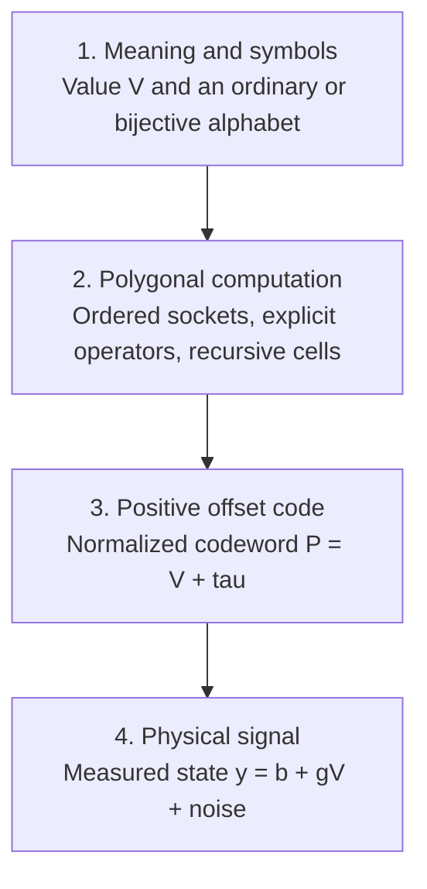
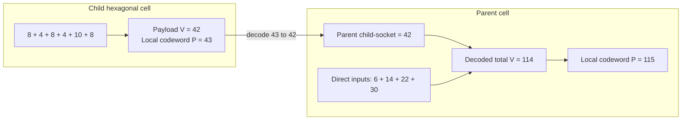

# Duotronic Positive-Baseline Polygonal Computation

## A Rigorous Framework for Bijective Symbol Systems, Recursive Hexagonal Aggregation, and Always-On Physical Encoding

**Author:** Hugh Armstrong, TBI Contracting Inc  
**Version:** 1.2  
**Date:** July 31, 2026  
**Status:** Technical framework and implementation specification

---

## Abstract

This paper defines a positive-baseline polygonal computation framework in which numerical meaning, numeral notation, recursive cell structure, and physical signal encoding are treated as separate layers. A bijective digit alphabet may represent positive values without a zero digit. A polygonal cell may combine local inputs and recursively contracted child cells. An optional offset then maps a decoded value $V$ to a normalized positive codeword $P=V+\tau$, with $\tau=1$ as the simplest active-baseline case.

The construction does not remove zero from mathematics. Instead, it gives a logical zero payload an active representation. In normalized form, $V=0$ is represented by $P=1$. In a physical implementation, a valid zero payload is carried by a calibrated nonzero current, voltage, pressure, optical intensity, heartbeat, or other measurable signal. This can allow a receiver to distinguish a valid zero from silence, an open circuit, a missing packet, or a failed producer.

The paper provides exact encoding and decoding rules, offset-preserving arithmetic, a recursive contraction law, a worked hexagonal example, an optional pronic-number test domain, implementation algorithms, hardware calibration guidance, conformance tests, and explicit limits on what the framework establishes. The result is a practical specification: each cell has a mandatory operator, an ordered set of active sockets, a declared payload domain, a baseline parameter, a decoded output contract, and a deterministic representation. Optional conformance profiles make restricted invariants, physical-channel requirements, and cyclic evaluation rules explicit rather than implicit.

A separate visualization layer maps decoded values and cell metadata to polygonal geometry. That layer is explicitly non-normative for arithmetic evaluation: a drawing may communicate the system, but only the declared data model and operators determine its result.

## Plain-language summary

The core idea is simple:

> Store or transmit a value on top of a known live baseline. A value of zero can then be represented by a real, detectable signal rather than by silence. When cells are nested, remove each child's local baseline before inserting the child's value into its parent.

Three independent ideas are combined:

1. A **bijective alphabet** such as $1,2,\ldots,9,A$ gives the positive values one through ten one-symbol names.
2. A **polygonal cell**, such as a hexagon, provides a repeatable set of local connection points.
3. A **positive baseline** makes a channel active even when its decoded payload is zero.

These ideas can be used together, but none proves or requires the others. Bijective notation does not require a hexagon. A hexagonal computation graph does not require bijective digits. An always-on physical signal does not require either one.

---

## 1. Problem statement

Numerical values, numeral strings, computation graphs, and physical signals are different objects:

- The integer forty-two is a **value**.
- The characters `42` are a **numeral** in a chosen notation.
- A hexagon containing six inputs is a **computation structure**.
- A voltage, current, pressure, pulse rate, optical intensity, or software heartbeat is a **physical or operational signal**.

Confusing these objects produces attractive diagrams but unstable mathematics. A change of alphabet may be mistaken for a change of value. A local hardware bias may accidentally be added to the payload. A visual centre marker may be treated simultaneously as an arithmetic coefficient, a geometric origin, and a physical baseline.

The grounded engineering problem is narrower:

> How can a system use a zero-free digit alphabet where useful, compose computations from local polygonal cells, and represent a zero payload on a physical channel that remains observably active?

A complete answer must preserve ordinary arithmetic, define every interface, and specify what happens at empty sockets, nested cells, failed channels, and domain boundaries.

In this paper, **Duotronic** names the combined engineering architecture: an explicitly typed symbolic interface, a recursively composable polygonal computation graph, and an optional always-on positive physical encoding. The term does not name a new arithmetic or imply that zero has been removed from mathematics.

### 1.1 Quick notation

| Symbol | Meaning |
|---|---|
| $V$ | Decoded semantic payload used by ordinary arithmetic |
| $P$ | Normalized positive-baseline codeword |
| $\tau$ | Normalized representation offset, usually $0$ or $1$ |
| $c$ | Arithmetic coefficient; never the representation baseline |
| $b$ | Calibrated physical baseline in measured units |
| $g$ | Physical gain per payload unit |
| $\mathcal D$ | Declared semantic payload domain |
| $s$ | Status carried separately from the numeric payload |

The compact distinction to retain is

\[
P=V+\tau,
\qquad
y=b+gV+\eta.
\]

The first equation is a normalized code. The second is a physical measurement model.

### 1.2 Design objectives

The framework is designed to:

1. preserve numerical meaning across every representation change;
2. keep the digit alphabet independent of the computation topology;
3. give every recursive child cell one unambiguous output value;
4. use a positive baseline without counting it more than once;
5. distinguish a valid encoded zero from a missing or failed signal;
6. distinguish an absent socket from a socket carrying zero;
7. separate arithmetic coefficients from representation offsets;
8. make restricted-domain invariants enforceable at construction and runtime;
9. define numeric, graph, and resource limits rather than inherit host-language behavior; and
10. make the system deterministic enough to serialize, test, and reproduce.

### 1.3 Defensible central claim

> A bijective symbolic interface can feed a recursive polygonal computation graph whose decoded result is lifted onto a strictly positive physical baseline, provided every local baseline is removed at cell boundaries and the physical channel is calibrated against noise and failure states.

### 1.4 Normative language

In this document, **must** identifies a requirement for conformance, **should** identifies a recommended engineering practice whose omission requires justification, and **may** identifies an optional feature. Illustrations and pronic mappings are explicitly nonnormative unless a profile imports them as data.

### 1.5 Capability profiles

Implementations need not support every extension. A serialized graph should declare the profiles on which its interpretation depends.

| Profile | Minimum meaning |
|---|---|
| `core-acyclic-1.2` | Deterministic acyclic cells, mandatory operators, decoded child interfaces, explicit absence, and cycle rejection |
| `positive-baseline-1` | Reversible $P=V+\tau$ encoding with the local baseline removed at outward interfaces |
| `even-payload-1` | Exact-integer payloads restricted to even values, with construction-time and runtime assertions |
| `physical-channel-1` | Declared $b$, $g$, tolerances, failure bands, units, sampling, and calibration policy |
| `feedback-delay-1` | Cycles permitted only through explicit one-tick-or-greater delays |
| `feedback-fixed-point-1` | Cycles evaluated by a declared, bounded fixed-point procedure with convergence semantics |

A profile name is a contract, not a descriptive tag. An implementation must reject an unknown required profile rather than silently approximate its behavior.

---

## 2. The four-layer model

The framework becomes coherent when divided into four layers.



| Layer | Object | Required question |
|---|---|---|
| Meaning | A value $V$ in a stated domain | What quantity is represented or computed? |
| Notation | A numeral string over an ordered alphabet | How is the quantity written and decoded? |
| Structure | A polygonal graph with operators and active sockets | How are inputs combined and child cells contracted? |
| Physical state | A measured signal with baseline, gain, and noise | How is a valid payload distinguished from silence or failure? |

The separation prevents two common errors:

1. changing a symbol string and unintentionally changing the represented value; and
2. treating a local physical baseline as though it were part of the child's payload.

---

## 3. Bijective numeration

### 3.1 Definition

Let $B\ge 1$ be a base and let

\[
\Sigma_B=\{\sigma_1,\sigma_2,\ldots,\sigma_B\}
\]

be an explicitly ordered digit alphabet. Assign the digit value

\[
d(\sigma_i)=i.
\]

For a nonempty numeral $s_1s_2\cdots s_m$, written from most significant to least significant symbol, define

\[
\operatorname{val}_B(s_1s_2\cdots s_m)
=
\sum_{i=1}^{m} d(s_i)B^{m-i}.
\]

The allowed digit values are $1,2,\ldots,B$, rather than $0,1,\ldots,B-1$. Every positive integer therefore has a unique finite bijective base-$B$ representation.

Logical zero is outside the language of nonempty bijective numerals. A system may represent it using:

- the empty string;
- a separate status token;
- a typed value outside the numeral alphabet; or
- the active physical baseline defined later.

### 3.2 Ordinary decimal and bijective base ten

For bijective base ten, use the symbols

\[
1,2,3,4,5,6,7,8,9,A,
\]

with $A=10$.

| Property | Ordinary decimal | Bijective base ten |
|---|---:|---:|
| Digit alphabet | $0,1,\ldots,9$ | $1,2,\ldots,9,A$ |
| Number of digit symbols | 10 | 10 |
| One-symbol values | 0 through 9 | 1 through 10 |
| Representation of ten | `10` | `A` |
| Logical zero | digit `0` | external or empty representation |

Both systems use ten digit symbols. Ordinary decimal does **not** require an eleventh digit to count to ten. The actual distinction is that bijective base ten allocates all ten one-symbol numerals to positive values.

This is useful for labels and interfaces in which every visible digit should carry a positive ordinal value. It is not evidence that ordinary decimal is structurally invalid.

### 3.3 Encoding

For $n>0$, bijective encoding uses an adjusted division step. At each iteration, compute

\[
n-1=qB+r,
\qquad
0\le r<B.
\]

Output $\sigma_{r+1}$, replace $n$ with $q$, and continue until $n=0$. The symbols are generated least significant first and must be reversed at the end.

Formally, the result is an ordered sequence of digit tokens. The examples below concatenate those tokens because every symbol in this particular alphabet is unambiguous as a single displayed digit.

In bijective base ten:

| Value | Bijective numeral |
|---:|---:|
| 1 | `1` |
| 9 | `9` |
| 10 | `A` |
| 11 | `11` |
| 20 | `1A` |
| 42 | `42` |
| 100 | `9A` |
| 101 | `A1` |

Converting forty-two from ordinary decimal to bijective base ten does not turn it into forty-three. Both strings represent the same integer.

### 3.4 Decoding

Decoding is the usual positional left fold. Starting with $v=0$, process each declared digit token from left to right:

\[
v\leftarrow Bv+d(s).
\]

At the end, $v$ is the represented positive integer.

### 3.5 Translation between alphabets

For two explicitly ordered bijective alphabets of bases $B$ and $C$, translation is

\[
\operatorname{translate}_{B\rightarrow C}
=
\operatorname{encode}_C\circ\operatorname{decode}_B.
\]

The integer is preserved; the string is not.

This makes the symbolic layer language-independent in a precise but limited sense. Each alphabet still requires:

- a published symbol order;
- one unique symbol per digit value;
- a normalization policy for visually similar characters;
- a decision about case, accents, and multi-code-point characters; and
- an external representation for zero, absence, invalid input, and unknown state.

An ordered alphabet built from the letters of a language is a custom positional code unless it follows that language's established numeral rules.

#### Implementation rule for Unicode alphabets

An implementation must enumerate the exact symbol strings that constitute the alphabet and assign each one a single published position. Unicode code points, grapheme clusters, accented forms, presentation variants, final forms, radicals, and combining-mark sequences do not acquire separate digit values merely because they are visually or linguistically related.

Two strings are distinct digits only when both are explicitly listed as distinct symbols. If normalization is permitted, the implementation must publish a normalization form and apply it before symbol lookup. For example, a Hebrew letter with a dagesh is not automatically a new digit, and a final-form letter is not automatically equivalent to its medial form. These choices belong to the alphabet specification, not to an unstated language heuristic.

The numeral parser should operate on a sequence of already identified digit tokens. Raw concatenation is safe only when the alphabet has a unique tokenization rule, such as fixed-width symbols, a prefix-free symbol set, or an explicit delimiter. This prevents a multi-code-point glyph from being split into unintended digits and prevents two valid symbols from being parsed ambiguously.

---

## 4. Positive-baseline encoding

### 4.1 Encoder and decoder

Let $V\ge 0$ be a decoded payload and let $\tau\ge 0$ be a fixed normalized baseline. Define

\[
E_\tau(V)=V+\tau
\]

and

\[
D_\tau(P)=P-\tau.
\]

The principal active-baseline mode uses $\tau=1$. It therefore maps

\[
0\mapsto1,\qquad
42\mapsto43,\qquad
114\mapsto115.
\]

The offset is reversible:

\[
D_\tau(E_\tau(V))=V.
\]

This is a biased representation of the payload, not a modification of the payload.

> **Important:** The construction does not abolish zero. It gives logical zero an active codeword.

### 4.2 Why the encoded value $1$ can act as an origin

Transport ordinary addition through the encoder by defining

\[
P\oplus_\tau Q
=
E_\tau\!\left(D_\tau(P)+D_\tau(Q)\right).
\]

Expanding the definition gives

\[
P\oplus_\tau Q=P+Q-\tau.
\]

The encoded additive identity is therefore $E_\tau(0)=\tau$. When $\tau=1$,

\[
P\oplus_1 1=P.
\]

This gives a rigorous meaning to the statement that the encoded system has its additive origin at $1$: the codeword $1$ represents decoded zero and is the identity of the transported addition operator.

It does **not** mean that the ordinary integer $1$ is equal to zero. It means that the physical or normalized codeword `1` decodes to the payload $0$.

This distinction should be visible in diagrams. A centre marker labeled `baseline 1` is different from a perimeter digit `1` representing the positive value one.

### 4.3 Transported arithmetic

Let

\[
P=x+\tau,
\qquad
Q=y+\tau.
\]

Arithmetic can be performed by decoding, applying the ordinary operation, and re-encoding. Equivalent codeword operations are:

#### Addition

\[
P\oplus_\tau Q=P+Q-\tau.
\]

#### Exact subtraction

For $x\ge y$,

\[
P\ominus_\tau Q=P-Q+\tau.
\]

#### Saturating nonnegative subtraction

\[
P\mathbin{\dot\ominus}_\tau Q
=
\max\!\left(\tau,P-Q+\tau\right).
\]

This represents $\max(0,x-y)$.

#### Multiplication

\[
P\otimes_\tau Q
=
(P-\tau)(Q-\tau)+\tau.
\]

The multiplicative identity is not $\tau$. It is

\[
E_\tau(1)=1+\tau.
\]

Thus, when $\tau=1$, the encoded multiplicative identity is $2$.

#### Division

For $y>0$,

\[
P\oslash_\tau Q
=
\frac{P-\tau}{Q-\tau}+\tau.
\]

An implementation must specify whether division is exact integer division, rational division, floating-point division, or a domain error when the quotient is not integral.

#### General transport principle

For any $k$-ary payload operation $f:\mathcal D^k\rightarrow\mathcal D$, define its encoded counterpart by

\[
f_\tau(P_1,\ldots,P_k)
=
E_\tau\!\left(
f(D_\tau(P_1),\ldots,D_\tau(P_k))
\right).
\]

Because $E_\tau$ is a bijection between $\mathcal D$ and the shifted code domain $E_\tau(\mathcal D)$, any equation expressed purely through transported operations holds in the encoded system exactly when its decoded counterpart holds in the payload system. Associativity, commutativity, and identity laws are therefore preserved when the underlying operation has them and the declared domain is closed.

This is the precise reason the origin can move from payload $0$ to codeword $\tau$ without declaring the ordinary numbers equal. The algebra is not replaced; it is carried through a reversible coordinate change.

#### Mixed baselines

The compact formulas above assume every operand and result uses the same $\tau$. If codewords use different baselines, each interface must identify its own offset. For addition with input baselines $\tau_P$ and $\tau_Q$ and result baseline $\tau_R$,

\[
R
=
E_{\tau_R}\!\left(D_{\tau_P}(P)+D_{\tau_Q}(Q)\right)
=
P+Q-\tau_P-\tau_Q+\tau_R.
\]

Applying the single-baseline shortcut $P+Q-\tau$ to mixed-baseline operands is invalid. Recursive cells avoid this ambiguity by decoding each child with that child's declared $\tau_j$ before the parent applies its own operator and result baseline.

### 4.4 The limited parity invariant

If $\tau=1$ and the payload domain is restricted to even integers, then

\[
V\equiv0\pmod2
\quad\Longrightarrow\quad
E_1(V)=V+1\equiv1\pmod2.
\]

The odd codeword can serve as a low-cost validity check on this restricted domain.

It is not a universal property. Once odd payloads or unrestricted operations are admitted, encoded states may be even or odd.

An implementation must not claim this invariant merely because its host type is `int`. Ordinary integer types contain both odd and even values. A conforming `even-payload-1` cell must use either:

- a refined or dependent type whose constructor accepts only even integers; or
- an explicit runtime `even_payload` assertion during construction, deserialization, child attachment, and evaluation.

The assertion must cover every present direct input, every decoded child payload, and the computed output. Checking only the final output is insufficient because two invalid odd inputs could sum to an apparently valid even result.

For exact integers and $\tau=1$, the check is bidirectional:

\[
V\equiv0\pmod2
\quad\Longleftrightarrow\quad
P=V+1\equiv1\pmod2.
\]

An odd codeword is therefore necessary and sufficient for an even decoded payload only after the record's baseline and exact-integer domain have already been authenticated. It does not by itself prove record integrity, freshness, or producer liveness.

### 4.5 Closure of a restricted payload domain

A restricted-domain profile must also state which operators preserve the domain. For the even integers:

- addition and subtraction are closed;
- multiplication by any integer is closed;
- an integer-weighted sum of even inputs is even;
- saturation at an even boundary preserves parity; and
- division is not generally closed, because an even dividend divided by an even divisor may be odd or nonintegral.

Consequently, a cell may claim `even-payload-1` only when its operator, weights, coefficient, rounding rule, and saturation rule are collectively closed on the declared domain, or when it performs and records a successful postcondition check. Floating-point values, `NaN`, infinities, and tolerance-based notions of evenness are outside this parity profile.

---

## 5. Physical grounding

A normalized integer codeword is not itself a current, voltage, pressure, or optical intensity. A physical implementation requires units, calibration, tolerance, and a failure model.

A simple measured channel is

\[
y=b+gV+\eta,
\]

where:

- $b>0$ is the physical baseline;
- $g>0$ is the gain per payload unit; and
- $\eta$ represents noise, interference, quantization error, and drift.

The receiver estimates the payload from

\[
\widehat V=\operatorname{round}\!\left(\frac{y-b}{g}\right)
\]

and accepts it only if the measured signal lies inside a defined decision interval:

\[
\left|y-(b+g\widehat V)\right|\le\delta.
\]

In the ideal normalized model, the live baseline corresponds to $\tau=1$. In hardware, $b$ and $g$ are independently calibrated quantities with real units.

### 5.1 Valid zero versus failed channel

Suppose an open circuit produces a signal near zero, while a valid zero payload produces a signal near $b$. The two conditions are distinguishable only if their uncertainty bands do not overlap.

A simple sufficient condition is

\[
b-\delta>y_{\text{fail,max}},
\]

where $y_{\text{fail,max}}$ is the largest signal expected from a failed channel.

This inequality states the real engineering requirement. The lower edge of the valid-baseline band must remain above the largest plausible failed-channel signal.

Temperature drift, leakage, quantization, interference, component aging, and calibration error all enlarge $\delta$. They cannot be eliminated by changing the numeral alphabet.

### 5.2 Costs and safeguards

An active baseline has real costs:

- **Energy:** an always-on signal consumes power or channel capacity.
- **Calibration:** the baseline and gain must be estimated and periodically verified.
- **Dynamic range:** the baseline consumes part of the available signal range.
- **Fault ambiguity:** a stuck output may imitate a valid baseline.
- **Noise:** moving the operating point does not automatically improve the signal-to-noise ratio.

A robust system may also require:

- timing or heartbeat constraints;
- sequence numbers;
- checksums or message authentication;
- redundant sensing paths;
- challenge-response tests;
- range and slew-rate limits; and
- an explicit `UNKNOWN` or `INVALID` state.

The baseline is one diagnostic feature, not a complete fault-tolerance system.

### 5.3 Minimal calibration and drift procedure

A simple two-point calibration measures the channel at decoded payload zero and at a known reference payload $V_{\mathrm{ref}}>0$. If the corresponding averaged measurements are $\bar y_0$ and $\bar y_{\mathrm{ref}}$, estimate

\[
\widehat b=\bar y_0,
\qquad
\widehat g=\frac{\bar y_{\mathrm{ref}}-\bar y_0}{V_{\mathrm{ref}}}.
\]

The implementation should then characterize residual error over its full range and operating conditions rather than infer $\delta$ from only two points. Calibration metadata should include time, temperature or other relevant environment, sample count, uncertainty, equipment identity where applicable, and the permitted recalibration interval.

During operation, a measurement outside every valid decision band must yield `UNKNOWN`, `INVALID`, or `FAULT` according to the declared policy; it must not be rounded to the nearest payload without limit. A baseline-only stuck fault remains possible, so systems that require evidence of a live producer should combine amplitude separation with timing, sequence, or challenge-response behavior.

---

## 6. Recursive polygonal cells

A polygonal cell is a local computation node with a finite set of sockets. A hexagon is attractive because it provides six symmetric neighbor directions, but the mathematics applies to triangles, squares, and arbitrary finite graphs.

Geometry controls routing and locality. An explicit evaluation rule controls value.

### 6.1 Cell definition

Define a cell $H$ by:

- an ordered active socket set $A(H)$;
- a child set $C(H)$;
- an operator $F_H$;
- an arithmetic coefficient $c_H$, if used; and
- a local representation baseline $\tau_H$.

Direct socket $i$ carries decoded input $x_i$. Child $j$ is another cell $H_j$. The decoded value is

\[
V(H)
=
F_H\!\left(
\{x_i:i\in A(H)\},
\{V(H_j):H_j\in C(H)\}
\right).
\]

The local positive codeword is

\[
P(H)=V(H)+\tau_H.
\]

For a coefficient-weighted additive cell, a useful concrete rule is

\[
V(H)
=
c_H\left(
\sum_i a_ix_i+
\sum_j b_jV(H_j)
\right),
\]

with nonnegative weights $a_i$ and $b_j$.

In the core profile, $c_H$ is a **global scalar**: it multiplies both the weighted direct-input sum and the weighted child-input sum. If only child contributions should be multiplied, that behavior must be expressed by the child weights $b_j$ or by a separately named operator, for example

\[
V(H)
=
\sum_i a_ix_i
+c_H\sum_j b_jV(H_j).
\]

This child-modifier form is not interchangeable with the core global-scalar rule and must have a distinct operator identifier in serialized records.

The coefficient and baseline are different parameters:

- $c_H$ changes the arithmetic result;
- $\tau_H$ changes only the representation of that result.

A visual centre may display one of these values, but a machine-readable cell record must store them separately.

### 6.1.1 Visual centre convention

When a diagram needs to show both the coefficient and the baseline at the geometric centre, the recommended glyph is a split centre marker:

- an **outer ring** displays the arithmetic coefficient $c_H$ or its declared symbol; and
- an **inner dot** displays the baseline mode $\tau_H$, normally `0` or `1`.

For example, an outer ring labeled `A` under bijective base ten may denote $c_H=10$, while an inner dot labeled `1` denotes $\tau_H=1$. Evaluation first computes the coefficient-governed payload and only then encodes it:

\[
V(H)=10S,
\qquad
P(H)=V(H)+1.
\]

The correct result is therefore $10S+1$, not $10(S+1)$. The split marker is a visualization convention, not a substitute for the separate `coefficient` and `baseline` fields in the cell record.

### 6.2 The child interface contract

The output of a child cell is its decoded value:

\[
\operatorname{out}(H_j)
=
D_{\tau_j}(P(H_j))
=
V(H_j).
\]

> **Contraction rule:** A parent consumes the child's decoded payload, never the child's local baseline.

This permits every cell to have its own live state without allowing the result to depend on the depth of nesting.

### 6.3 Contraction invariance

A well-formed cell tree is **contraction-invariant** if evaluating all leaves and operators directly gives the same decoded root value as evaluating each child, decoding its local codeword, and substituting the result into its parent.

#### Proposition 1: Contraction invariance

If every child interface outputs $V(H_j)$, then recursive contraction preserves the decoded root value.

#### Proof

For a leaf cell, the statement is immediate. Assume it holds for every child of a cell $H$. Each contracted child then contributes exactly $V(H_j)$, which is the same argument used by $F_H$ in the expanded tree. The input multiset or ordered input tuple of $F_H$ is unchanged, so $V(H)$ is unchanged. By structural induction, the decoded root value is invariant under any valid sequence of child contractions. $\square$

### 6.4 Why the local baseline must be removed

If a child with $\tau=1$ computes payload $42$, its local codeword is $43$. If the parent consumes $43$ as payload, one unit of representation bias enters the arithmetic.

At $d$ levels of nesting, repeated leakage can introduce a topology-dependent error. Two different groupings of the same leaves may then produce different results. Decoding at every boundary prevents this.

### 6.5 Quantifying baseline leakage in a linear cell

For the global-scaled weighted-sum operator,

\[
V(H)=c_H\left(\sum_i a_ix_i+\sum_j b_jV(H_j)\right),
\]

suppose the parent incorrectly substitutes a child's codeword $P(H_j)=V(H_j)+\tau_j$. The local payload error is exactly

\[
\Delta_H
=
c_H\sum_j b_j\tau_j.
\]

With unit coefficient, unit child weights, and $m$ active children using $\tau=1$, the cell is biased upward by $m$. Higher ancestors may then scale that error by their own coefficients and edge weights. This makes baseline leakage testable: the expected discrepancy can be calculated from the graph rather than described only as a qualitative nesting problem.

The formula also shows why a visual instruction such as “subtract one once at the root” is not sufficient. Each local baseline belongs to a particular child interface and must be removed before any parent-specific weight or coefficient is applied.

---

## 7. Worked hexagonal example

Consider a child hexagon whose six active sockets contain

\[
8,4,8,4,10,8.
\]

With unit weights and $c=1$,

\[
V(H_{\text{child}})
=
8+4+8+4+10+8
=
42.
\]

In active-baseline mode,

\[
\tau_{\text{child}}=1
\]

and therefore

\[
P(H_{\text{child}})=42+1=43.
\]

The child reports

\[
\operatorname{out}(H_{\text{child}})
=
D_1(43)
=
42.
\]

Now consider a parent cell with direct decoded inputs

\[
6,14,22,30
\]

and the contracted child output $42$. With $c=1$,

\[
V(H_{\text{parent}})
=
6+14+22+30+42
=
114.
\]

The parent has its own local baseline:

\[
P(H_{\text{parent}})=114+1=115.
\]



If the parent incorrectly consumed the child's physical codeword $43$, it would calculate a decoded total of $115$ and then add its own baseline to produce $116$. The extra unit is the signature of a leaked child baseline.

---

## 8. Pronic numbers as an optional structured domain

Pronic numbers can provide regular test cases, landmarks, or grouping targets. They are not required by the polygonal framework.

To avoid confusing pronic values with physical codewords $P$, denote the $n$-th positive pronic by

\[
R_n=n(n+1),
\qquad n\ge1.
\]

Consecutive pronics satisfy

\[
R_{n+1}-R_n=2(n+1).
\]

The even integers strictly between $R_n$ and $R_{n+1}$ are

\[
W_n=\{R_n+2j:1\le j\le n\}.
\]

Therefore,

\[
|W_n|=n
\]

and

\[
\sum_{w\in W_n}w=n(n+1)^2.
\]

Examples are

\[
W_1=\{4\},
\qquad
W_2=\{8,10\},
\qquad
W_3=\{14,16,18\}.
\]

The cumulative sum through gap $N$ is

\[
\sum_{n=1}^{N}n(n+1)^2
=
\frac{N(N+1)(N+2)(3N+5)}{12}.
\]

### 8.1 Relationship to the worked example

The values in the worked geometry include

\[
42=6\cdot7=R_6
\]

and

\[
72=8\cdot9=R_8.
\]

These are useful demonstration targets. They do not make the decomposition into socket values unique, and they do not imply that six-directional symmetry is intrinsic to pronic numbers.

Many additive partitions produce the same total. A canonical pronic decomposition requires an additional deterministic rule and a proof of uniqueness, optimality, or another measurable advantage.

Coefficient examples are also selective:

\[
10\cdot42=420=R_{20},
\]

\[
11\cdot42=462=R_{21}.
\]

An arbitrary coefficient does not necessarily preserve the pronic property. For example,

\[
35\cdot42=1470
\]

is not pronic.

### 8.2 Nonnormative mappings from pronic gaps to six sockets

A hexagon can display pronic-gap data, but the mapping must be declared rather than treated as inherent geometry. Two useful visualization profiles are:

1. **Flattened-gap profile.** Enumerate the members of $W_1,W_2,\ldots$ in increasing gap order and place the first six values clockwise:

   | Socket | Source | Value |
   |---:|---:|---:|
   | 0 | $W_1[1]$ | 4 |
   | 1 | $W_2[1]$ | 8 |
   | 2 | $W_2[2]$ | 10 |
   | 3 | $W_3[1]$ | 14 |
   | 4 | $W_3[2]$ | 16 |
   | 5 | $W_3[3]$ | 18 |

   Their socket sum is

   \[
   4+8+10+14+16+18=70.
   \]

2. **Gap-aggregate profile.** Assign one gap total to each socket. Because

   \[
   G_n=\sum_{w\in W_n}w=n(n+1)^2,
   \]

   the first six clockwise socket values are

   \[
   4,18,48,100,180,294.
   \]

   These correspond to $G_1$ through $G_6$. Their six-socket total is

   \[
   \sum_{n=1}^{6}G_n
   =
   \sum_{n=1}^{6}n(n+1)^2
   =
   644.
   \]

In particular,

\[
14+16+18=48
\]

is the element-sum of $W_3$. The element-sum across $W_1,W_2,$ and $W_3$ is $70$. Neither profile is canonical; each is a deterministic bridge between pronic-domain data and a six-socket display.

---

## 9. Deterministic cell specification

A drawing becomes an executable system only after it has a canonical data model.

At minimum, each cell should specify:

| Field | Meaning | Required rule |
|---|---|---|
| `version` | Schema version | Required for reproducible decoding |
| `cell_id` | Stable identifier within a graph package | Required when children are referenced by identifier |
| `profiles` | Required capability contracts | Unknown required profiles cause rejection |
| `alphabet` | Ordered symbol set and base | One symbol per digit value |
| `payload_domain` | Numeric kind and admissible values | Validated at inputs, child boundaries, and outputs |
| `operator` | Registered arithmetic operation | **Mandatory; no implicit fallback operator is permitted** |
| `coefficient` | Arithmetic multiplier or parameter | Separate from the baseline |
| `baseline` | $\tau_H$ for the local codeword | Removed at every outward interface |
| `sockets` | Ordered direct inputs | Empty is `null`, not numeric zero |
| `direct_weights` | Per-socket arithmetic weights | Defaults to one per socket when omitted |
| `children` | Ordered child cells or references | Each contributes decoded payload |
| `child_weights` | Per-child arithmetic weights | Defaults to one per child when omitted |
| `centre_display` | Optional visual mapping | Never controls arithmetic semantics |
| `numeric_policy` | Overflow, rounding, and nonfinite-value rules | Must be deterministic for the declared domain |
| `units` | Physical units and gain | Never inferred from normalized integers |
| `status` | Validity or fault state | Separate from numeric payload |

### 9.1 Example cell record

```json
{
  "version": "1.2",
  "type": "hex-cell",
  "cell_id": "hex-child-42",
  "profiles": [
    "core-acyclic-1.2",
    "positive-baseline-1",
    "even-payload-1"
  ],
  "alphabet": {
    "base": 10,
    "symbols": ["1", "2", "3", "4", "5", "6", "7", "8", "9", "A"]
  },
  "payload_domain": {
    "kind": "integer",
    "minimum": 0,
    "multiple_of": 2
  },
  "operator": "global-scaled-weighted-sum",
  "coefficient": 1,
  "baseline": 1,
  "numeric_policy": {
    "overflow": "reject",
    "nonfinite": "reject"
  },
  "centre_display": {
    "outer_ring": "coefficient",
    "inner_dot": "baseline"
  },
  "socket_order": "north-clockwise",
  "sockets": [8, 4, 8, 4, 10, 8],
  "direct_weights": [1, 1, 1, 1, 1, 1],
  "children": [],
  "child_weights": [],
  "payload": 42,
  "codeword": 43,
  "status": "VALID"
}
```

The stored `payload` and `codeword` may be treated as derived values and recalculated during validation.

The `operator` field is mandatory even when the intended operation appears obvious from the weights or diagram. There is no default operator. A missing or unknown operator makes the record invalid because silently assuming addition would change the meaning of records intended for products, thresholds, transforms, or future extensions.

By contrast, `direct_weights` and `child_weights` may be omitted. Their only defined defaults are vectors of ones whose lengths match `sockets` and `children`, respectively. An explicitly supplied weight vector with the wrong length is invalid; it is not padded or truncated.

### 9.1.1 Core operator registry

An operator identifier must resolve to a versioned definition that declares its formula, admissible domain, unit rule, arity, status propagation, and closure properties. Version 1.2 defines two additive operators:

| Operator identifier | Decoded formula | Coefficient scope |
|---|---|---|
| `global-scaled-weighted-sum` | $c_H(\sum_i a_ix_i+\sum_j b_jV(H_j))$ | Direct and child contributions |
| `child-scaled-weighted-sum` | $\sum_i a_ix_i+c_H\sum_j b_jV(H_j)$ | Child contribution only |

The two names are not aliases. A custom operator should use a collision-resistant namespace, such as a stable URI or organization-qualified identifier, and must not reuse a core identifier with different semantics.

### 9.2 Empty sockets and zero payloads

An unused socket and a socket carrying decoded zero are different states.

Use one of the following for absence:

- `null`;
- an occupancy bitmap;
- a tagged union;
- a typed `ABSENT` state; or
- a separate connection table.

Do not overload numeric zero to mean both `connected value zero` and `no connection`.

In a bijective input alphabet, absence is not a digit. It is structural metadata.

### 9.3 Order, rotation, and symmetry

If $F_H$ is a commutative sum with equal weights, rotating or permuting sockets does not change the value.

If sockets have different weights, directions, units, or operations, they must be indexed in a published order. A canonical hexagonal order might begin at north and proceed clockwise.

Symmetry is therefore a tested property of a cell type, not an automatic consequence of drawing a hexagon.

### 9.4 Cycles

The core recursive profile requires an acyclic child relation. Its evaluator must detect a back-edge and reject the graph with a cycle error rather than recurse indefinitely or return a traversal-dependent value.

A cyclic extension must choose and publish one of two explicit models:

1. **Delayed feedback.** Every feedback edge contains a delay register, so the value used during tick $t+1$ is the source value from tick $t$. The specification must define initial register values, update order, tick rate, and reset behavior.
2. **Fixed-point evaluation.** For a state vector $v$, external inputs $u$, and declared update map $F$, evaluate synchronously by

   \[
   v^{(t+1)}=F(v^{(t)},u).
   \]

   The profile must define $v^{(0)}$, a norm, tolerance $\varepsilon$, iteration limit $K$, rounding rules, and failure behavior. It accepts a result only when

   \[
   \lVert v^{(t+1)}-v^{(t)}\rVert\le\varepsilon.
   \]

   A sufficient reusable convergence condition is that $F$ is a contraction on the declared state domain: for some $0\le L<1$,

   \[
   \lVert F(v,u)-F(w,u)\rVert\le L\lVert v-w\rVert.
   \]

   Under that condition, Banach's fixed-point theorem gives a unique fixed point in a complete invariant domain.

Other evaluation models are possible, such as:

- synchronous state updates;
- asynchronous message passing;
- a fixed-point equation;
- bounded iteration;
- event-driven propagation; or
- an explicit delay on every feedback edge.

Without a declared cyclic profile, a cyclic cell graph is invalid under this specification.

### 9.5 Status and error semantics

Numeric payloads must not double as control or fault sentinels. Each occupied interface carries a status separately from any value:

| Status | Meaning | Numeric participation |
|---|---|---|
| `VALID` | A payload exists and passed validation | Included in evaluation |
| `UNKNOWN` | The connection exists but no current value is known | No numeric payload may be consumed |
| `INVALID` | The record or value failed schema, domain, or integrity checks | Evaluation fails |
| `FAULT` | The producer or physical channel reports a failure | Evaluation fails unless an operator declares recovery semantics |
| `ABSENT` | No socket or edge is present | Structural state; not an occupied input |

The default **strict propagation** policy evaluates a cell only when every occupied required input is `VALID`. Otherwise, `INVALID` takes precedence over `FAULT`, which takes precedence over `UNKNOWN`. `ABSENT` inputs are excluded structurally before evaluation.

An operator may declare a different policy, such as quorum voting or missing-data imputation, but the policy must be part of the operator definition and its result must remain distinguishable from an unqualified valid measurement. No policy may reinterpret `INVALID`, `UNKNOWN`, `FAULT`, or `ABSENT` as the numeric payload zero without an explicit conversion step.

### 9.6 Numeric and resource determinism

The mathematical equations use ideal integers or reals, but an interoperable implementation must publish its machine-level behavior. At minimum, it must state:

- numeric kind: unbounded integer, bounded signed or unsigned integer, rational, fixed point, decimal, or binary floating point;
- lower and upper payload bounds;
- overflow behavior: reject, saturate, or a declared modular reduction;
- rounding mode and evaluation order where rounding can occur;
- whether negative zero, `NaN`, or infinity can appear;
- maximum numeral length, socket count, child count, node count, and recursion depth; and
- time, memory, or iteration limits for graph evaluation.

The core exact-integer profile rejects nonfinite values and rejects overflow. Saturation and modular arithmetic are distinct operator semantics, not invisible implementation details.

These limits also protect the evaluator from adversarial or accidental resource exhaustion. Cycle detection prevents infinite recursion but does not by itself prevent a very deep acyclic graph, exponentially duplicated subgraphs, oversized integers, or an unbounded fixed-point calculation.

### 9.7 Canonical serialization and graph identity

When cell records are hashed, signed, cached, or used as witnesses, the profile must define canonical bytes. A practical rule is:

1. normalize symbol strings according to the alphabet policy;
2. expand permitted defaults or define their canonical omission consistently;
3. order object keys and encode numbers by a single canonical rule;
4. preserve array order for sockets, children, and weights;
5. exclude explicitly nonnormative display metadata from arithmetic identity; and
6. either exclude derived `payload` and `codeword` caches or recompute and verify them before hashing.

For a declared hash algorithm $h$, a content identifier can then be defined by

\[
\operatorname{cid}(H)
=
h\!\left(\operatorname{canonical}(H_{\mathrm{norm}})\right),
\]

where $H_{\mathrm{norm}}$ contains exactly the normative fields selected by the profile. The algorithm name, canonicalization version, and included-field set are part of the identity contract.

A graph package should assign unique local `cell_id` values, identify one root, and represent shared children by reference rather than by ambiguous textual duplication. A content hash and a local cell identifier serve different purposes: the first describes bytes; the second names a node within one package.

### 9.8 Two-stage record validation

Validation occurs in two stages:

1. **Syntactic validation** checks required fields, basic types, enumerations, and simple bounds against a published JSON Schema or equivalent interface definition.
2. **Semantic validation** resolves the operator, checks profile support, verifies weight lengths, tokenization, units, domain closure, child references, derived fields, resource limits, and graph acyclicity or feedback semantics.

Passing a JSON Schema is therefore necessary but not sufficient. A schema cannot by itself establish that a child graph is acyclic, that every `even-payload-1` input is even after reference resolution, or that two physical units are compatible. Appendix C provides a minimal syntactic schema; the semantic checks remain normative.

---

## 10. Reference algorithms

### 10.1 Bijective encoding

```python
def bijective_encode(
    n: int,
    alphabet: list[str],
) -> tuple[str, ...]:
    if n <= 0:
        raise ValueError("bijective numerals represent positive integers")
    if not alphabet or len(set(alphabet)) != len(alphabet):
        raise ValueError("alphabet must contain unique symbols")

    base = len(alphabet)
    output: list[str] = []

    while n > 0:
        n, remainder = divmod(n - 1, base)
        output.append(alphabet[remainder])

    return tuple(reversed(output))
```

For a single-glyph or otherwise uniquely tokenized alphabet, presentation may concatenate the returned tokens. Tokenization and rendering are interface policies, not part of the numerical value.

### 10.2 Bijective decoding

```python
def bijective_decode(
    symbols: tuple[str, ...] | list[str],
    alphabet: list[str],
) -> int:
    if not symbols:
        raise ValueError("empty sequence is not a positive bijective numeral")
    if not alphabet or len(set(alphabet)) != len(alphabet):
        raise ValueError("alphabet must contain unique symbols")

    base = len(alphabet)
    digit = {symbol: index + 1 for index, symbol in enumerate(alphabet)}
    value = 0

    for symbol in symbols:
        try:
            value = base * value + digit[symbol]
        except KeyError as error:
            raise ValueError(f"symbol not in alphabet: {symbol!r}") from error

    return value
```

### 10.3 Positive-baseline transport

```python
def encode_baseline(payload: int | float, tau: int | float = 1):
    return payload + tau


def decode_baseline(codeword: int | float, tau: int | float = 1):
    return codeword - tau


def encoded_add(p, q, tau=1):
    return p + q - tau


def encoded_subtract_saturating(p, q, tau=1):
    return max(tau, p - q + tau)


def encoded_multiply(p, q, tau=1):
    return (p - tau) * (q - tau) + tau
```

### 10.4 Recursive cell evaluation

```python
from dataclasses import dataclass, field


@dataclass
class Cell:
    operator: str
    sockets: list[int | float | None]
    status: str
    children: list["Cell"] = field(default_factory=list)
    coefficient: int | float = 1
    baseline: int | float = 1
    direct_weights: list[int | float] | None = None
    child_weights: list[int | float] | None = None
    require_even_payload: bool = False


@dataclass(frozen=True)
class CellResult:
    payload: int | float
    codeword: int | float


CORE_OPERATORS = {
    "global-scaled-weighted-sum",
    "child-scaled-weighted-sum",
}


def assert_exact_even(value, label: str) -> None:
    if type(value) is not int or value % 2 != 0:
        raise ValueError(f"{label} must be an exact even integer")


def evaluate(
    cell: Cell,
    *,
    _active: set[int] | None = None,
    _memo: dict[int, CellResult] | None = None,
) -> CellResult:
    """Evaluate an acyclic cell graph and reject recursive back-edges."""
    if _active is None:
        _active = set()
    if _memo is None:
        _memo = {}

    cell_id = id(cell)
    if cell_id in _active:
        raise RecursionError("cyclic cell reference")
    if cell_id in _memo:
        return _memo[cell_id]

    if cell.operator not in CORE_OPERATORS:
        raise ValueError(f"missing or unknown operator: {cell.operator!r}")
    if cell.status != "VALID":
        raise ValueError(f"cell is not evaluable: status={cell.status!r}")

    _active.add(cell_id)
    try:
        direct_weights = (
            [1] * len(cell.sockets)
            if cell.direct_weights is None
            else cell.direct_weights
        )
        child_weights = (
            [1] * len(cell.children)
            if cell.child_weights is None
            else cell.child_weights
        )

        if len(direct_weights) != len(cell.sockets):
            raise ValueError("one direct weight is required per socket")
        if len(child_weights) != len(cell.children):
            raise ValueError("one child weight is required per child")

        if cell.require_even_payload:
            for index, value in enumerate(cell.sockets):
                if value is not None:
                    assert_exact_even(value, f"socket {index}")
            for index, weight in enumerate(direct_weights):
                if type(weight) is not int:
                    raise ValueError(
                        f"direct weight {index} must be an exact integer"
                    )
            for index, weight in enumerate(child_weights):
                if type(weight) is not int:
                    raise ValueError(
                        f"child weight {index} must be an exact integer"
                    )
            if type(cell.coefficient) is not int:
                raise ValueError("coefficient must be an exact integer")

        direct_sum = sum(
            weight * value
            for weight, value in zip(direct_weights, cell.sockets)
            if value is not None
        )

        child_sum = 0
        for weight, child in zip(child_weights, cell.children):
            child_result = evaluate(
                child,
                _active=_active,
                _memo=_memo,
            )
            decoded_child = decode_baseline(
                child_result.codeword,
                child.baseline,
            )
            if cell.require_even_payload:
                assert_exact_even(decoded_child, "decoded child payload")
            child_sum += weight * decoded_child

        if cell.operator == "global-scaled-weighted-sum":
            payload = cell.coefficient * (direct_sum + child_sum)
        else:
            payload = direct_sum + cell.coefficient * child_sum

        if cell.require_even_payload:
            assert_exact_even(payload, "cell output")

        result = CellResult(
            payload=payload,
            codeword=encode_baseline(payload, cell.baseline),
        )
        _memo[cell_id] = result
        return result
    finally:
        _active.remove(cell_id)
```

The `operator` and `status` arguments have no defaults, so constructing a cell requires the caller to choose semantics and supply an explicit validity state. The active recursion stack detects a genuine back-edge. The memo table permits a directed acyclic graph to share the same child object without falsely classifying that reuse as a cycle.

When `require_even_payload=True`, the reference evaluator enforces the restricted profile at every present direct input, every decoded child interface, and the output. It also requires exact integer weights and coefficients so the configured operator is closed on even integers. Production code should derive this flag from the record's declared profiles rather than expose two independent declarations that could disagree.

A production implementation should additionally:

- define integer overflow behavior;
- check units and types;
- resolve versioned custom operators;
- authenticate child records where required;
- separate evaluation errors from payload zero; and
- make recursion and resource limits explicit.

---

## 11. How to use the framework

A practical design process consists of seven explicit decisions.

### Step 1: Choose capability profiles

Declare the minimum profiles every evaluator must support. Do not attach `even-payload-1`, a physical-channel profile, or a feedback profile unless all of its validation and test requirements are implemented.

### Step 2: Choose the semantic domain

State whether payloads are:

- nonnegative integers;
- positive integers;
- signed integers;
- rationals;
- real measurements;
- bounded machine words; or
- typed quantities with units.

The domain determines which operations are closed and which boundary cases must be handled.

### Step 3: Choose the symbolic interface

Use ordinary notation or publish an ordered bijective alphabet. Define how the following are represented:

- logical zero;
- absence;
- unknown;
- invalid input; and
- failed source.

These conditions should not silently share one symbol.

### Step 4: Choose the topology

Specify:

- socket count;
- orientation;
- canonical socket order;
- adjacency rules;
- occupancy representation;
- permitted child depth; and
- whether rotation should preserve meaning.

### Step 5: Choose the operator

Define:

- direct-input weights;
- child weights;
- coefficients;
- nonlinear functions;
- rounding;
- overflow;
- domain errors; and
- unit compatibility.

Select a mandatory operator identifier and do this independently of the centre baseline. Also declare status propagation, numeric bounds, resource limits, and whether omitted weight arrays receive the unit-weight defaults.

### Step 6: Choose the physical code

Set $\tau$ in the normalized model. For a physical implementation, also set:

- baseline $b$;
- gain $g$;
- tolerance $\delta$;
- sample or update rate;
- valid range;
- failure thresholds; and
- recalibration policy.

### Step 7: Make it reproducible

Version the schema, serialize it deterministically, publish test vectors, and compare expanded and contracted evaluations. If records are hashed or signed, publish the canonicalization and included-field rules as part of the profile.

---

## 12. Validation and acceptance tests

A conforming implementation should pass at least the following tests.

### 12.1 Symbol round trip

For every supported positive integer $n$,

\[
\operatorname{decode}(\operatorname{encode}(n))=n.
\]

### 12.2 Baseline round trip

For every supported payload $V$,

\[
D_\tau(E_\tau(V))=V.
\]

### 12.3 Arithmetic equivalence

For every supported operation $f$,

\[
D_\tau\!\left(f_\tau(E_\tau(x),E_\tau(y))\right)=f(x,y).
\]

### 12.4 Contraction invariance

The expanded tree and every valid sequence of recursive child contractions must produce the same decoded root value.

### 12.5 No baseline leakage

Tests should deliberately replace a child payload with its physical codeword and verify that the interface or conformance checker rejects the substitution.

### 12.6 Occupancy distinction

The system must keep the following states distinct:

- absent socket;
- present socket with payload zero;
- invalid input;
- unknown value; and
- failed producer.

### 12.7 Symmetry

Rotations and reflections should preserve value only for cell types that explicitly declare the relevant symmetry.

### 12.8 Physical separation

The valid-baseline and failed-channel uncertainty bands must remain nonoverlapping across the specified operating range.

### 12.9 Fault injection

Test at least:

- open circuit;
- stuck at baseline;
- stuck at a nonbaseline value;
- saturation;
- delayed heartbeat;
- dropped child record;
- corrupted child record; and
- baseline drift.

### 12.10 Canonical serialization

Equivalent cell records should produce identical canonical bytes or hashes wherever deterministic identity is required.

### 12.11 Cycle handling

The acyclic profile must reject direct self-reference and longer feedback loops. A cyclic profile must additionally test its declared initialization, update semantics, convergence or delay behavior, iteration limit, and nonconvergence status.

### 12.12 Operator and weight defaults

Conformance tests must verify that:

- a missing operator is rejected;
- an unknown operator is rejected;
- omission of `direct_weights` produces one unit weight per socket;
- omission of `child_weights` produces one unit weight per child; and
- an explicitly supplied weight vector with the wrong length is rejected.

### 12.13 Restricted-domain assertions

The `even-payload-1` suite must include:

- an odd direct input that is rejected;
- two odd direct inputs whose even sum is still rejected;
- an odd decoded child output that is rejected at attachment or evaluation;
- a noninteger weight or coefficient that is rejected; and
- a valid all-even nested graph whose codewords are odd when $\tau=1$.

These tests demonstrate that the profile validates its input domain, not merely the parity of the final answer.

### 12.14 Numeric and resource boundaries

Test the minimum and maximum payloads, exact overflow boundary, maximum numeral length, maximum permitted node and depth counts, and every rounding or saturation edge. Floating-point profiles must test signed zero, nonfinite inputs, operation ordering, and canonical serialization of numbers. Fixed-point profiles must test scale agreement and quantization boundaries.

### 12.15 Record integrity

When `payload` or `codeword` is stored, alter each derived field independently and verify that validation detects the mismatch. When content identifiers are used, semantically identical records must canonicalize identically, while a change to any included normative field must change the identifier with overwhelming probability under the declared hash function.

---

## 13. Suitable applications

### 13.1 Always-on instrumentation

Sensors, process monitors, or communication links may benefit when a valid zero reading must remain distinguishable from a dead channel. The baseline provides liveness evidence only to the extent supported by the actual channel and failure model.

### 13.2 Modular reduction networks

Recursive polygonal cells can summarize local groups and pass decoded results upward. Possible uses include:

- hierarchical aggregation;
- spatial sensor grids;
- distributed monitoring;
- local consensus or voting;
- multiresolution visualization; and
- computation systems requiring a stable child-to-parent contract.

### 13.3 Human-readable symbol systems

Bijective alphabets assign one-symbol names to the first $B$ positive values. This is useful for:

- compact labels;
- spreadsheet-style identifiers;
- ordered categories;
- human-facing socket labels; and
- translation between explicitly ordered symbol sets.

An additive letter score is not automatically a bijective numeral system. In a true positional bijective system, symbol order and position both matter.

### 13.4 Fault-aware software state

The baseline concept can be implemented in software as:

- a heartbeat;
- an epoch or sequence counter;
- a validity token;
- a typed envelope;
- an authenticated witness; or
- an explicit `VALID`, `INVALID`, or `UNKNOWN` state.

In software, the main benefit is usually not arithmetic efficiency. It is the separation of `valid payload zero` from `no observation`, `unknown`, or `failed producer`.

### 13.5 Analog and neuromorphic systems

A nonzero operating baseline may be useful where a zero-amplitude state lies too close to the hardware noise floor or is indistinguishable from an inactive element. However, the implementation must be analyzed in its own physical units and should be compared against conventional biasing, differential signaling, redundancy, and explicit validity channels.

### 13.6 Auditable aggregation and witness records

A versioned cell graph can serve as a compact, independently recomputable witness of how local inputs were aggregated. Canonical records, mandatory operator identifiers, decoded child contracts, and verified derived fields allow another implementation to reproduce the root result and locate the first divergent cell.

This supports auditability of the declared computation. It does not prove that source observations are true, that a custom operator is appropriate, or that an opaque upstream model is correct. Those claims require separate provenance, authentication, and domain validation.

---

## 14. Limitations and non-claims

| The framework supports | It does not establish |
|---|---|
| A digit alphabet with no zero digit | That zero is erroneous or absent from mathematics |
| An active codeword for logical zero | That an offset automatically defeats noise or faults |
| Recursive contraction of local cells | A unique decomposition of every integer |
| Hexagonal locality and six directions | That pronics possess intrinsic sixfold geometry |
| Translation through a shared integer value | That additive letter strings are bijective numerals |
| Parity checks on a restricted even domain | That all physical codewords are always odd |
| Selected coefficient-to-pronic identities | That arbitrary coefficients preserve pronics |
| A positive representation of the additive identity | That ordinary $1$ and ordinary $0$ are the same number |
| Canonical graph records and reproducible evaluation | That inputs, operators, or external claims are truthful |
| Construction-time and runtime domain assertions | That parity is an error-correcting or cryptographic integrity code |

The method should be evaluated against simpler alternatives. Depending on the application, any of the following may be cheaper or clearer:

- a conventional zero digit plus a validity bit;
- a framed packet with a checksum;
- a separate sensor-health line;
- differential signaling;
- a sequence number or heartbeat;
- an explicit option type; or
- a conventional tree or mesh reduction graph.

The positive-baseline construction is justified when liveness, locality, recursive composition, or a zero-free symbolic boundary provides a measurable benefit that outweighs energy, calibration, and protocol complexity.

---

## 15. Research and engineering agenda

The following questions remain open and testable:

1. Can a deterministic polygonal decomposition improve compression, routing, proof generation, or fault isolation?
2. Does a hexagonal topology outperform ordinary trees, grids, or meshes under a defined workload?
3. What baseline power, noise margin, drift, and fault coverage are obtained in a physical prototype?
4. Which typed operator system best prevents incompatible quantities from being combined?
5. Can canonical cell records support stable hashes, proofs, or witness contracts?
6. Which error-detecting invariants provide more coverage than the restricted parity rule?
7. Do polygonal visualizations improve human comprehension or merely change presentation?
8. What is the cost of local decoding at each recursive boundary?
9. Under what rules, if any, does a useful canonical pronic decomposition exist?
10. How should cyclic polygon networks be specified and proven convergent?
11. Which canonical serialization and operator-registry design best supports long-lived interoperability?
12. Can a stronger checksum, residue code, or authenticated tag complement the restricted parity invariant at acceptable cost?
13. Which portions of the core profile can be mechanically verified in a proof assistant or model checker?
14. How should profile negotiation behave when distributed nodes support different numeric domains or feedback semantics?
15. What threat model is appropriate for malicious graphs, forged child records, replayed measurements, and resource-exhaustion inputs?

Useful future prototypes should publish test vectors, schematics, calibration data, error budgets, energy measurements, and comparisons with simpler baselines.

---

## 16. Conclusion

The strongest version of the Duotronic idea is not that zero should be removed from mathematics. It is that a system can avoid a zero digit at its symbolic boundary, preserve ordinary decoded arithmetic inside a recursive polygonal graph, and represent a zero payload with a live physical baseline.

These are three precise design choices joined by explicit encoders, decoders, and cell interfaces.

Once the layers are separated, the centre value $1$ acquires a grounded role. In the normalized $\tau=1$ representation, it is the codeword of decoded zero and the identity of transported addition:

\[
P\oplus_1 1=P.
\]

It is not an extra quantity to be summed into every ancestor, and it is not automatically an arithmetic multiplier. A child cell computes its payload, lifts the payload onto its active local baseline, and removes that lift when reporting upward. This contraction law preserves the expanded computation at every nesting depth.

The resulting framework can be implemented directly:

1. declare required capability profiles;
2. choose and enforce a payload domain;
3. choose an alphabet;
4. define the polygon topology;
5. select a mandatory, versioned operator;
6. separate coefficients from baselines;
7. define status, numeric, and resource policies;
8. calibrate the physical channel;
9. publish a deterministic schema and canonicalization rule; and
10. test round trips, contraction invariance, domain guards, and fault separation.

Its value should then be judged by measurable properties: liveness detection, fault coverage, modularity, routing efficiency, human comprehension, power cost, dynamic range, and noise margin.

---

## Appendix A. Notation

| Symbol | Meaning |
|---|---|
| $V$ | Decoded semantic payload |
| $\mathcal D$ | Declared semantic payload domain |
| $B$ | Base or alphabet size |
| $\Sigma_B$ | Ordered bijective digit alphabet |
| $d(\sigma_i)$ | Value assigned to digit symbol $\sigma_i$ |
| $\tau$ | Normalized representation baseline |
| $P=V+\tau$ | Positive-baseline codeword |
| $b$ | Physical baseline in measured units |
| $g$ | Physical gain per payload unit |
| $\eta$ | Noise and drift |
| $H$ | Polygonal computation cell |
| $F_H$ | Cell evaluation operator |
| $c_H$ | Arithmetic coefficient, separate from $\tau_H$ |
| $s$ | Status carried separately from the numeric payload |
| $\Delta_H$ | Payload error caused by baseline leakage at cell $H$ |
| $R_n=n(n+1)$ | The $n$-th positive pronic number |
| $W_n$ | Even integers strictly between $R_n$ and $R_{n+1}$ |
| $G_n=n(n+1)^2$ | Sum of the elements in pronic gap $W_n$ |

## Appendix B. Minimal conformance profile

An implementation conforms to the minimal profile if it publishes:

1. the exact profile names it requires;
2. its payload domain and numeric policy;
3. its ordered alphabet or ordinary notation;
4. its mandatory operator identifier, definition, weight defaults, and socket order;
5. its baseline and decode rule;
6. its absent, invalid, unknown, and fault states;
7. graph and resource limits, including cycle behavior;
8. at least one nested contraction test vector;
9. canonical serialization rules when deterministic identity is claimed; and
10. physical calibration and failure thresholds when real signals are used.

A diagram without these items may still be illustrative, but it is not yet an interoperable computation specification.

## Appendix C. Minimal JSON Schema for a cell record

The following Draft 2020-12 schema is a syntactic starting point. It intentionally leaves operator-specific and graph-wide checks to the semantic validator described in Section 9.8.

```json
{
  "$schema": "https://json-schema.org/draft/2020-12/schema",
  "$id": "urn:duotronic:cell-schema:1.2",
  "title": "Duotronic polygonal cell 1.2",
  "type": "object",
  "required": [
    "version",
    "type",
    "profiles",
    "payload_domain",
    "operator",
    "coefficient",
    "baseline",
    "sockets",
    "children",
    "status"
  ],
  "properties": {
    "version": {"const": "1.2"},
    "type": {"enum": ["polygon-cell", "hex-cell"]},
    "cell_id": {"type": "string", "minLength": 1},
    "profiles": {
      "type": "array",
      "minItems": 1,
      "uniqueItems": true,
      "items": {"type": "string", "minLength": 1}
    },
    "alphabet": {
      "type": "object",
      "required": ["base", "symbols"],
      "properties": {
        "base": {"type": "integer", "minimum": 1},
        "symbols": {
          "type": "array",
          "minItems": 1,
          "uniqueItems": true,
          "items": {"type": "string", "minLength": 1}
        },
        "normalization": {"type": "string"}
      },
      "additionalProperties": false
    },
    "payload_domain": {
      "type": "object",
      "required": ["kind"],
      "properties": {
        "kind": {
          "enum": [
            "integer",
            "rational",
            "fixed-point",
            "decimal",
            "binary-float"
          ]
        },
        "minimum": {"type": "number"},
        "maximum": {"type": "number"},
        "multiple_of": {"type": "number", "exclusiveMinimum": 0}
      },
      "additionalProperties": true
    },
    "operator": {"type": "string", "minLength": 1},
    "coefficient": {"type": "number"},
    "baseline": {"type": "number", "minimum": 0},
    "numeric_policy": {
      "type": "object",
      "properties": {
        "overflow": {"enum": ["reject", "saturate", "modular"]},
        "nonfinite": {"enum": ["reject", "permit"]},
        "rounding": {"type": "string"}
      },
      "additionalProperties": true
    },
    "centre_display": {"type": "object"},
    "socket_order": {"type": "string"},
    "sockets": {
      "type": "array",
      "items": {"type": ["number", "null"]}
    },
    "direct_weights": {
      "type": "array",
      "items": {"type": "number"}
    },
    "children": {
      "type": "array",
      "items": {
        "oneOf": [
          {"type": "string", "minLength": 1},
          {"$ref": "#"}
        ]
      }
    },
    "child_weights": {
      "type": "array",
      "items": {"type": "number"}
    },
    "payload": {"type": "number", "readOnly": true},
    "codeword": {"type": "number", "readOnly": true},
    "units": {"type": ["string", "object"]},
    "status": {
      "enum": ["VALID", "UNKNOWN", "INVALID", "FAULT", "ABSENT"]
    }
  },
  "additionalProperties": true
}
```

The semantic validator must additionally confirm that alphabet `base` equals the number of declared symbols, a hex cell has the declared socket count, weight arrays match their corresponding input arrays, references resolve, profiles are supported, operators are registered, derived values recompute correctly, and every graph-wide requirement holds.

## Appendix D. Revision summary

| Version | Principal contribution |
|---|---|
| 1.0 | Four-layer separation, positive-baseline arithmetic, decoded child contract, and initial reference algorithms |
| 1.1 | Split centre convention, global coefficient scope, Unicode tokenization, pronic-to-hex mappings, cycle detection, and explicit feedback profiles |
| 1.2 | Enforceable even-payload profile, mandatory operator semantics, clarified weight defaults and gap indexing, status model, numeric and resource limits, leakage formula, canonical graph identity, two-stage validation, and minimal JSON Schema |

## Appendix E. Core conformance vectors

| Test | Input | Expected result |
|---|---|---|
| Baseline origin | $V=0,\tau=1$ | $P=1$ |
| Baseline round trip | $V=42,\tau=1$ | $E_1(42)=43$ and $D_1(43)=42$ |
| Encoded addition | $P=43,Q=11,\tau=1$ | $P\oplus_1Q=53$, decoding to $52$ |
| Mixed-baseline addition | $(P,\tau_P)=(43,1)$, $(Q,\tau_Q)=(12,2)$, $\tau_R=1$ | $R=53$, decoding to $52$ |
| Encoded multiplication | $P=7,Q=8,\tau=1$ | $P\otimes_1Q=43$, decoding to $42$ |
| Child cell | sockets $[8,4,8,4,10,8]$, unit weights, $c=1$, $\tau=1$ | payload $42$, codeword $43$ |
| Parent contraction | direct $[6,14,22,30]$, decoded child $42$, $c=1$, $\tau=1$ | payload $114$, codeword $115$ |
| Deliberate leakage | same parent but consumes child codeword $43$ | erroneous payload $115$, erroneous codeword $116$ |
| Even-domain guard | direct inputs $[1,1]$ under `even-payload-1` | reject, despite even final sum |
| Operator guard | otherwise valid record with omitted or unknown `operator` | reject |
| Weight default | omitted weights for six sockets and no children | direct weights $[1,1,1,1,1,1]$, child weights $[]$ |
| Gap aggregates | $G_1$ through $G_6$ | $[4,18,48,100,180,294]$, sum $644$ |
